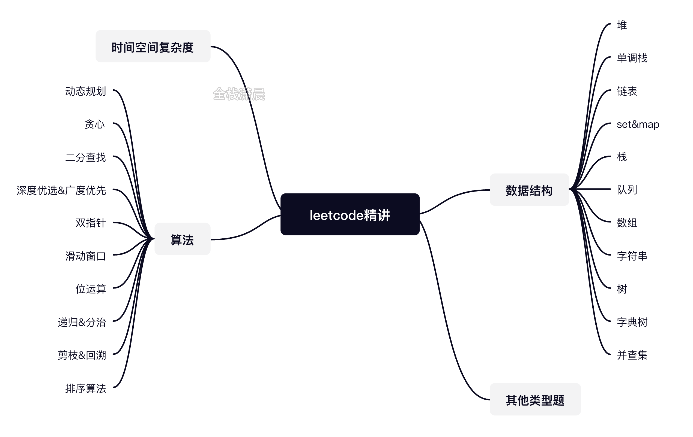
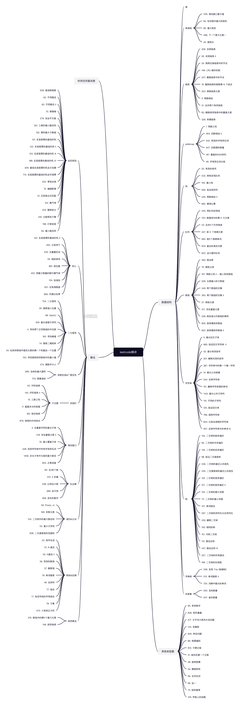

## 搞定大厂算法面试之leetcode精讲1.开篇介绍

#### 为什么要学习数据结构和算法

1. **面试需要**： 大家都知道，国内外的一二线互联网公司都需要面试算法，像google、fb或者像阿里、字节这样的公司，都喜欢在面试的最后环节让候选人手写一段代码解决某个问题，甚至是需要白板编程，没有任何编辑器的提示，这就需要候选者有扎实的数据结构和算法的功力，而且对编码习惯、代码风格、设计模式都有较高的要求。不管是前端、后端、不管用什么语言，这些编程思想和解决问题的方式都是一致的。 那么为什么这么多公司都喜欢考察数据结构和算法呢？这是因为啊，面试短短的1、2个小时，面试官很难判断候选人的能力，就算是考察项目经验和以往的开发经验，由于面试官没有参与过你开发过项目或者研发方向，也很难理解候选人面临的问题和挑战。而考察数据结构和算法，既是对编程基础的考察，又能很好的考量解决问题的能力、思考问题的方式和路径，以及编码的习惯和风格。

    不知道大家有没有这样的感觉，就是面试了很多公司，一到面试算法的部分总是掉链子，刷了很多题，但是依然写不好，总是挂在手写题上，或者明明有能力但面试的时候却说不出来，究其原因就是缺少正确的刷题方式和方法、以及刻意的练习。

2. **核心能力的提升**：

    数据结构和算法是程序员最核心的能力，不管负责什么业务，是前端还是后端还是人工智能领域的工程师、这项能力都是一个必备的最基础的能力。为什么数据结构和算法这么重要呢。

    我们日常开发用到的大量的框架、库，都是以数据结构和算法为基础设计出来的，举个例子，`react`源码中就用到了大量的链表，还有小顶堆这些数据结构，作为使用了`react`多年的工程师，如果对日常使用的框架的底层原理和运行逻辑没有一个大概的认识，怎么能设计好技术方案，做好选型以及项目优化改进呢。数据结构和算法就好比武侠小说里的内力，而大家学的框架、库都是招式，框架经常会变，而数据结构和算法却是最基础也是最核心的能力，招式用的好不好，打出来的效果怎样，都需要强大的内功来支撑。

    千万不要说这些数据结构和算法我平时工作用不到啊，其实恰恰相反，如果想深挖技术，想要用算法提升程序运行的效率，或者提高自己的编码能力，学习数据结构和算法是一个非常好的方式，这也是我们的核心竞争力之一

3. **提升职业生涯的高度**：

    不知道大家有没有遇见过一些技术很厉害的程序员，不管在哪家公司，他们总能找到自己的位置，随着时间的推移，独立lead一个项目或者带团队都是迟早的事，为什么这些人职业生涯会走的更远呢？引用乔布斯的一句话，“Stay hungry，Stay foolish”。

    要想职业生涯走的更高更远就需要不断精进自己的技术和能力，比如程序员最核心的数据结构和算法的能力，当然，如果走向了技术管理层，还需要技术的前瞻性和管理能力，这些都是需要方法和刻意练习。时刻保持危机感，不要只停留在某个技术的使用层面，只有这样能选择机会才会更多。

    这里我分享一些个人的经验，不要相信所谓的35岁危机，本质就是到了相应的年龄就需更高的能力，不要做无效的内卷，但是基础的数据结构和算法却是必须的。底层能力才能决定我们走多远。

#### 怎样学习数据结构和算法

1. **了解基础的数据结构**：比如链表、栈、队列、树等等，可以借助博客，书籍，课程进行学习，书籍比如「javascript数据结构与算法」，以及其他语言的数据结构和算法的书籍，不推荐「算法导论」，因为推理和证明性的内容很多。
2. **按照类别刻意练习**：按照`leetcode`上的分类进行刷题，比如按照动态规划、分治、回溯等分类练习，`leetcode`题目虽然多，但如果按类别来刷，其实也没多少，很多题目都是类似的套路和延伸，掌握其中面试热门的一百多道就足够应付面试了。

#### 如何刷题:

1. 切碎知识点

   ：对每个类型的题目形成一套解题思路和模版，比如解动态规划的步骤有

   - 根据重叠子问题定义状态
   - 寻找最优子结构推导状态转移方程
   - 确定`dp`初始状态
   - 确定输出值

2. **刻意练习**：要练习缺陷的、弱的地方，那些写起来不舒服、不爽、枯燥的题目就是薄弱点，不要只练习熟悉类型的题

3. **反馈**：在`leetcode`上寻找别人的解题思路，包括评论区的讨论，还有程序的运行时间和占用内存的数据，顺便提一句，`leetcode`的运行时间和占用内存情况的数据不准确，就当个参考就好，不要太在意运行时间的排名。

4. **多写**：反复练习，加强记忆，三分学，七分练。

5. **总结规律**；将刷题的套路总结成自己方法，比如拆解问题、找基本的子问题、问题的组装、数学归纳等等。最后这些方法落实到代码层面无非是`if else，for while`、递归等，总结了这些规律，才能在题目变化的时候还能找到正确的解题路径。题目做多了也会有相应的感觉，有时从题目要求中也能明显的感觉到该用什么算法，比如题中提到了用`O(logn)`的复杂度来解，那很有可能要用到二分法，提到了`O(nlogn)`，那可能是用归并或者快排的思想解题。

#### 面试时如何做一道题

- **明确题意**：有不清楚的地方要和面试官明确题目的意思，包括程序的特殊数据输入，数据量，边界条件的处理等等。

- **可能的解**：要尽可能的列出你知道的方法，对比他们的优劣势，选择你认为最好的方法进行编码。不要小看暴力解法，它往往是题目思考和优化的起点。

- **写完之后进行复杂度分析**：包括时间和空间复杂度分析。

   面试官往往是考察思考和解决问题的方式，我们要尽量的让面试官看到我们思考的路径和过程，即使最后的运行结果不太正确，也不一定会影响最后的录用，可能也就是因为某个条件或者返回值出现了问题。

   在面试的过程中，如果完全没有思路，也可以向面试官寻求提示和帮助，人无完人，就算是在平时的工作中我们也会遇到困难，这不丢人，积极寻找帮助也是推进项目前进的方式，没有问题有时候才是最大的问题。如果确定这道题是你完全没有遇到过的，可以要求面试官更换一道题，与其浪费时间思考，不如直接换一道，也许换了之后就是熟悉的题目了，知识点和题目这么多，每个人都有自己的知识盲区。不要想着面试官是监考的老师，而是未来的同事，面试不是考试，大多数题都没有标准答案，有时候只要表现的比其他候选人更好一点就可以了。

#### 课程特色

- **`leetcode`分类讲解**：对`leetcode`高频面试题进行分类讲解，讲到对应的题目时，会介绍对应的数据结构，它有什么特点，以及它的实现，比如堆的实现、字典树的实现等，然后会介绍这道题相应的算法，比如递归，回溯、贪心、动态规划等。
- **思考路径和套路**：每道题都会列出尽可能多的解题方式，以及复杂度分析，然后讲解思考的路径，同类型的题总结相应的套路，比如二分法，双指针，动态规划，dfs，bfs等的模版。
- **题目量和难度达到面试的要求**：目前课程包涵174道高频面试题，后续会不定时增加新的面试题，其他同类型的题目基本都是这些问题的变种和延伸，hard题22道，medium题83道，easy题69道，每道题都有详细的注释，后面还会更新更多大厂高频面试题
- **节省时间**：难题理解困难，解法看不懂，花了大量时间刷题还是刷不会，这可能是大家最头疼的问题了，这门课程会讲解必要的前置知识，相应的解题套路，大量的图解配合视频讲解，不多废话，做到通俗易懂，节省大家的理解和刷题成本。在面试前几天快速进入做题的状态。
- **解题语言**：这门课主要主要的用`JavaScript`来解题，也会附上`Java`的解题代码，数据结构和算法与相应的实现语言没有太大关系，不管用`python`还是`Go`，其实理解了逻辑和方法，只需要相应的改一下`if else，for while`，数组和对象的声明等等，就可以用对应的语言来解题了。

#### 适合人群

- **应届校招生**：校招门槛水涨船高，对同学们的能力要求也越来越高，当然薪资肯定也是一年比一年高，做到提前准备，提前刷题，对于处于即将毕业的计算机学科的同学来说还是很必要的。
- 算法薄弱在职工程师：社招的同学如果是想进入bat、美团、字节这样的公司，算法的考察基本是必考的，就算是一些中型的公司，现在也越来越多的考察同学们的基础能力了，对算法的考察也是非常重要的一个环节。

#### 课程大纲和目录

