## 搞定大厂算法面试之leetcode精讲3.动态规划

#### 什么是动态规划

动态规划，英文：`Dynamic Programming`，简称`DP`，将问题分解为互**相重叠的子问题**，通过反复求解子问题来解决原问题就是动态规划，如果某一问题有很多重叠子问题，使用动态规划来解是比较有效的。

求解动态规划的核心问题是穷举，但是这类问题穷举有点特别，因为这类问题**存在「重叠子问题」**，如果暴力穷举的话效率会极其低下。动态规划问题一定会**具备「最优子结构」**，才能通过子问题的最值得到原问题的最值。另外，虽然动态规划的核心思想就是穷举求最值，但是问题可以千变万化，穷举所有可行解其实并不是一件容易的事，只有列出**正确的「状态转移方程」**才能正确地穷举。重叠子问题、最优子结构、状态转移方程就是动态规划三要素

#### 动态规划和其他算法的区别

1. 动态规划和分治的区别：动态规划和分治都有最优子结构 ，但是分治的子问题不重叠
2. 动态规划和贪心的区别：动态规划中每一个状态一定是由上一个状态推导出来的，**这一点就区分于贪心**，贪心没有状态推导，而是从局部直接选最优解，所以它永远是局部最优，但是全局的解不一定是最优的。
3. 动态规划和递归的区别：递归和回溯可能存在非常多的重复计算，动态规划可以用递归加记忆化的方式减少不必要的重复计算

#### 动态规划的解题方法

- 递归+记忆化(自顶向下)
- 动态规划（自底向上）

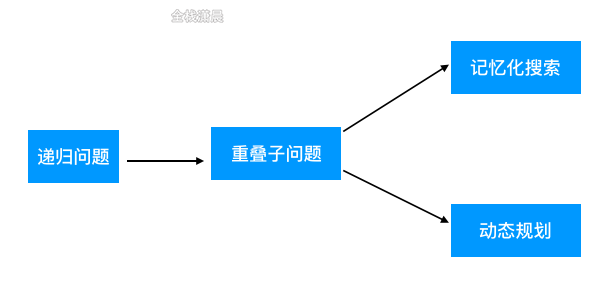

#### 解动态规划题目的步骤

1. 根据重叠子问题定义状态
2. 寻找最优子结构推导状态转移方程
3. 确定dp初始状态
4. 确定输出值

#### 斐波那契的动态规划的解题思路

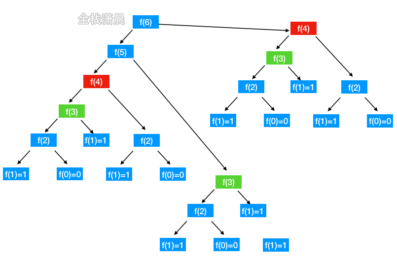

[动画过大，点击查看](https://xiaochen1024.com/20211118134958.gif)

###### 暴力递归

```javascript
//暴力递归复杂度O(2^n)
var fib = function (N) {
    if (N == 0) return 0;
    if (N == 1) return 1;
    return fib(N - 1) + fib(N - 2);
};
```

###### 递归 + 记忆化

```javascript
var fib = function (n) {
    const memo = {}; // 对已算出的结果进行缓存

    const helper = (x) => {
        if (memo[x]) return memo[x];
        if (x == 0) return 0;
        if (x == 1) return 1;
        memo[x] = helper(x - 1) + helper(x - 2);
        return memo[x];
    };

    return helper(n);
};
```

###### 动态规划

```javascript
const fib = (n) => {
    if (n <= 1) return n;
    const dp = [0, 1];
    for (let i = 2; i <= n; i++) {
        //自底向上计算每个状态
        dp[i] = dp[i - 1] + dp[i - 2];
    }
    return dp[n];
};
```

###### 滚动数组优化

```javascript
const fib = (n) => {
    if (n <= 1) return n;
    //滚动数组 dp[i]只和dp[i-1]、dp[i-2]相关，只维护长度为2的滚动数组，不断替换数组元素
    const dp = [0, 1];
    let sum = null;
    for (let i = 2; i <= n; i++) {
        sum = dp[0] + dp[1];
        dp[0] = dp[1];
        dp[1] = sum;
    }
    return sum;
};
```

###### 动态规划 + 降维，（降维能减少空间复杂度，但不利于程序的扩展）

```javascript
var fib = function (N) {
    if (N <= 1) {
        return N;
    }
    let prev2 = 0;
    let prev1 = 1;
    let result = 0;
    for (let i = 2; i <= N; i++) {
        result = prev1 + prev2; //直接用两个变量就行
        prev2 = prev1;
        prev1 = result;
    }
    return result;
};
```

#### [509. 斐波那契数](https://leetcode-cn.com/problems/fibonacci-number/)（easy）

##### 方法1.动态规划

- 思路：自底而上的动态规划
- 复杂度分析：时间复杂度`O(n)`，空间复杂度`O(1)`

Js:

```javascript
var fib = function (N) {
    if (N <= 1) {
        return N;
    }
    let prev2 = 0;
    let prev1 = 1;
    let result = 0;
    for (let i = 2; i <= N; i++) {
        result = prev1 + prev2;
        prev2 = prev1;
        prev1 = result;
    }
    return result;
};
```

Java:

```java
class Solution {
    public int fib(int n) {
        if (n <= 1) {
            return n;
        }
        int prev2 = 0, prev1 = 1, result = 0;
        for (int i = 2; i <= n; i++) {
            result = prev2 + prev1;
            prev2 = prev1; 
            prev1 = result; 
        }
        return result;
    }
}
```

#### [62. 不同路径](https://leetcode-cn.com/problems/unique-paths/) （medium）

##### 方法1.动态规划

[动画过大，点击查看](https://xiaochen1024.com/20211118135215.gif)

- 思路:由于在每个位置只能向下或者向右， 所以每个坐标的路径和等于上一行相同位置和上一列相同位置不同路径的总和，状态转移方程：`f[i][j] = f[i - 1][j] + f[i][j - 1]`;
- 复杂度:时间复杂度`O(mn)`。空间复杂度`O(mn)`，优化后`O(n)`

js:

```javascript
var uniquePaths = function (m, n) {
    const f = new Array(m).fill(0).map(() => new Array(n).fill(0)); //初始dp数组
    for (let i = 0; i < m; i++) {
        //初始化列
        f[i][0] = 1;
    }
    for (let j = 0; j < n; j++) {
        //初始化行
        f[0][j] = 1;
    }
    for (let i = 1; i < m; i++) {
        for (let j = 1; j < n; j++) {
            f[i][j] = f[i - 1][j] + f[i][j - 1];
        }
    }
    return f[m - 1][n - 1];
};

//状态压缩
var uniquePaths = function (m, n) {
    let cur = new Array(n).fill(1);
    for (let i = 1; i < m; i++) {
        for (let r = 1; r < n; r++) {
            cur[r] = cur[r - 1] + cur[r];
        }
    }
    return cur[n - 1];
};
```

Java:

```java
class Solution {
    public int uniquePaths(int m, int n) {
        int[][] f = new int[m][n];
        for (int i = 0; i < m; ++i) {
            f[i][0] = 1;
        }
        for (int j = 0; j < n; ++j) {
            f[0][j] = 1;
        }
        for (int i = 1; i < m; ++i) {
            for (int j = 1; j < n; ++j) {
                f[i][j] = f[i - 1][j] + f[i][j - 1];
            }
        }
        return f[m - 1][n - 1];
    }
}

//状态压缩
class Solution {
    public int uniquePaths(int m, int n) {
        int[] cur = new int[n];
        Arrays.fill(cur,1);
        for (int i = 1; i < m;i++){
            for (int j = 1; j < n; j++){
                cur[j] += cur[j-1] ;
            }
        }
        return cur[n-1];
    }
}
```

#### [63. 不同路径 II](https://leetcode-cn.com/problems/unique-paths-ii/)（medium）

##### 方法1.动态规划

- 思路：和62题一样，区别就是遇到障碍直接返回0
- 复杂度：时间复杂度`O(mn)`，空间复杂度`O(mn)`，状态压缩之后是o(n)

Js:

```javascript
var uniquePathsWithObstacles = function (obstacleGrid) {
    const m = obstacleGrid.length;
    const n = obstacleGrid[0].length;
    const dp = Array(m)
        .fill()
        .map((item) => Array(n).fill(0)); //初始dp数组

    for (let i = 0; i < m && obstacleGrid[i][0] === 0; ++i) {
        //初始列
        dp[i][0] = 1;
    }

    for (let i = 0; i < n && obstacleGrid[0][i] === 0; ++i) {
        //初始行
        dp[0][i] = 1;
    }

    for (let i = 1; i < m; ++i) {
        for (let j = 1; j < n; ++j) {
            //遇到障碍直接返回0
            dp[i][j] = obstacleGrid[i][j] === 1 ? 0 : dp[i - 1][j] + dp[i][j - 1];
        }
    }

    return dp[m - 1][n - 1];
};

//状态压缩
var uniquePathsWithObstacles = function (obstacleGrid) {
    let m = obstacleGrid.length;
    let n = obstacleGrid[0].length;
    let dp = Array(n).fill(0); //用0填充，因为现在有障碍物，当前dp数组元素的值还和obstacleGrid[i][j]有关
    dp[0] = 1; //第一列 暂时用1填充
    for (let i = 0; i < m; i++) {
        for (let j = 0; j < n; j++) {
            if (obstacleGrid[i][j] == 1) {
                //注意条件，遇到障碍物dp[j]就变成0，这里包含了第一列的情况
                dp[j] = 0;
            } else if (j > 0) {
                //只有当j>0 不是第一列了才能取到j - 1
                dp[j] += dp[j - 1];
            }
        }
    }
    return dp[n - 1];
};
```

Java:

```java
class Solution {
    public int uniquePathsWithObstacles(int[][] obstacleGrid) {
        int n = obstacleGrid.length, m = obstacleGrid[0].length;
        int[] dp = new int[m];

        dp[0] = obstacleGrid[0][0] == 0 ? 1 : 0;
        for (int i = 0; i < n; ++i) {
            for (int j = 0; j < m; ++j) {
                if (obstacleGrid[i][j] == 1) {
                    dp[j] = 0;
                    continue;
                }
                if (j - 1 >= 0 && obstacleGrid[i][j - 1] == 0) {
                    dp[j] += dp[j - 1];
                }
            }
        }
        
        return dp[m - 1];
    }
}
```

#### [70. 爬楼梯](https://leetcode-cn.com/problems/climbing-stairs/) （medium）

##### 方法1.动态规划

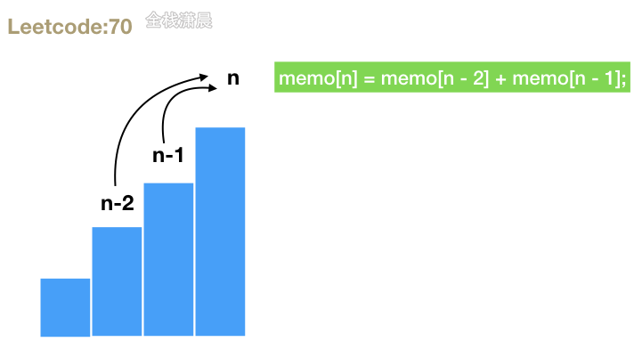

- 思路：因为每次可以爬 1 或 2 个台阶，所以到第n阶台阶可以从第n-2或n-1上来，其实就是斐波那契的dp方程
- 复杂度分析：时间复杂度`O(n)`，空间复杂度`O(1)`

Js:

```javascript
var climbStairs = function (n) {
    const memo = [];
    memo[1] = 1;
    memo[2] = 2;
    for (let i = 3; i <= n; i++) {
        memo[i] = memo[i - 2] + memo[i - 1];//所以到第n阶台阶可以从第n-2或n-1上来
    }
    return memo[n];
};

//状态压缩
var climbStairs = (n) => {
    let prev = 1;
    let cur = 1;
    for (let i = 2; i < n + 1; i++) {
        [prev, cur] = [cur, prev + cur]
        // const temp = cur;   // 暂存上一次的cur
        // cur = prev + cur;   // 当前的cur = 上上次cur + 上一次cur
        // prev = temp;        // prev 更新为 上一次的cur
    }
    return cur;
}
```

Java:

```java
class Solution {
    public int climbStairs(int n) {
        int prev = 1, cur = 1;
        for (int i = 2; i < n + 1; i++) {
        int temp = cur;
        cur = prev + cur;  
        prev = temp; 
        }
        return cur;
    }
}
```

#### [279. 完全平方数](https://leetcode-cn.com/problems/perfect-squares/) (medium)

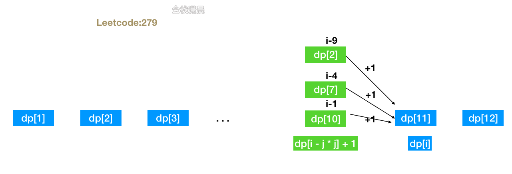

##### 方法1:动态规划

- 思路：`dp[i]` 表示`i`的完全平方和的最少数量，`dp[i - j * j] + 1`表示减去一个完全平方数`j`的完全平方之后的数量加1就等于`dp[i]`，只要在`dp[i]`, `dp[i - j * j] + 1`中寻找一个较少的就是最后`dp[i]`的值。

- ###### 复杂度：时间复杂度`O(n* sqrt(n))`，n是输入的整数，需要循环n次，每次计算dp方程的复杂度`sqrt(n)`，空间复杂度O(n)

js：

```js
var numSquares = function (n) {
    const dp = [...Array(n)].map((_) => 0); //初始化dp数组 当n为0的时候
    for (let i = 1; i <= n; i++) {
        dp[i] = i; // 最坏的情况就是每次+1 比如: dp[3]=1+1+1
        for (let j = 1; i - j * j >= 0; j++) {//枚举前一个状态
            dp[i] = Math.min(dp[i], dp[i - j * j] + 1); // 动态转移方程
        }
    }
    return dp[n];
};
```

java：

```java
class Solution {
    public int numSquares(int n) {
        int[] dp = new int[n + 1];
        for (int i = 1; i <= n; i++) {
            dp[i] = i;
            for (int j = 1; i - j * j >= 0; j++) { 
                dp[i] = Math.min(dp[i], dp[i - j * j] + 1);
            }
        }
        return dp[n];
    }
}
```

#### [120. 三角形最小路径和](https://leetcode-cn.com/problems/triangle/)（medium）

##### 方法1.动态规划

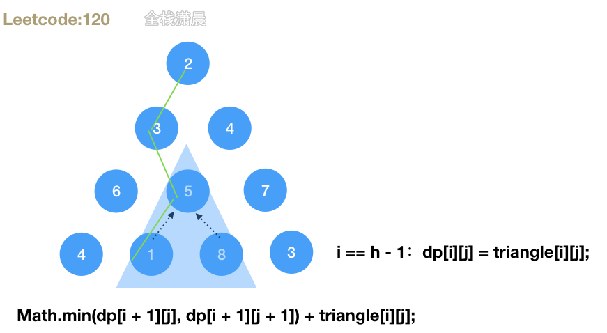

- 思路：从三角形最后一层开始向上遍历，每个数字的最小路径和是它下面两个数字中的较小者加上它本身
- 复杂度分析：时间复杂度`O(n^2)`，空间复杂`O(n)`

Js:

```js
const minimumTotal = (triangle) => {
    const h = triangle.length;
    // 初始化dp数组
    const dp = new Array(h);
    for (let i = 0; i < h; i++) {
        dp[i] = new Array(triangle[i].length);
    }

    for (let i = h - 1; i >= 0; i--) { //自底而上遍历
        for (let j = 0; j < triangle[i].length; j++) { //同一层的
            if (i == h - 1) {  // base case 最底层
                dp[i][j] = triangle[i][j];
            } else { // 状态转移方程，上一层由它下面一层计算出
                dp[i][j] = Math.min(dp[i + 1][j], dp[i + 1][j + 1]) + triangle[i][j];
            }
        }
    }
    return dp[0][0];
};


//状态压缩
const minimumTotal = (triangle) => {
    const bottom = triangle[triangle.length - 1];
    const dp = new Array(bottom.length);
    // base case 是最后一行
    for (let i = 0; i < dp.length; i++) {
        dp[i] = bottom[i];
    }
    // 从倒数第二列开始迭代
    for (let i = dp.length - 2; i >= 0; i--) {
        for (let j = 0; j < triangle[i].length; j++) {
            dp[j] = Math.min(dp[j], dp[j + 1]) + triangle[i][j];
        }
    }
    return dp[0];
};
```

Java:

```java
class Solution {
    public int minimumTotal(List<List<Integer>> triangle) {
        int n = triangle.size();
        int [] dp = new int [n];
        for(int i = 0 ; i < n ; i++){
            dp[i] = triangle.get(n-1).get(i);
        }
        for(int i = n-2 ; i >= 0 ; i--){
            for(int j = 0 ; j <= i ; j++){
                dp[j] = triangle.get(i).get(j) + Math.min(dp[j] , dp[j+1]);//迭代
            }
        }
        return dp[0];
    }
}
```

#### [152. 乘积最大子数组](https://leetcode-cn.com/problems/maximum-product-subarray/) （medium）

##### 方法1.动态规划

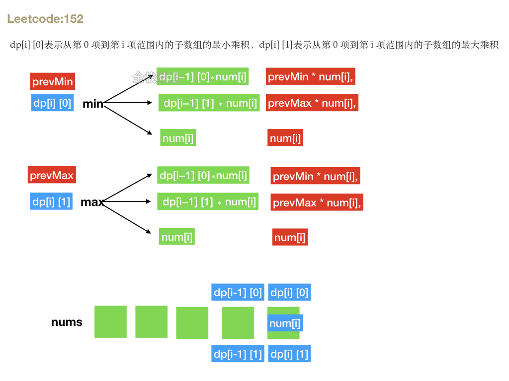

- 思路：
  1. 状态定义：`dp[i][0]`表示从第 0 项到第 i 项范围内的子数组的最小乘积，`dp[i][1]`表示从第 0 项到第 i 项范围内的子数组的最大乘积
  2. 初始状态：`dp[0][0]=nums[0], dp[0][1]=nums[0]`
  3. 分情况讨论:
     - 不和别人乘，就 `nums[i]`自己
     - `num[i]` 是负数，希望乘上前面的最大积
     - `num[i]` 是正数，希望乘上前面的最小积
  4. 状态转移方程：
     - **dp[i] [0]=min(dp[i−1] [0]∗num[i] , dp[i−1] [1] ∗ num[i], num[i])**
     - **dp[i] [1]=max(dp[i−1] [0]∗num[i] , dp[i−1] [1] ∗ num[i], num[i])**
  5. 状态压缩：`dp[i][x]`只与`dp[i][x]-1`，所以只需定义两个变量，`prevMin = nums[0]`，`prevMax = nums[0]`
  6. 状态压缩之后的方程：
     - **prevMin = Math.min(prevMin \* num[i], prevMax \* num[i], nums[i])**
     - **prevMax = Math.max(prevMin \* num[i], prevMax \* num[i], nums[i])**
- 复杂度：时间复杂度`O(n)`，空间复杂度`O(1)`

js:

```javascript
var maxProduct = (nums) => {
    let res = nums[0]
    let prevMin = nums[0]
    let prevMax = nums[0]
    let temp1 = 0, temp2 = 0
    for (let i = 1; i < nums.length; i++) {
        temp1 = prevMin * nums[i]
        temp2 = prevMax * nums[i]
        prevMin = Math.min(temp1, temp2, nums[i])
        prevMax = Math.max(temp1, temp2, nums[i])
        res = Math.max(prevMax, res)
    }
    return res
}
```

Java:

```java
class Solution {
    public int maxProduct(int[] nums) {
        int res = nums[0], prevMin = nums[0], prevMax = nums[0];
        int temp1 = 0, temp2 = 0;
        for (int i = 1; i < nums.length; i++) {
            temp1 = prevMin * nums[i];
            temp2 = prevMax * nums[i];
            prevMin = Math.min(Math.min(temp1, temp2), nums[i]);
            prevMax = Math.max(Math.max(temp1, temp2), nums[i]);
            res = Math.max(prevMax, res);
        }
        return res;
    }
}
```

#### 买卖股票问题


#### [121. 买卖股票的最佳时机](https://leetcode-cn.com/problems/best-time-to-buy-and-sell-stock/)（easy）限定交易次数 k=1

#### [122. 买卖股票的最佳时机 II](https://leetcode-cn.com/problems/best-time-to-buy-and-sell-stock-ii/)（medium）交易次数无限制 k = +infinity

#### [123. 买卖股票的最佳时机 III](https://leetcode-cn.com/problems/best-time-to-buy-and-sell-stock-iii/) (hrad) 限定交易次数 k=2

#### [188. 买卖股票的最佳时机 IV](https://leetcode-cn.com/problems/best-time-to-buy-and-sell-stock-iv/) (hard) 限定交易次数 最多次数为 k

#### [309. 最佳买卖股票时机含冷冻期](https://leetcode-cn.com/problems/best-time-to-buy-and-sell-stock-with-cooldown/)(medium) 含有交易冷冻期

#### [714. 买卖股票的最佳时机含手续费](https://leetcode-cn.com/problems/best-time-to-buy-and-sell-stock-with-transaction-fee/) (medium) 每次交易含手续费

第5，6道题相当于在第2道题的基础上加了冷冻期和手续费的条件。

###### 限制条件

- 先买入才能卖出
- 不能同时参加多笔交易，再次买入时，需要先卖出
- `k >= 0`才能进行交易，否则没有交易次数

###### **定义操作**

- 买入
- 卖出
- 不操作

###### 定义状态

- `i`: 天数
- `k`: 交易次数，每次交易包含买入和卖出，这里我们只在买入的时候需要将 `k - 1`
- `0`: 不持有股票
- `1`: 持有股票

###### **举例**

```js
  dp[i][k][0]//第i天 还可以交易k次 手中没有股票
  dp[i][k][1]//第i天 还可以交易k次 手中有股票
```

最终的最大收益是`dp[n - 1][k][0]`而不是`dp[n - 1][k][1]`，因为最后一天卖出肯定比持有收益更高

###### **状态转移方程**

```js
// 今天没有持有股票，分为两种情况：
// 1. dp[i - 1][k][0]，昨天没有持有，今天不操作。 
// 2. dp[i - 1][k][1] + prices[i] 昨天持有，今天卖出，今天手中就没有股票了。
dp[i][k][0] = Math.max(dp[i - 1][k][0], dp[i - 1][k][1] + prices[i])


// 今天持有股票，分为两种情况：
// 1.dp[i - 1][k][1] 昨天持有，今天不操作
// 2.dp[i - 1][k - 1][0] - prices[i] 昨天没有持有，今天买入。
dp[i][k][1] = Math.max(dp[i - 1][k][1], dp[i - 1][k - 1][0] - prices[i])

//最大利润就是这俩种情况的最大值
```

#### [121. 买卖股票的最佳时机](https://leetcode-cn.com/problems/best-time-to-buy-and-sell-stock/)（easy）限定交易次数 k=1

状态转移方程

```js
//第i天不持有 由 第i-1天不持有然后不操作 和 第i-1天持有然后卖出 两种情况的最大值转移过来
dp[i][1][0] = Math.max(dp[i - 1][1][0], dp[i - 1][1][1] + prices[i])
//第i天持有 由 第i-1天持有然后不操作 和 第i-1天不持有然后买入 两种情况的最大值转移过来
dp[i][1][1] = Math.max(dp[i - 1][1][1], dp[i - 1][0][0] - prices[i])
            = Math.max(dp[i - 1][1][1], -prices[i]) // k=0时 没有交易次数，dp[i - 1][0][0] = 0
```

`k`是固定值1，不影响结果，所以可以不用管，简化之后如下

```javascript
dp[i][0] = Math.max(dp[i - 1][0], dp[i - 1][1] + prices[i])
dp[i][1] = Math.max(dp[i - 1][1], -prices[i])
```

完整代码

```javascript
//时间复杂度O(n) 空间复杂度O(n)，dp数组第二维是常数
const maxProfit = function (prices) {
    let n = prices.length;
    let dp = Array.from(new Array(n), () => new Array(2));
    dp[0][0] = 0; //第0天不持有
    dp[0][1] = -prices[0]; //第0天持有
    for (let i = 1; i < n; i++) {
        dp[i][0] = Math.max(dp[i - 1][0], dp[i - 1][1] + prices[i]);
        dp[i][1] = Math.max(dp[i - 1][1], -prices[i]);
    }
    return dp[n - 1][0];
};
```

状态压缩，`dp[i]` 只和 `dp[i - 1]` 有关，去掉一维

```js
//时间复杂度O(n) 空间复杂度O(1)
const maxProfit = function (prices) {
    let n = prices.length;
    let dp = Array.from(new Array(n), () => new Array(2));
    dp[0] = 0;
    dp[1] = -prices[0];
    for (let i = 1; i < n; i++) {
        dp[0] = Math.max(dp[0], dp[1] + prices[i]);
        dp[1] = Math.max(dp[1], -prices[i]);
    }
    return dp[0];
};

//语意化
const maxProfit = function (prices) {
    let n = prices.length;
    let sell = 0;
    let buy = -prices[0];
    for (let i = 1; i < n; i++) {
        sell = Math.max(sell, buy + prices[i]);
        buy = Math.max(buy, -prices[i]);
    }
    return sell;
};
```

#### [122. 买卖股票的最佳时机 II](https://leetcode-cn.com/problems/best-time-to-buy-and-sell-stock-ii/)（medium）交易次数无限制 k = +infinity

状态转移方程

```js
//第i天不持有 由 第i-1天不持有然后不操作 和 第i-1天持有然后卖出 两种情况的最大值转移过来
dp[i][k][0] = Math.max(dp[i - 1][k][0], dp[i - 1][k][1] + prices[i])
//第i天持有 由 第i-1天持有然后不操作 和 第i-1天不持有然后买入 两种情况的最大值转移过来
dp[i][k][1] = Math.max(dp[i - 1][k][1], dp[i - 1][k - 1][0] - prices[i])
```

k同样不影响结果，简化之后如下

```js
dp[i][0] = Math.max(dp[i - 1][0], dp[i - 1][1] + prices[i])
dp[i][1] = Math.max(dp[i - 1][1], dp[i - 1][0] - prices[i])
```

完整代码

```js
const maxProfit = function (prices) {
    let n = prices.length;
    let dp = Array.from(new Array(n), () => new Array(2));
    dp[0][0] = 0; //第0天不持有
    dp[0][1] = -prices[0]; //第0天买入 花了prices[0]
    for (let i = 1; i < n; i++) {
        dp[i][0] = Math.max(dp[i - 1][0], dp[i - 1][1] + prices[i]);
        dp[i][1] = Math.max(dp[i - 1][1], dp[i - 1][0] - prices[i]);
    }
    return dp[n - 1][0];
};
```

状态压缩，同样`dp[i]` 只和 dp[i - 1] 有关，去掉一维

```js
const maxProfit = function (prices) {
    let n = prices.length;
    let dp = Array.from(new Array(n), () => new Array(2));
    dp[0] = 0;
    dp[1] = -prices[0];
    for (let i = 1; i < n; i++) {
        dp[0] = Math.max(dp[0], dp[1] + prices[i]);
        dp[1] = Math.max(dp[1], dp[0] - prices[i]);
    }
    return dp[0];
};

//语意化
const maxProfit = function (prices) {
    let n = prices.length;
    let sell = 0;
    let buy = -prices[0];
    for (let i = 1; i < n; i++) {
        sell = Math.max(sell, buy + prices[i]);
        buy = Math.max(buy, sell - prices[i]);
    }
    return sell;
};
```

#### [123. 买卖股票的最佳时机 III](https://leetcode-cn.com/problems/best-time-to-buy-and-sell-stock-iii/) (hrad) 限定交易次数 k=2

状态转移方程

```js
dp[i][k][0] = Math.max(dp[i - 1][k][0], dp[i - 1][k][1] + prices[i])
dp[i][k][1] = Math.max(dp[i - 1][k][1], dp[i - 1][k - 1][0] - prices[i])
```

k对结果有影响 不能舍去，只能对k进行循环

```js
for (let i = 0; i < n; i++) {
  for (let k = maxK; k >= 1; k--) {
    dp[i][k][0] = Math.max(dp[i - 1][k][0], dp[i - 1][k][1] + prices[i]);
    dp[i][k][1] = Math.max(dp[i - 1][k][1], dp[i - 1][k - 1][0] - prices[i]);
  }
}


//k=2，直接写出循环的结果
dp[i][2][0] = Math.max(dp[i - 1][2][0], dp[i - 1][2][1] + prices[i])
dp[i][2][1] = Math.max(dp[i - 1][2][1], dp[i - 1][1][0] - prices[i])

dp[i][1][0] = Math.max(dp[i - 1][1][0], dp[i - 1][1][1] + prices[i])
dp[i][1][1] = Math.max(dp[i - 1][1][1], dp[i - 1][0][0] - prices[i])
            = Math.max(dp[i - 1][1][1], -prices[i])// k=0时 没有交易次数，dp[i - 1][0][0] = 0

//去掉i这一维度
dp[2][0] = Math.max(dp[2][0], dp[2][1] + prices[i])
dp[2][1] = Math.max(dp[2][1], dp[1][0] - prices[i])

dp[1][0] = Math.max(dp[1][0], dp[1][1] + prices[i])
dp[1][1] = Math.max(dp[1][1], dp[0][0] - prices[i])
            = Math.max(dp[1][1], -prices[i])// k=0时 没有交易次数，dp[i - 1][0][0] = 0
```

完整代码

```js
//和前面一样 我们直接降维
const maxProfit = function (prices) {
    let buy_1 = -prices[0], sell_1 = 0
    let buy_2 = -prices[0], sell_2 = 0
    let n = prices.length
    for (let i = 1; i < n; i++) {
        sell_2 = Math.max(sell_2, buy_2 + prices[i])
        buy_2 = Math.max(buy_2, sell_1 - prices[i])
        sell_1 = Math.max(sell_1, buy_1 + prices[i])
        buy_1 = Math.max(buy_1, -prices[i])
    }
    return sell_2
}
```

#### [188. 买卖股票的最佳时机 IV](https://leetcode-cn.com/problems/best-time-to-buy-and-sell-stock-iv/) (hard) 限定交易次数 最多次数为 k

```js
const maxProfit = function (k, prices) {
    let n = prices.length;
    let profit = new Array(k);//和123题一样 求出所有k的状态
    // 初始化k次交易买入卖出的利润
    for (let j = 0; j <= k; j++) {
        profit[j] = {
            buy: -prices[0],//表示有股票
            sell: 0,//表示没有股票
        };
    }
    for (let i = 0; i < n; i++) {
        for (let j = 1; j <= k; j++) {
            //122题可以交易无数次，188交易k次，所以直接在加一层k循环就可以
          	//122最后的递推方程：
          	//sell = Math.max(sell, buy + prices[i]);
        		//buy = Math.max(buy, -prices[i]);
            profit[j] = {
                sell: Math.max(profit[j].sell, profit[j].buy + prices[i]),
                buy: Math.max(profit[j].buy, profit[j - 1].sell - prices[i]),
            };
        }
    }
    return profit[k].sell; //返回第k次清空手中的股票之后的最大利润
};
```

#### [309. 最佳买卖股票时机含冷冻期](https://leetcode-cn.com/problems/best-time-to-buy-and-sell-stock-with-cooldown/)(medium) 含有交易冷冻期

状态转移方程

```js
dp[i][k][0] = Math.max(dp[i - 1][k][0], dp[i - 1][k][1] + prices[i])
//冷却时间1天，所以要从 i - 2 天转移状态
//买入，卖出 ---- 冷冻期 ----  买入，卖出
dp[i][k][1] = Math.max(dp[i - 1][k][1], dp[i - 2][k - 1][0] - prices[i])
```

题目不限制k的大小，可以舍去

```js
dp[i][0] = Math.max(dp[i - 1][0], dp[i - 1][1] + prices[i])
dp[i][1] = Math.max(dp[i - 1][1], dp[i - 2][0] - prices[i])

//降维i
dp[0] = Math.max(dp[0], dp[1] + prices[i])
dp[1] = Math.max(dp[1], profit_freeze - prices[i])
```

完整代码

```js
const maxProfit = function (prices) {
    let n = prices.length;
    let buy = -prices[0];//手中有股票
    let sell = 0;//没有股票
    let profit_freeze = 0;
    for (let i = 1; i < n; i++) {
        let temp = sell;
        sell = Math.max(sell, buy + prices[i]);
        buy = Math.max(buy, profit_freeze - prices[i]);
        profit_freeze = temp;
    }
    return sell;
};
```

#### [714. 买卖股票的最佳时机含手续费](https://leetcode-cn.com/problems/best-time-to-buy-and-sell-stock-with-transaction-fee/) (medium) 每次交易含手续费

状态转移方程

```js
//每次交易要支付手续费 我们定义在卖出的时候扣手续费
dp[i][0] = max(dp[i - 1][0], dp[i - 1][1] + prices[i] - fee)
dp[i][1] = max(dp[i - 1][1], dp[i - 1][0] - prices[i])
```

完整代码

```js
const maxProfit = function (prices, fee) {
    let sell = 0;//卖出
    let buy = -prices[0];//买入
    for (let i = 1; i < prices.length; i++) {
        sell = Math.max(sell, buy + prices[i] - fee);
        buy = Math.max(buy, sell - prices[i]);
    }
    return sell;
};
```

#### [322. 零钱兑换](https://leetcode-cn.com/problems/coin-change/) (medium)

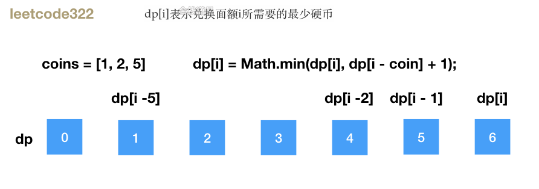

不能用贪心做，反例，`coins=[1, 3, 5, 6, 7]`，`amount=30`，用贪心先用最大的面额7，在用2个1，`4 * 7 + 2 * 1 = 30`，但是我们用5个6，`5 * 6 = 30` 就能用最少的硬币兑换完成

方法1.动态规划

- 思路：`dp[i]`表示兑换面额`i`所需要的最少硬币，因为硬币无限，所以可以自底向上计算`dp[i]`，对于`dp[0~i]`的每个状态，循环`coins`数组，寻找可以兑换的组合，用`i`面额减去当前硬币价值，`dp[i-coin]`在加上一个硬币数就是`dp[i]`,最后取最小值就是答案，状态转移方程就是`dp[i] = Math.min(dp[i], dp[i - coin] + 1)`;
- 复杂度分析：时间复杂度是*O*(sn)，s是兑换金额，n是硬币数组长度，一共需要计算s个状态，每个状态需要遍历n个面额来转移状态。空间复杂度是`O(s)`，也就是dp数组的长度

Js:

```javascript
var coinChange = function (coins, amount) {
    let dp = new Array(amount + 1).fill(Infinity);//初始化dp数组
    dp[0] = 0;//面额0只需要0个硬币兑换

    for (let i = 1; i <= amount; i++) {//循环面额
        for (let coin of coins) {//循环硬币数组
            if (i - coin >= 0) {//当面额大于硬币价值时
                //dp[i - coin]： 当前面额i减当前硬币价值所需要的最少硬币
                //dp[i] 可由 dp[i - coin] + 1 转换而来
                dp[i] = Math.min(dp[i], dp[i - coin] + 1);
            }
        }
    }

    return dp[amount] === Infinity ? -1 : dp[amount];//如果dp[amount] === Infinity，则无法兑换
};
```

Java:

```java
public class Solution {
    public int coinChange(int[] coins, int amount) {
        int max = amount + 1;
        int[] dp = new int[amount + 1];
        Arrays.fill(dp, max);
        dp[0] = 0;
        for (int i = 1; i <= amount; i++) {
            for (int j = 0; j < coins.length; j++) {
                if (coins[j] <= i) {
                    dp[i] = Math.min(dp[i], dp[i - coins[j]] + 1);
                }
            }
        }
        return dp[amount] > amount ? -1 : dp[amount];
    }
}
```

#### [72. 编辑距离](https://leetcode-cn.com/problems/edit-distance/) （hard）

##### 方法1.动态规划

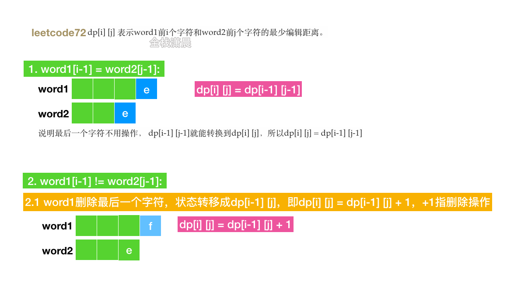

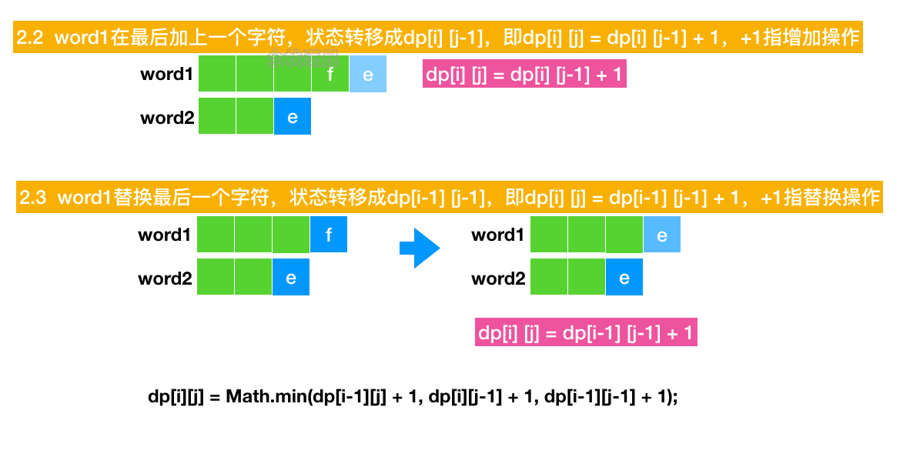

- 思路：

  ```
  dp[i][j]
  ```

   

  表示word1前i个字符和word2前j个字符的最少编辑距离。

  1. 如果`word1[i-1] === word2[j-1]`,说明最后一个字符不用操作，此时`dp[i][j] = dp[i-1][j-1]`，即此时的最小操作数和word1和word2都减少一个字符的最小编辑数相同

  2. 如果

     ```
     word1[i-1] !== word2[j-1]
     ```

     ，则分为三种情况

     1. word1删除最后一个字符，状态转移成`dp[i-1][j]`，即`dp[i][j] = dp[i-1][j] + 1`，+1指删除操作
     2. word1在最后加上一个字符，状态转移成`dp[i][j-1]`，即`dp[i][j] = dp[i][j-1] + 1`，+1指增加操作
     3. word1替换最后一个字符，状态转移成`dp[i-1][j-1]`，即dp[i] [j] = dp[i-1] [j-1] + 1，+1指替换操作

- 复杂度：时间复杂度是`O(mn)` ，m是word1的长度，n是word2的长度。空间复杂度是`O(mn)` ，需要用m * n大小的二维数字存储状态。

Js:

```javascript
const minDistance = (word1, word2) => {
    let dp = Array.from(Array(word1.length + 1), () => Array(word2.length + 1).fill(0));

    //初始化数组，word1前i个字符最少需要i次操作，比如i次删除变成word2
    for (let i = 1; i <= word1.length; i++) {
        dp[i][0] = i;
    }

    //初始化数组，word2前i个字符最少需要i次操作，比如j次插入变成word1
    for (let j = 1; j <= word2.length; j++) {
        dp[0][j] = j;
    }

    for (let i = 1; i <= word1.length; i++) {
        //循环word1和word2
        for (let j = 1; j <= word2.length; j++) {
            if (word1[i - 1] === word2[j - 1]) {
                //如果word1[i-1] === word2[j-1],说明最后一个字符不用操作。
                dp[i][j] = dp[i - 1][j - 1];
            } else {
                //dp[i-1][j] + 1：对应删除
                //dp[i][j-1] + 1：对应新增
                // dp[i-1][j-1] + 1：对应替换操作
                dp[i][j] = Math.min(dp[i - 1][j] + 1, dp[i][j - 1] + 1, dp[i - 1][j - 1] + 1);
            }
        }
    }

    return dp[word1.length][word2.length];
};
```

Java:

```java
public int minDistance(String word1, String word2) {
    int m = word1.length();
    int n = word2.length();
    int[][] dp = new int[m + 1][n + 1];

    for (int i = 1; i <= m; i++) {
        dp[i][0] =  i;
    }
    for (int j = 1; j <= n; j++) {
        dp[0][j] = j;
    }
    for (int i = 1; i <= m; i++) {
        for (int j = 1; j <= n; j++) {
            if (word1.charAt(i - 1) == word2.charAt(j - 1)) {
                dp[i][j] = dp[i - 1][j - 1];
            } else {
                dp[i][j] = Math.min(Math.min(dp[i - 1][j - 1], dp[i][j - 1]), dp[i - 1][j]) + 1;
            }
        }
    }
    return dp[m][n];
}
```

#### [10. 正则表达式匹配](https://leetcode-cn.com/problems/regular-expression-matching/)(hard)

##### 方法1.动态规划

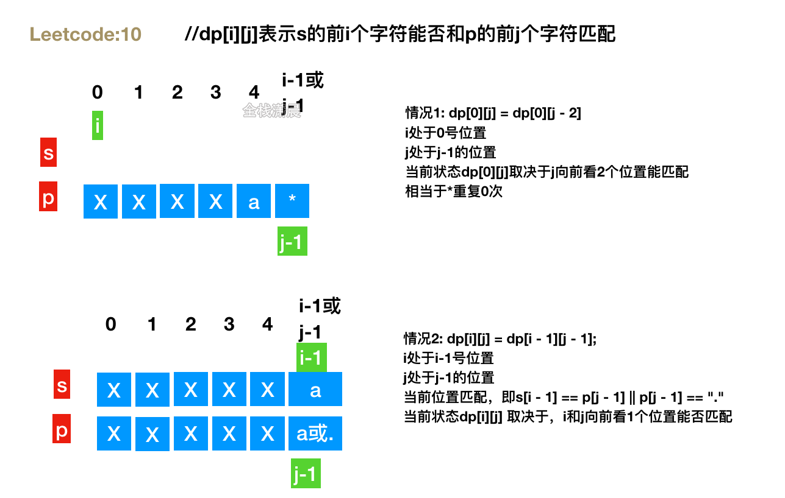

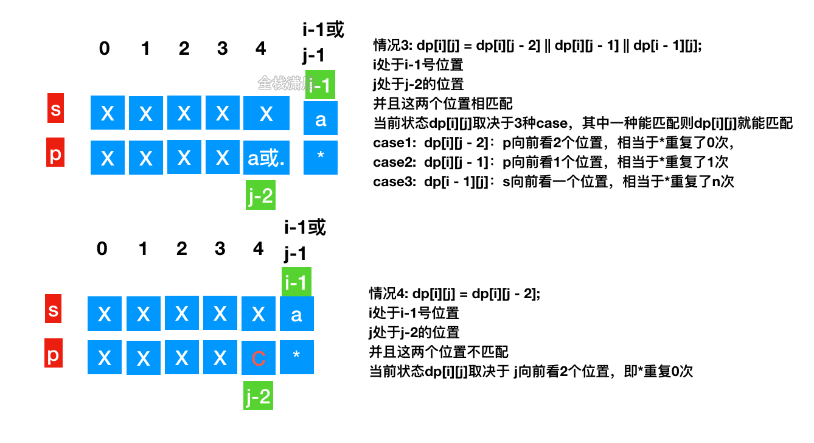

- 思路：`dp[i][j]` 表示 s 的前 i 个字符能否和p的前j个字符匹配，分为四种情况，看图
- 复杂度：时间复杂度`O(mn)`，m,n分别是字符串s和p的长度，需要嵌套循环s和p。空间复杂度`O(mn)`，dp数组所占的空间

js:

```js
//dp[i][j]表示s的前i个字符能否和p的前j个字符匹配
const isMatch = (s, p) => {
    if (s == null || p == null) return false;//极端情况 s和p都是空 返回false

    const sLen = s.length, pLen = p.length;

    const dp = new Array(sLen + 1);//因为位置是从0开始的，第0个位置是空字符串 所以初始化长度是sLen + 1
    for (let i = 0; i < dp.length; i++) {//初始化dp数组
        dp[i] = new Array(pLen + 1).fill(false); // 将项默认为false
    }
    // base case s和p第0个位置是匹配的
    dp[0][0] = true;
    for (let j = 1; j < pLen + 1; j++) {//初始化dp的第一列，此时s的位置是0
        //情况1:如果p的第j-1个位置是*，则j的状态等于j-2的状态
        //例如：s='' p='a*' 相当于p向前看2个位置如果匹配，则*相当于重复0个字符
        if (p[j - 1] == "*") dp[0][j] = dp[0][j - 2];
    }
    // 迭代
    for (let i = 1; i < sLen + 1; i++) {
        for (let j = 1; j < pLen + 1; j++) {

            //情况2:如果s和p当前字符是相等的 或者p当前位置是. 则当前的dp[i][j] 可由dp[i - 1][j - 1]转移过来
            //当前位置相匹配，则s和p都向前看一位 如果前面所有字符相匹配 则当前位置前面的所有字符也匹配
            //例如：s='XXXa' p='XXX.' 或者 s='XXXa' p='XXXa'
            if (s[i - 1] == p[j - 1] || p[j - 1] == ".") {
                dp[i][j] = dp[i - 1][j - 1];
            } else if (p[j - 1] == "*") {//情况3:进入当前字符不匹配的分支 如果当前p是* 则有可能会匹配
                //s当前位置和p前一个位置相同 或者p前一个位置等于. 则有三种可能
                //其中一种情况能匹配 则当前位置的状态也能匹配
                //dp[i][j - 2]：p向前看2个位置，相当于*重复了0次，
                //dp[i][j - 1]：p向前看1个位置，相当于*重复了1次
                //dp[i - 1][j]：s向前看一个位置，相当于*重复了n次
                //例如 s='XXXa' p='XXXa*'
                if (s[i - 1] == p[j - 2] || p[j - 2] == ".") {
                    dp[i][j] = dp[i][j - 2] || dp[i][j - 1] || dp[i - 1][j];
                } else {
                    //情况4:s当前位置和p前2个位置不匹配，则相当于*重复了0次
                    //例如 s='XXXb' p='XXXa*' 当前位置的状态和p向前看2个位置的状态相同
                    dp[i][j] = dp[i][j - 2];
                }
            }
        }
    }
    return dp[sLen][pLen]; // 长为sLen的s串 是否匹配 长为pLen的p串
};
```

Java:

```java
class Solution {
    public boolean isMatch(String s, String p) {
        if (p==null){
            if (s==null){
                return true;
            }else{
                return false;
            }
        }

        if (s==null && p.length()==1){
            return false;
        }

        int m = s.length()+1;
        int n = p.length()+1;

        boolean[][]dp = new boolean[m][n];

        dp[0][0] = true;

        for (int j=2;j<n;j++){
            if (p.charAt(j-1)=='*'){
                dp[0][j] = dp[0][j-2];
            }
        }

        for (int r=1;r<m;r++){
            int i = r-1;
            for (int c=1;c<n;c++){
                int j = c-1;
                if (s.charAt(i)==p.charAt(j) || p.charAt(j)=='.'){
                    dp[r][c] = dp[r-1][c-1];
                }else if (p.charAt(j)=='*'){
                    if (p.charAt(j-1)==s.charAt(i) || p.charAt(j-1)=='.'){
                        dp[r][c] = dp[r-1][c] || dp[r][c-2];
                    }else{
                        dp[r][c] = dp[r][c-2];
                    }
                }else{
                    dp[r][c] = false;
                }

            }
        }
        return dp[m-1][n-1];
    }
}
```

#### [312. 戳气球](https://leetcode-cn.com/problems/burst-balloons/) (hard)

##### 方法1:动态规划

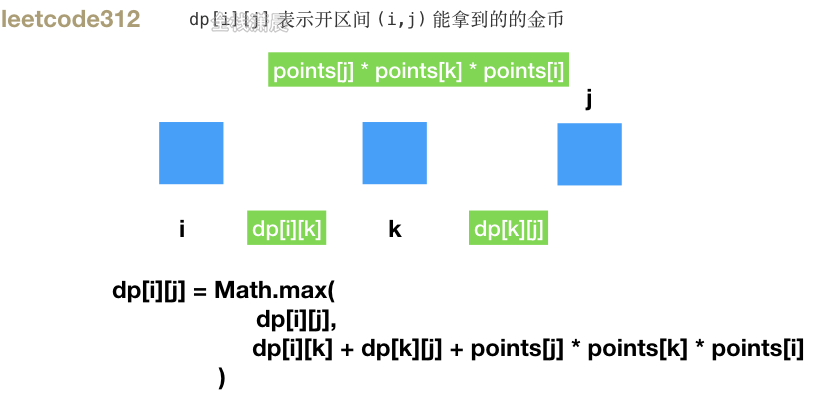

- 思路：`dp[i][j]` 表示开区间 `(i,j)` 能拿到的的金币，k是这个区间 *最后一个* 被戳爆的气球，枚举`i`和`j`，遍历所有区间，`i-j`能获得的最大数量的金币等于 戳破当前的气球获得的金钱加上之前`i-k`、`k-j`区间中已经获得的金币
- 复杂度：时间复杂度`O(n^3)`，n是气球的数量，三层遍历。空间复杂度`O(n^2)`，dp数组的空间。

js：

```js
var maxCoins = function (nums) {
    const n = nums.length;
    let points = [1, ...nums, 1]; //两边添加虚拟气球
    const dp = Array.from(Array(n + 2), () => Array(n + 2).fill(0)); //dp数组初始化
    //自底向上转移状态
    for (let i = n; i >= 0; i--) {
        //i不断减小
        for (let j = i + 1; j < n + 2; j++) {
            //j不断扩大
            for (let k = i + 1; k < j; k++) {
                //枚举k在i和j中的所有可能
                //i-j能获得的最大数量的金币等于 戳破当前的气球获得的金钱加上之前i-k,k-j区间中已经获得的金币
                dp[i][j] = Math.max(
                    //挑战最大值
                    dp[i][j],
                    dp[i][k] + dp[k][j] + points[j] * points[k] * points[i]
                );
            }
        }
    }
    return dp[0][n + 1];
};
```

java：

```java
class Solution {
    public int maxCoins(int[] nums) {
        int n = nums.length;
        int[][] dp = new int[n + 2][n + 2];
        int[] val = new int[n + 2];
        val[0] = val[n + 1] = 1;
        for (int i = 1; i <= n; i++) {
            val[i] = nums[i - 1];
        }
        for (int i = n - 1; i >= 0; i--) {
            for (int j = i + 2; j <= n + 1; j++) {
                for (int k = i + 1; k < j; k++) {
                    int sum = val[i] * val[k] * val[j];
                    sum += dp[i][k] + dp[k][j];
                    dp[i][j] = Math.max(dp[i][j], sum);
                }
            }
        }
        return dp[0][n + 1];
    }
}
```

#### [343. 整数拆分](https://leetcode-cn.com/problems/integer-break/) (medium)

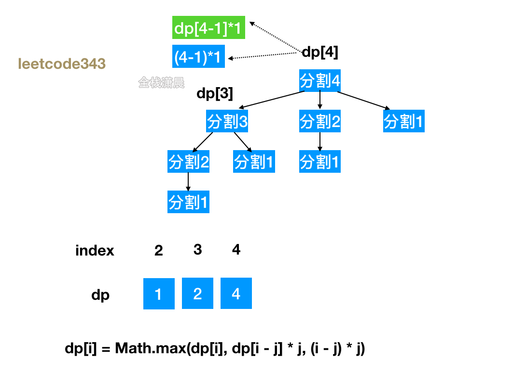

- 思路：`dp[i]`为正整数i拆分之后的最大乘积，循环数字n，对每个数字进行拆分，取最大的乘积，状态转移方程：`dp[i] = Math.max(dp[i], dp[i - j] * j, (i - j) * j)`，`j*(i-j)`表示把i拆分为`j`和i-j两个数相乘，`j * dp[i-j]`表示把`i`拆分成`j`和继续把`(i-j)`这个数拆分，取`(i-j)`拆分结果中的最大乘积与j相乘
- 复杂度：时间复杂度`O(n^2)`，两层循环。空间复杂度`O(n)`，`dp`数组的空间

js：

```js
var integerBreak = function (n) {
    //dp[i]为正整数i拆分之后的最大乘积
    let dp = new Array(n + 1).fill(0);
    dp[2] = 1;

    for (let i = 3; i <= n; i++) {
        for (let j = 1; j < i; j++) {
            //j*(i-j)表示把i拆分为j和i-j两个数相乘
            //j*dp[i-j]表示把i拆分成j和继续把(i-j)这个数拆分，取(i-j)拆分结果中的最大乘积与j相乘
            dp[i] = Math.max(dp[i], dp[i - j] * j, (i - j) * j);
        }
    }
    return dp[n];
};
```

java：

```js
class Solution {
    public int integerBreak(int n) {
        int[] dp = new int[n+1]; 
        dp[2] = 1;//初始状态
        for (int i = 3; i <= n; ++i) {
            for (int j = 1; j < i - 1; ++j) {
                dp[i] = Math.max(dp[i], Math.max(j * (i - j), j * dp[i - j]));
            }
        }
        return dp[n];
    }
}
```

#### 0-1背包问题

0-1背包问题指的是有`n`个物品和容量为`j`的背包，`weight`数组中记录了`n`个物品的重量，位置`i`的物品重量是weight[i]，`value`数组中记录了`n`个物品的价值，位置i的物品价值是`vales[i]`，每个物品只能放一次到背包中，问将那些物品装入背包，使背包的价值最大。

举例：

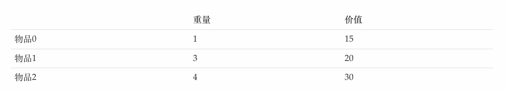

我们用动态规划的方式来做

- 状态定义：`dp[i][j]` 表示从前i个物品里任意取，放进容量为j的背包，价值总和最大是多少

- 状态转移方程： `dp[i][j] = max(dp[i - 1][j]`, `dp[i - 1][j - weight[i]] + value[i])`; 每个物品有放入背包和不放入背包两种情况

  1. 当`j - weight[i]<0`：表示装不下`i`号元素了，不放入背包，此时`dp[i][j] = dp[i - 1][j]`，dp[i] [j]取决于前`i-1`中的物品装入容量为`j`的背包中的最大价值
  2. 当`j - weight[i]>=0`：可以选择放入或者不放入背包。 放入背包则：`dp[i][j] = dp[i - 1][j - weight[i]] + value[i]`， `dp[i - 1][j - weight[i]]` 表示`i-1`中的物品装入容量为`j-weight[i]`的背包中的最大价值，然后在加上放入的物品的价值`value[i]`就可以将状态转移到`dp[i][j]`。 不放入背包则：`dp[i][j] = dp[i - 1] [j]`，在这两种情况中取较大者。

- 初始化dp数组：`dp[i][0]`表示背包的容积为0，则背包的价值一定是0，`dp[0][j]`表示第0号物品放入背包之后背包的价值

  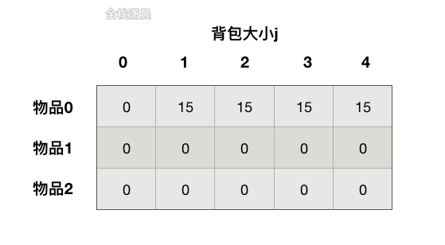

- 最终需要返回值：就是dp数组的最后一行的最后一列

循环完成之后的dp数组如下图

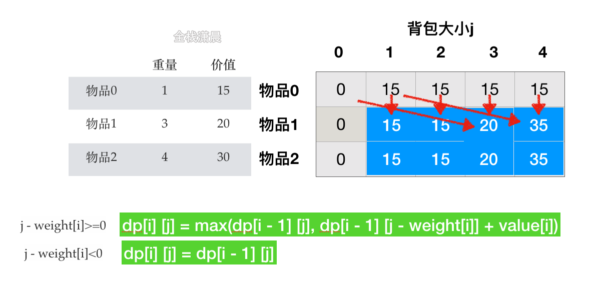

js：

```js
function testWeightBagProblem(wight, value, size) {
    const len = wight.length,
        dp = Array.from({ length: len + 1 }).map(//初始化dp数组
            () => Array(size + 1).fill(0)
        );
    //注意我们让i从1开始，因为我们有时会用到i - 1，为了防止数组越界
    //所以dp数组在初始化的时候，长度是wight.length+1
    for (let i = 1; i <= len; i++) {
        for (let j = 0; j <= size; j++) {
            //因为weight的长度是wight.length+1，并且物品下标从1开始，所以这里i要减1
            if (wight[i - 1] <= j) {
                dp[i][j] = Math.max(
                    dp[i - 1][j],
                    value[i - 1] + dp[i - 1][j - wight[i - 1]]
                )
            } else {
                dp[i][j] = dp[i - 1][j];
            }
        }
    }

    return dp[len][size];
}

function test() {
    console.log(testWeightBagProblem([1, 3, 4], [15, 20, 30], 4));
}

test();
```

#### 状态压缩

根据状态转移方程`dp[i][j] = max(dp[i - 1][j], dp[i - 1][j - weight[i]] + value[i])`，第i行只与第i-1行状态相关，所以我们可以用滚动数组进行状态压缩，其次我们注意到，j只与j前面的状态相关，所以只用一个数组从后向前计算状态就可以了。

[动画过大，点击查看](https://xiaochen1024.com/20211118135529.gif)

```js
function testWeightBagProblem2(wight, value, size) {
    const len = wight.length,
        dp = Array(size + 1).fill(0);
    for (let i = 1; i <= len; i++) {
        //从后向前计算，如果从前向后的话，最新的值会覆盖老的值，导致计算结果不正确
      	//dp[i][j] = Math.max(dp[i - 1][j], dp[i - 1][j - wight[i - 1]] + value[i - 1])
        for (let j = size; j >= wight[i - 1]; j--) {
            dp[j] = Math.max(dp[j], dp[j - wight[i - 1]] + value[i - 1] );
        }
    }
    return dp[size];
}
```

#### [416. 分割等和子集](https://leetcode-cn.com/problems/partition-equal-subset-sum/) （medium）

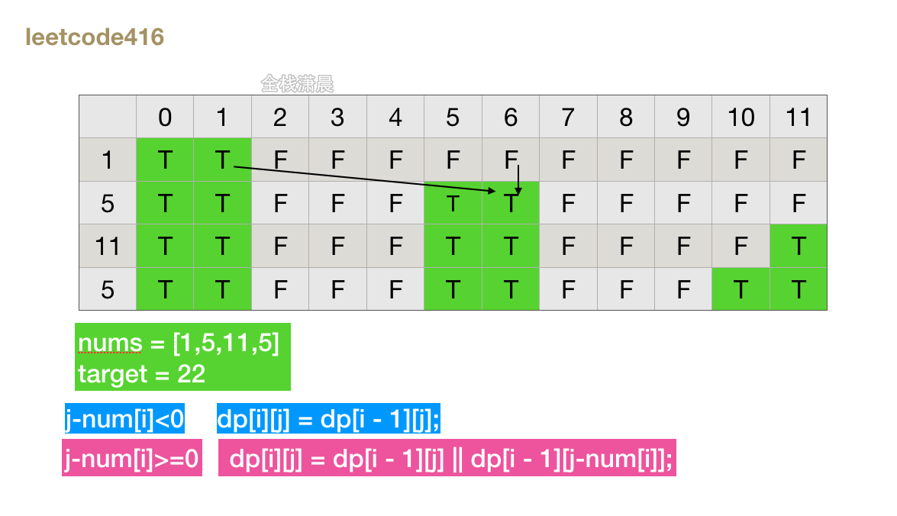

- 思路：本题可以看成是0-1背包问题，给一个可装载重量为 `sum / 2` 的背包和 N 个物品，每个物品的重量记录在 nums 数组中，问是否在一种装法，能够恰好将背包装满？`dp[i][j]`表示前i个物品是否能装满容积为j的背包，当`dp[i][j]`为true时表示恰好可以装满。每个数都有放入背包和不放入两种情况，分析方法和0-1背包问题一样。
- 复杂度：时间复杂度`O(n*sum)`，n是nums数组长度，sum是nums数组元素的和。空间复杂度`O(n * sum)`，状态压缩之后是`O(sum)`

js：

```js
//可以看成是0-1背包问题，给一个可装载重量为 sum / 2 的背包和 N 个物品，
//每个物品的重量记录在 nums 数组中，问是否在一种装法，能够恰好将背包装满？
var canPartition = function (nums) {
    let sum = 0
    let n = nums.length
    for (let i = 0; i < n; i++) {
        sum += nums[i]
    }
    if (sum % 2 !== 0) {//如果是奇数，那么分割不了，直接返回false
        return false
    }
    sum = sum / 2
    //dp[i][j]表示前i个物品是否能装满容积为j的背包，当dp[i][j]为true时表示恰好可以装满
    //最后求的是 dp[n][sum] 表示前n个物品能否把容量为sum的背包恰好装满
    //dp数组长度是n+1，而且是二维数组，第一维表示物品的索引，第二个维度表示背包大小
    let dp = new Array(n + 1).fill(0).map(() => new Array(sum + 1).fill(false))
    //dp数组初始化，dp[..][0] = true表示背包容量为0，这时候就已经装满了，
    //dp[0][..] = false 表示没有物品，肯定装不满
    for (let i = 0; i <= n; i++) {
        dp[i][0] = true
    }
    for (let i = 1; i <= n; i++) {//i从1开始遍历防止取dp[i - 1][j]的时候数组越界
        let num = nums[i - 1]
        //j从1开始，j为0的情况已经在dp数组初始化的时候完成了
        for (let j = 1; j <= sum; j++) {
            if (j - num < 0) {//背包容量不足 不能放入背包
                dp[i][j] = dp[i - 1][j];//dp[i][j]取决于前i-1个物品是否能前好装满j的容量
            } else {
                //dp[i - 1][j]表示不装入第i个物品
                //dp[i - 1][j-num]表示装入第i个，此时需要向前看前i - 1是否能装满j-num
                //和背包的区别，这里只是返回true和false 表示能否装满，不用计算价值
                dp[i][j] = dp[i - 1][j] || dp[i - 1][j - num];
            }
        }
    }
    return dp[n][sum]
};

//状态转移方程 F[i, target] = F[i - 1, target] || F[i - 1, target - nums[i]]
//第 n 行的状态只依赖于第 n-1 行的状态
//状态压缩
var canPartition = function (nums) {
    let sum = nums.reduce((acc, num) => acc + num, 0);
    if (sum % 2) {
        return false;
    }
    sum = sum / 2;
    const dp = Array.from({ length: sum + 1 }).fill(false);
    dp[0] = true;

    for (let i = 1; i <= nums.length; i++) {
        //从后向前计算，如果从前向后的话，最新的值会覆盖老的值，导致计算结果不正确
        for (let j = sum; j > 0; j--) {
            dp[j] = dp[j] || (j - nums[i] >= 0 && dp[j - nums[i]]);
        }
    }

    return dp[sum];
};
```

java：

```java
public class Solution {

    public boolean canPartition(int[] nums) {
        int len = nums.length;
        int sum = 0;
        for (int num : nums) {
            sum += num;
        }
        if ((sum & 1) == 1) {
            return false;
        }

        int target = sum / 2;
        boolean[][] dp = new boolean[len][target + 1];
        
        dp[0][0] = true;

        if (nums[0] <= target) {
            dp[0][nums[0]] = true;
        }
        for (int i = 1; i < len; i++) {
            for (int j = 0; j <= target; j++) {
                dp[i][j] = dp[i - 1][j];
                if (nums[i] <= j) {
                    dp[i][j] = dp[i - 1][j] || dp[i - 1][j - nums[i]];
                }
            }

            if (dp[i][target]) {
                return true;
            }
        }
        return dp[len - 1][target];
    }
}

//状态压缩
public class Solution {

    public boolean canPartition(int[] nums) {
        int len = nums.length;
        int sum = 0;
        for (int num : nums) {
            sum += num;
        }
        if ((sum & 1) == 1) {
            return false;
        }

        int target = sum / 2;
        boolean[] dp = new boolean[target + 1];
        dp[0] = true;

        if (nums[0] <= target) {
            dp[nums[0]] = true;
        }
        for (int i = 1; i < len; i++) {
            for (int j = target; nums[i] <= j; j--) {
                if (dp[target]) {
                    return true;
                }
                dp[j] = dp[j] || dp[j - nums[i]];
            }
        }
        return dp[target];
    }
}
```

#### [198. 打家劫舍](https://leetcode-cn.com/problems/house-robber/) （medium）

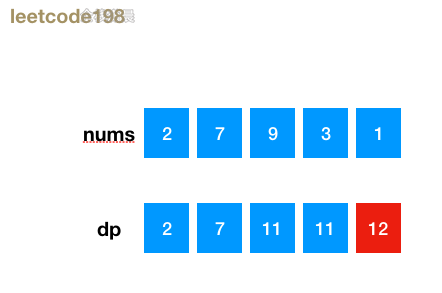

- 思路：

  ```
  dp[i]
  ```

  表示0-i能偷的最大金额，

  ```
  dp[i]
  ```

  由两种情况中的最大值转移过来

  1. `dp[i - 2] + nums[i]` 表示偷当前位置，那么i-1的位置不能偷，而且需要加上`dp[i-2]`,也就是前i-2个房间的金钱
  2. `dp[i - 1]`表示偷当前位置，只偷i-1的房间

- 复杂度：时间复杂度`O(n)`，遍历一次数组，空间复杂度`O(1)`，状态压缩之后是`O(1)`，没有状态压缩是`O(n)`

js：

```js
//dp[i]表示0-i能偷的最大金额
const rob = (nums) => {
    const len = nums.length;
    const dp = [nums[0], Math.max(nums[0], nums[1])]; //初始化dp数组的前两项
    for (let i = 2; i < len; i++) {
        //从第三个位置开始遍历
        //dp[i - 2] + nums[i] 表示偷当前位置，那么i-1的位置不能偷，
      	//而且需要加上dp[i-2],也就是前i-2个房间的金钱
        //dp[i - 1]表示偷当前位置，只偷i-1的房间
        dp[i] = Math.max(dp[i - 2] + nums[i], dp[i - 1]);
    }
    return dp[len - 1]; //返回最后最大的项
};

//状态压缩
var rob = function (nums) {
    if(nums.length === 1) return nums[0]
    let len = nums.length;
    let dp_0 = nums[0],
        dp_1 = Math.max(nums[0], nums[1]);
    let dp_max = dp_1;
    for (let i = 2; i < len; i++) {
        dp_max = Math.max(
            dp_1, //不抢当前家
            dp_0 + nums[i] //抢当前家
        );
        dp_0 = dp_1; //滚动交换变量
        dp_1 = dp_max;
    }
    return dp_max;
};
```

java:

```java
class Solution {
    public int rob(int[] nums) {
        if (nums == null || nums.length == 0) {
            return 0;
        }
        int length = nums.length;
        if (length == 1) {
            return nums[0];
        }
        int[] dp = new int[length];
        dp[0] = nums[0];
        dp[1] = Math.max(nums[0], nums[1]);
        for (int i = 2; i < length; i++) {
            dp[i] = Math.max(dp[i - 2] + nums[i], dp[i - 1]);
        }
        return dp[length - 1];
    }
}

//状态压缩
class Solution {
    public int rob(int[] nums) {
        if (nums == null || nums.length == 0) {
            return 0;
        }
        int len = nums.length;
        int dp_0 = 0,
            dp_1 = nums[0];
        int dp_max = nums[0];
        for (int i = 2; i <= len; i++) {
            dp_max = Math.max(
                dp_1, //不抢当前家
                dp_0 + nums[i - 1] //抢当前家
            );
            dp_0 = dp_1; //滚动交换变量
            dp_1 = dp_max;
        }
        return dp_max;
    }
}
```

#### [64. 最小路径和](https://leetcode-cn.com/problems/minimum-path-sum/) (medium)

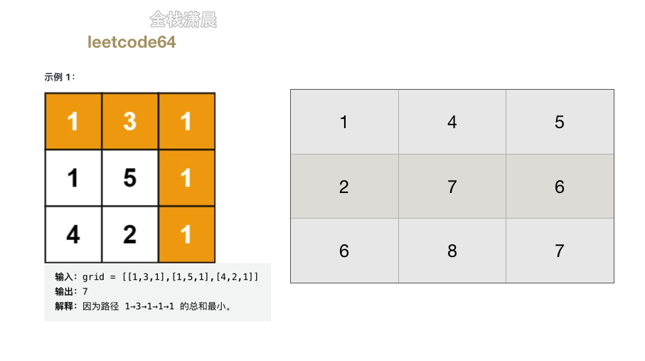

- 思路：`dp[i][j]`表示从矩阵左上角到`（i，j）`这个网格对应的最小路径和，只要从上到下，从左到右遍历网格，当前最小路径和就是当前的数值加上上面和左边左小的。
- 复杂度：时间复杂度`O(mn)`，m、n分别是矩阵的长和宽。空间复杂度如果原地修改是`O(1)`，如果新建dp数组就是`O(mn)`

js：

```js
var minPathSum = function(dp) {
    let row = dp.length, col = dp[0].length

    for(let i = 1; i < row; i++)//初始化第一列
        dp[i][0] += dp[i - 1][0]

    for(let j = 1; j < col; j++)//初始化第一行
        dp[0][j] += dp[0][j - 1]

    for(let i = 1; i < row; i++)
        for(let j = 1; j < col; j++)
            dp[i][j] += Math.min(dp[i - 1][j], dp[i][j - 1])//取上面和左边最小的
    
    return dp[row - 1][col - 1]
};
```

java：

```java
class Solution {
    public int minPathSum(int[][] grid) {
        if (grid == null || grid.length == 0 || grid[0].length == 0) {
            return 0;
        }
        int rows = grid.length, columns = grid[0].length;
        int[][] dp = new int[rows][columns];
        dp[0][0] = grid[0][0];
        for (int i = 1; i < rows; i++) {
            dp[i][0] = dp[i - 1][0] + grid[i][0];
        }
        for (int j = 1; j < columns; j++) {
            dp[0][j] = dp[0][j - 1] + grid[0][j];
        }
        for (int i = 1; i < rows; i++) {
            for (int j = 1; j < columns; j++) {
                dp[i][j] = Math.min(dp[i - 1][j], dp[i][j - 1]) + grid[i][j];
            }
        }
        return dp[rows - 1][columns - 1];
    }
}
```