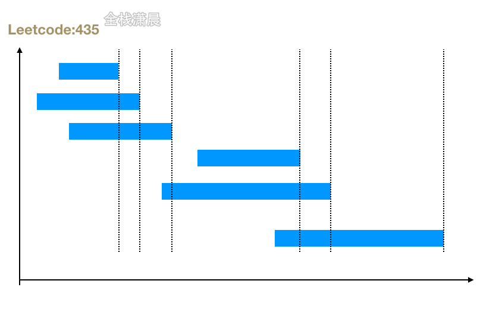

## 搞定大厂算法面试之leetcode精讲4.贪心

#### 什么是贪心算法

贪心法，又称贪心算法，贪婪算法，在对问题求解时，总是做出在当前看来最好的选择，期望通过每个阶段的局部最优选择达到全局最优，但结果不一定最优

适用场景：简单的说，问题能够分解成子问题来解决，子问题的最优解能递推到最终问题的最优解，就能用贪心算法的到最后的最优解，这种子问题最优解称为最优子结构

贪心算法与动态规划的不同点在于它对每个子问题的解决方案都做出当前的最优选择，不能回退，而动态规划会保留之前的运算结果，并根据之前的结果进行选择，有回退的功能，贪心是动态规划的理想化的情况。

#### [122. 买卖股票的最佳时机 II](https://leetcode-cn.com/problems/best-time-to-buy-and-sell-stock-ii/)（medium）

##### 方法1.动态规划


- 思路：根据题意只能持有一只股票，不限制交易次数，我们可以用动态规划来做，首先定义状态，题中有两个状态，一个是天数，一个是是否持有股票，所以我们定义`dp[i][0]`表示第 i天交易完后手里没有股票的最大利润，`dp[i][1]` 表示第 i天交易完后手里持有一支股票的最大利润，接下来就是定义状态转移方程：

  1. 假如当前的状态是`dp[i][0]`，表示手中没股票，则可由前一天的两种情况转移过来，第一种是`dp[i-1][0]`，表示前一天手里没股票，而且今天没做任何操作。第二种是`dp[i-1][1]`，表示前一天持有股票，但是今天卖了，所以收益是`dp[i-1][1]+prices[i]`，我们需要求出这两种情况下的最大值就是最大利润，状态转移方程就是：

     `dp[i][0] = Math.max(dp[i - 1][0], dp[i - 1][1] + prices[i]);`

  2. 假如当前的状态是`dp[i][1]`，表示手中有股票，则可由前一天的两种情况转移过来，第一种是`dp[i−1][1]`，表示前一天手中有股票，即是今天没做任何操作。第二种是`dp[i−1][0]`，表示前一天没有股票，但是今天买进了，所以收益是`dp[i-1][1]-prices[i]`，我们需要求出这两种情况下的最大值就是最大利润，状态转移方程就是：

     `dp[i][1] = Math.max(dp[i - 1][1], dp[i - 1][0] - prices[i]);`

  由上面的状态转移方程我们知道，当前天的最大收益，只与前一天的状态相关，所以我们可以不用定义二维数组来存放状态，只需要将`dp[i - 1][0]`，`dp[i - 1][1]`存放在变量中。

- 复杂度分析：时间复杂度：`O(n)`，n是数组长度，每天有持有股票或者没持有两种状态，一共2n的状态转移次数，时间复杂度就是`O(2n)`，时间复杂度和常系数无关，所以时间复杂度就是`O(n)`。空间复杂度`O(n)`，因为要开辟n的空间存放状态，虽然是二维数组，但是第二维是常数。如果进行了状态压缩，空间复杂度可以优化到O(1)

js:

```js
var maxProfit = function (prices) {
    const n = prices.length;
    const dp = new Array(n).fill(0).map((v) => new Array(2).fill(0)); //初始化状态数组
    (dp[0][0] = 0), (dp[0][1] = -prices[0]); //3.定义初始值
    for (let i = 1; i < n; ++i) {
        //1.确定状态
        //2.推导状态转移方程
        //当前没持有股票，可由前一天的两种状态转移过了，
      	//1是前一天没持有，今天不动，2是前一天持有，今天卖掉，求这两种情况的较大值
        dp[i][0] = Math.max(dp[i - 1][0], dp[i - 1][1] + prices[i]);
        //当前持有股票，可由前一天的两种状态转移过了，
      	//1是前一天持有，今天不动，2是前一天没持有，今天买入，求这两种情况的较大值
        dp[i][1] = Math.max(dp[i - 1][1], dp[i - 1][0] - prices[i]);
    }
    //4.确定输出值
    return dp[n - 1][0]; //返回第n-1天的最大值
};

//空间压缩
var maxProfit = function (prices) {
    const n = prices.length;
    let dp0 = 0,
        dp1 = -prices[0];
    for (let i = 1; i < n; ++i) {
        let newDp0 = Math.max(dp0, dp1 + prices[i]);
        let newDp1 = Math.max(dp1, dp0 - prices[i]);
        dp0 = newDp0;
        dp1 = newDp1;
    }
    return dp0;
};
```

Java:

```java
class Solution {
    public int maxProfit(int[] prices) {
        int n = prices.length;
        int[][] dp = new int[n][2];
        dp[0][0] = 0;
        dp[0][1] = -prices[0];
        for (int i = 1; i < n; ++i) {
            dp[i][0] = Math.max(dp[i - 1][0], dp[i - 1][1] + prices[i]);
            dp[i][1] = Math.max(dp[i - 1][1], dp[i - 1][0] - prices[i]);
        }
        return dp[n - 1][0];
    }
}

//空间压缩
class Solution {
    public int maxProfit(int[] prices) {
        int n = prices.length;
        int dp0 = 0, dp1 = -prices[0];
        for (int i = 1; i < n; ++i) {
            int newDp0 = Math.max(dp0, dp1 + prices[i]);
            int newDp1 = Math.max(dp1, dp0 - prices[i]);
            dp0 = newDp0;
            dp1 = newDp1;
        }
        return dp0;
    }
}
```

##### 方法2.贪心


- 思路：因为不限制交易次数，只要今天价格比昨天高，就交易，利润为正累加，最后的和就是最大的利润，注意第一天是没有利润的，这道题之所以可以用贪心是因为**局部最优：收集每天的正利润，可以推导出，全局最优：求得最大利润**。
- 复杂度分析：时间复杂度`O(n)`，n是数组的长度。空间复杂度是`O(1)`

js:

```js
var maxProfit = function (prices) {
    let ans = 0;
    let n = prices.length;
    for (let i = 1; i < n; ++i) {
        //今天价格和昨天的差值是否为正，如果为正累加进去，为负则加0
        ans += Math.max(0, prices[i] - prices[i - 1]);
    }
    return ans;
};
```

Java:

```java
class Solution {
    public int maxProfit(int[] prices) {
        int ans = 0;
        int n = prices.length;
        for (int i = 1; i < n; ++i) {
            ans += Math.max(0, prices[i] - prices[i - 1]);
        }
        return ans;
    }
}
```

#### [455. 分发饼干](https://leetcode-cn.com/problems/assign-cookies/) (easy)

#### 

- 思路：大尺寸的饼干既可以满足胃口大的孩子也可以满足胃口小的孩子，那么就应该优先满足胃口大的。排序两个数组，从右到左遍历，用大饼干首先满足胃口大的小孩
- 复杂度：时间复杂度`O(mlogm + nlogn)`。空间复杂度`O(logm + logn)`

js：

```js
var findContentChildren = function (g, s) {
    g = g.sort((a, b) => a - b);
    s = s.sort((a, b) => a - b); //排序数组
    let result = 0;
    let index = s.length - 1;
    for (let i = g.length - 1; i >= 0; i--) {
        //从胃口大的小孩开始满足
        if (index >= 0 && s[index] >= g[i]) {
            result++; //结果加1
            index--;
        }
    }
    return result;
};
```

java：

```java
class Solution {
    public int findContentChildren(int[] g, int[] s) {
        Arrays.sort(g);
        Arrays.sort(s);
        int index = 0;
        int result = 0;
        for (int i = 0; i < s.length && index < g.length; i++) {
            if (s[i] >= g[index]) {
                index++;
                result++;
            }
        }
        return result;
    }
}
```

#### [435. 无重叠区间](https://leetcode-cn.com/problems/non-overlapping-intervals/) (medium)

##### 方法1.动态规划


- 思路：`dp[i]`表示前i个区间中最大不重合区间的个数，首先将区间数组按左边界排序，找出intervals中最多有多少个不重复的区间，动态规划方程`dp[i] = Math.max(dp[i], dp[j] + 1)`。intervals的长度减去最多的不重复的区间 就是最少删除区间的个数
- 复杂度：时间复杂度`O(n^2)`，两层嵌套循环leetcode执行超时 复杂度过高。空间复杂度`O(n)`，dp数组的空间

js：

```js
//leetcode执行超时 复杂度过高
var eraseOverlapIntervals = function (intervals) {
    if (!intervals.length) {
        return 0;
    }

    intervals.sort((a, b) => a[0] - b[0]); //按左边界排序
    const n = intervals.length;
    const dp = new Array(n).fill(1); //初始化dp数组

    for (let i = 1; i < n; i++) {
        for (let j = 0; j < i; j++) {
            //循环i,j找出intervals中最多有多少个不重复的区间
            //j的右边界小于i的左边界 相当于多出了一个不重合区间
            if (intervals[j][1] <= intervals[i][0]) {
                dp[i] = Math.max(dp[i], dp[j] + 1); //更新dp[i]
            }
        }
    }
    return n - Math.max(...dp); //n减去最多的不重复的区间 就是最少删除区间的个数
};
```

java：

```java
class Solution {
    public int eraseOverlapIntervals(int[][] intervals) {
        if (intervals.length == 0) {
            return 0;
        }
        
        Arrays.sort(intervals, new Comparator<int[]>() {
            public int compare(int[] interval1, int[] interval2) {
                return interval1[0] - interval2[0];
            }
        });

        int n = intervals.length;
        int[] dp = new int[n];
        Arrays.fill(dp, 1);
        for (int i = 1; i < n; ++i) {
            for (int j = 0; j < i; ++j) {
                if (intervals[j][1] <= intervals[i][0]) {
                    dp[i] = Math.max(dp[i], dp[j] + 1);
                }
            }
        }
        return n - Arrays.stream(dp).max().getAsInt();
    }
}
```

##### 方法2.贪心



- 思路：intervals按右边界排序，然后从左往右遍历，右边界结束的越早，留给后面的区间的空间就越大，不重合的区间个数就越多，intervals的长度减去最多的不重复的区间 就是最少删除区间的个数
- 复杂度：时间复杂度`O(nlogn)`，数组排序`O(nlogn)`，循环一次数组`O(n)`。空间复杂度`O(logn)`，排序需要的栈空间

js：

```js
var eraseOverlapIntervals = function (intervals) {
    if (!intervals.length) {
        return 0;
    }

    //按右边界排序，然后从左往右遍历，右边界结束的越早，留给后面的区间的空间就越大，不重合的区间个数就越多
    intervals.sort((a, b) => a[1] - b[1]);

    const n = intervals.length;
    let right = intervals[0][1]; //right初始化为第一个区间的右边界
    let ans = 1; //最多的不重合区间的个数
    for (let i = 1; i < n; ++i) {
        //循环区间数组
        if (intervals[i][0] >= right) {
            //当区间的左边界大于上一个区间的右边界的时候 说明是一对不重合区间
            ++ans; //ans加1
            right = intervals[i][1]; //更新right
        }
    }
    return n - ans; //intervals的长度减去最多的不重复的区间 就是最少删除区间的个数
};
```

java：

```java
class Solution {
    public int eraseOverlapIntervals(int[][] intervals) {
        if (intervals.length == 0) {
            return 0;
        }
        
        Arrays.sort(intervals, new Comparator<int[]>() {
            public int compare(int[] interval1, int[] interval2) {
                return interval1[1] - interval2[1];
            }
        });

        int n = intervals.length;
        int right = intervals[0][1];
        int ans = 1;
        for (int i = 1; i < n; ++i) {
            if (intervals[i][0] >= right) {
                ++ans;
                right = intervals[i][1];
            }
        }
        return n - ans;
    }
}
```

能不能用贪心算法需要满足贪心选择性，贪心算法正确的的证明可以用反证法

以这一题为例：

- 我们的思路是保留最多的不重合的区间，所以按照区间结尾排序，区间结尾结束的越早且和前一个区间不重叠的，就加入最多不重复的区间中，我们称为算法a，假如算法a中的某一个步骤是选择区间`[a, b]`，我们称为区间A。
- 假设这个选择不正确，也就是说算法a得到的不是最优解。
- 我们假设存在另一个算法c能得到最优解，算法c中的一个步骤是选择区间`[c, d]`，我们称为区间C，使得它是最优解中的一个区间，其中`d>b`,因为算法a选择的是结尾最先结束且不重合的区间，如果算法a不正确，又因为区间数组中的区间是固定的，则其他算法c肯定存在`d>b`的情况。
- 我们用区间A替换区间C完全不影响算法c的结果，因为`b<d`,所以不影响区间C后面区间的结果。所以我们选择了区间A也构成了一个最优解。而我们假设的是选择区间A不是最优解，所以和之前的假设矛盾，所以算法a是正确的贪心算法

#### [55. 跳跃游戏](https://leetcode-cn.com/problems/jump-game/) （medium）

##### 方法1.动态规划

- 思路：`dp[i]`表示能否到达位置i，对每个位置i判断能否通过前面的位置跳跃过来，当前位置j能达到，并且当前位置j加上能到达的位置如果超过了i，那`dp[i]`更新为ture，便是i位置也可以到达。
- 复杂度：时间复杂度`O(n^2)`，空间复杂度`O(n)`

js:

```js
function canJump(nums) {
    let dp = new Array(nums.length).fill(false); //初始化dp
    dp[0] = true; //第一项能到达
    for (let i = 1; i < nums.length; i++) {
        for (let j = 0; j < i; j++) {
            //当前位置j能达到，并且当前位置j加上能到达的位置如果超过了i，那dp[i]更新为ture，便是i位置也可以到达
            if (dp[j] && nums[j] + j >= i) {
                dp[i] = true;
                break;
            }
        }
    }

    return dp[nums.length - 1];
}
```

java：

```java
class Solution {
    public boolean canJump(int[] nums) {
        boolean[] dp = new boolean[nums.length];
        
        dp[0] = true;

        for (int i = 1; i < nums.length; i++) {
            for (int j = 0; j < i; j++) {
                if (dp[j] && nums[j] + j >= i) {
                    dp[i] = true;
                    break;
                }
            }
        }

        return dp[nums.length - 1];
    }
}
```

##### 方法2.贪心


- 思路：不用考虑每一步跳跃到那个位置，而是尽可能的跳跃到最远的位置，看最多能覆盖的位置，不断更新能覆盖的距离。
- 复杂度：时间复杂度`O(n)`，遍历一边。空间复杂度`O(1)`

js：

```js
var canJump = function (nums) {
    if (nums.length === 1) return true; //长度为1 直接就是终点
    let cover = nums[0]; //能覆盖的最远距离
    for (let i = 0; i <= cover; i++) {
        cover = Math.max(cover, i + nums[i]); //当前覆盖距离cover和当前位置加能跳跃的距离中取一个较大者
        if (cover >= nums.length - 1) {
            //覆盖距离超过或等于nums.length - 1 说明能到达终点
            return true;
        }
    }
    return false; //循环完成之后 还没返回true 就是不能达到终点
};
```

java：

```java
class Solution {
    public boolean canJump(int[] nums) {
        if (nums.length == 1) {
            return true;
        }
        int cover = nums[0];
        for (int i = 0; i <= cover; i++) {
            cover = Math.max(cover, i + nums[i]);
            if (cover >= nums.length - 1) {
                return true;
            }
        }
        return false;
    }
}
```

#### [881. 救生艇](https://leetcode-cn.com/problems/boats-to-save-people/) （medium）


- 思路：题意是一条船只能坐2人，要求尽可能的用少的船装下这些人。所以可以用贪心策略。让更多的人组成2人组，而且这些2人组的两人重量加起来不超过船的载重。所以可以先排序people，用双指针从两边向中间遍历，让重的人和轻的人组成2人组，如果当前最重的人和最轻的人的重量和超过了载重，那只能让重的人先乘一条船。
- 复杂度：时间复杂度`O(nlogn)`，排序的复杂度。空间复杂度`O(logn)`，排序的栈空间

js：

```js
var numRescueBoats = function (people, limit) {
    people.sort((a, b) => (a - b));
    let ans = 0,
        left = 0,//左指针初始化在0的位置
        right = people.length - 1 //右指针初始化在people.length - 1的位置
    while (left <= right) {//两指针向中间靠拢 遍历
        //当people[left] + people[right--]) <= limit 表示左右两边的人可以一起坐船 然后让left++ right--
        //如果两人坐不下，那只能让重的人先坐一条船 也就是让right--
        if ((people[left] + people[right--]) <= limit) {
            left++
        }
      	
        ans++
    }
    return ans
};
```

java：

```java
class Solution {
    public int numRescueBoats(int[] people, int limit) {
        Arrays.sort(people);
        int ans = 0,
            left = 0,
            right = people.length - 1;
        while (left <= right) {
            if ((people[left] + people[right--]) <= limit) {
                left++;
            }
            ans++;
        }
        return ans;
    }
}
```

#### [452. 用最少数量的箭引爆气球](https://leetcode-cn.com/problems/minimum-number-of-arrows-to-burst-balloons/) (medium)


- 思路：区间按照结尾从小到大排序，循环数组，如果后面一个区间的开始大于前一个区间的结尾 就需要新增一支箭。
- 复杂度：时间复杂度`O(nlogn)`，排序的复杂度`O(nlogn)`，循环数组的复杂度`O(n)`。空间复杂度`O(logn)`，排序栈空间

js：

```js
var findMinArrowShots = function (points) {
    if (!points.length) {
        return 0;
    }

    points.sort((a, b) => a[1] - b[1]); //按照区间结尾排序
    let pos = points[0][1];
    let ans = 1;
    for (let balloon of points) {
        if (balloon[0] > pos) {
            //如果后面一个区间的开始大于前一个区间的结尾 就需要新增一支箭
            pos = balloon[1]; //更新pos为新的区间的结尾
            ans++;
        }
    }
    return ans;
};
```

java：

```java
class Solution {
    public int findMinArrowShots(int[][] points) {
        if (points.length == 0) {
            return 0;
        }
        Arrays.sort(points, new Comparator<int[]>() {
            public int compare(int[] point1, int[] point2) {
                if (point1[1] > point2[1]) {
                    return 1;
                } else if (point1[1] < point2[1]) {
                    return -1;
                } else {
                    return 0;
                }
            }
        });
        int pos = points[0][1];
        int ans = 1;
        for (int[] balloon: points) {
            if (balloon[0] > pos) {
                pos = balloon[1];
                ++ans;
            }
        }
        return ans;
    }
}
```

#### [134. 加油站](https://leetcode-cn.com/problems/gas-station/)(medium)


- 思路：首先判断总油量是否小于总油耗，如果是则肯定不能走一圈。如果否，那肯定能跑一圈。接下来就是循环数组，从第一个站开始，计算每一站剩余的油量，如果油量为负了，就以这个站为起点从新计算。如果到达某一个点为负，说明起点到这个点中间的所有站点都不能到达该点。
- 复杂度：时间复杂度`O(n)`，空间复杂度`O(1)`

js：

```js
var canCompleteCircuit = function (gas, cost) {
    let totalGas = 0;
    let totalCost = 0;
    for (let i = 0; i < gas.length; i++) {
        totalGas += gas[i];
        totalCost += cost[i];
    }
    if (totalGas < totalCost) {//总油量小于总油耗 肯定不能走一圈
        return -1;
    }

    let currentGas = 0;
    let start = 0;
    for (let i = 0; i < gas.length; i++) {
        currentGas = currentGas - cost[i] + gas[i];
        if (currentGas < 0) {//如果到达下一站的时候油量为负数 就以这个站为起点 从新计算
            currentGas = 0;
            start = i + 1;
        }
    }

    return start;
};
```

java：

```java
class Solution {
    public int canCompleteCircuit(int[] gas, int[] cost) {
        int n = gas.length;
        int sum = 0;
        for(int i = 0;i < n;i++){
            sum += gas[i] - cost[i];
        }

        if(sum < 0){
            return -1;
        }

        int currentGas = 0;
        int start = 0;
        for(int i = 0;i < n;i++){
            currentGas += gas[i] - cost[i];
            if(currentGas < 0){
                currentGas = 0;
                start = i + 1;
            }
        }
        return start;
    }
}
```

#### [621. 任务调度器](https://leetcode-cn.com/problems/task-scheduler/) (medium)


- 思路：先排个数最多的任务A，在A的冷却时间内插入其他任务，先计算前n-1行n的间隔的时间大小，再计算和最大次数相同的字母个数，然后累加进ret。最后在tasks的长度和ret中取较大的一个
- 复杂度：时间复杂度`O(n)`，空间复杂度`O(1)`

js：

```js
function leastInterval(tasks, n) {
    let arr = Array(26).fill(0);
    for (let c of tasks) {
        //统计各个字母出现的次数
        arr[c.charCodeAt() - "A".charCodeAt()]++;
    }
    let max = 0;
    for (let i = 0; i < 26; i++) {
        //找到最大次数
        max = Math.max(max, arr[i]);
    }
    let ret = (max - 1) * (n + 1); //计算前n-1行n的间隔的时间大小
    for (let i = 0; i < 26; i++) {
        //计算和最大次数相同的字母个数，然后累加进ret
        if (arr[i] == max) {
            ret++;
        }
    }
    return Math.max(ret, tasks.length); //在tasks的长度和ret中取较大的一个
}
```

java：

```java
class Solution {
    public int leastInterval(char[] tasks, int n) {
        int[] arr = new int[26];
        for (char c : tasks) {
            arr[c - 'A']++;
        }
        int max = 0;
        for (int i = 0; i < 26; i++) {
            max = Math.max(max, arr[i]);
        }
        int ret = (max - 1) * (n + 1);
        for (int i = 0; i < 26; i++) {
            if (arr[i] == max) {
                ret++;
            }
        }
        return Math.max(ret, tasks.length);
    }
}
```

#### [860. 柠檬水找零](https://leetcode-cn.com/problems/lemonade-change/) (easy)

- 思路：优先找面额大的
- 复杂度：时间复杂度`O(n)`，空间复杂度`O(1)`

js:

```js
var lemonadeChange = function (bills) {
    let five = 0, ten = 0;
    for (const bill of bills) {
        if (bill === 5) {//面值为5 直接可以兑换柠檬水
            five += 1;
        } else if (bill === 10) {//面值为10 兑换柠檬水 还需要找5元
            if (five === 0) {
                return false;
            }
            five -= 1;
            ten += 1;
        } else {//面值为20 兑换柠檬水 需要找3个5元或一个10元一个5元
            if (five > 0 && ten > 0) {
                five -= 1;
                ten -= 1;
            } else if (five >= 3) {
                five -= 3;
            } else {
                return false;
            }
        }
    }
    return true;
};
```

java：

```java
class Solution {
    public boolean lemonadeChange(int[] bills) {
        int five = 0, ten = 0;
        for (int bill : bills) {
            if (bill == 5) {
                five++;
            } else if (bill == 10) {
                if (five == 0) {
                    return false;
                }
                five--;
                ten++;
            } else {
                if (five > 0 && ten > 0) {
                    five--;
                    ten--;
                } else if (five >= 3) {
                    five -= 3;
                } else {
                    return false;
                }
            }
        }
        return true;
    }
}
```