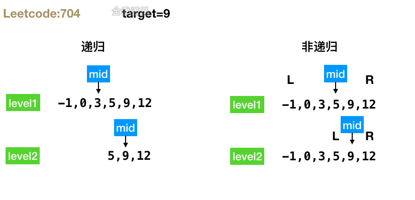
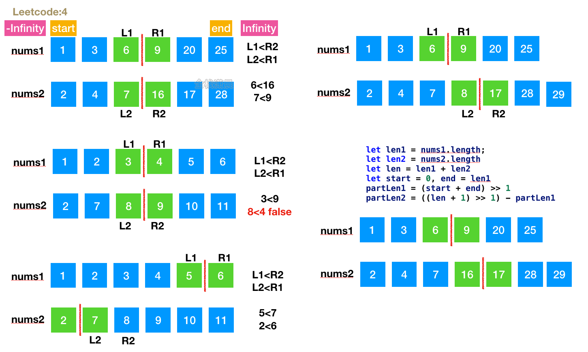
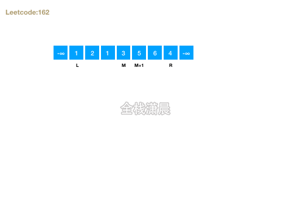
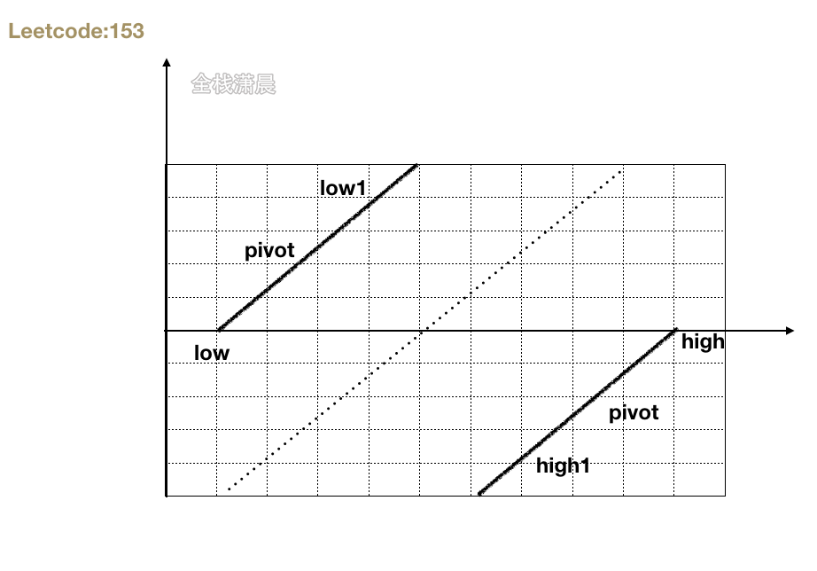

## 搞定大厂算法面试之leetcode精讲5.二分查找

#### 二分搜索

**时间复杂度O(logn)**

**步骤**：

- 从数组中间的元素开始，如果中间的元素正好是目标值，搜索结束
- 如果目标值大于或小于中间的元素，则在大于或小于中间的元素的那一半继续搜索

**代码模版**

```js
//二分查找伪代码模版
while (left <= right) {
  mid = (left + right) / 2;
  if (array[mid] === target) return result;
  else if (array[mid] < target) left = mid + 1;
  else right = mid - 1;
}
```

#### [704. 二分查找](https://leetcode-cn.com/problems/binary-search/) （easy）



##### 方法1:递归

- 思路：先找到中间位置，判断是否是需要寻找的目标值，如果是就返回，不是的话判断目标值和中间元素的大小，然后继续向左右子树递归寻找
- 复杂度：时间复杂度`O(logn)`，空间复杂度`O(logn)`，递归栈大小

js：

```js
var search = function (nums, target) {
    return search_interval(nums, target, 0, nums.length - 1)
};

function search_interval(nums, target, left, right) {
    if (left > right) {
        return -1
    }
    let mid = left + Math.floor((right - left) / 2);
    if (nums[mid] === target) {//判断目标值和中间元素的大小
        return mid
    } else if (nums[mid] < target) {//递归寻找目标元素
        return search_interval(nums, target, mid + 1, right)
    } else {
        return search_interval(nums, target, left, mid - 1)
    }
}
```

java：

```java
class Solution {
    public int search(int[] nums, int target) {
        return search_interval(nums, 0, nums.length - 1, target);
    }
    private int search_interval(int[] nums, int l, int r, int target) {
        if (l > r) {
            return -1;
        }
        int mid = l + (r - l) / 2;
        if (nums[mid] == target) {
            return mid;
        } else if (nums[mid] > target) {
            return search_interval(nums, l, mid - 1, target);
        } else {
            return search_interval(nums, mid + 1, r, target);
        }
    }
}
```

##### 方法2:非递归

- 思路：定义`left`、`right`指针，比较目标元素和中间元素的大小，然后不断缩小左右指针的范围继续寻找目标元素
- 复杂度：时间复杂度`O(logn)`，空间复杂度`O(1)`

js：

```js
var search = function (nums, target) {
    let left = 0,
        right = nums.length - 1;
    while (left <= right) {
        let mid = Math.floor((left + right) / 2);
        if (nums[mid] === target) {
            return mid;
        } else if (target < nums[mid]) {//比较目标和中间元素的大小，然后不断缩小left和rihgt指针的范围
            right = mid - 1;
        } else {
            left = mid + 1;
        }
    }
    return -1;
};
```

java：

```js
class Solution {
    public int search(int[] nums, int target) {
        int low = 0, high = nums.length - 1;
        while (low <= high) {
            int mid = (high - low) / 2 + low;
            int num = nums[mid];
            if (num == target) {
                return mid;
            } else if (num > target) {
                high = mid - 1;
            } else {
                low = mid + 1;
            }
        }
        return -1;
    }
}
```

#### [35. 搜索插入位置](https://leetcode-cn.com/problems/search-insert-position/) (easy)

时间复杂度`O(logn)`，空间复杂度`O(1)`

js:

```js
var searchInsert = function(nums, target) {
    const n = nums.length;
    let left = 0, right = n - 1, ans = n;
    while (left <= right) {
        let mid = ((right - left) >> 1) + left;
        if (target <= nums[mid]) {
            ans = mid;
            right = mid - 1;
        } else {
            left = mid + 1;
        }
    }
    return ans;
};
```

java:

```java
class Solution {
    public int searchInsert(int[] nums, int target) {
        int n = nums.length;
        int left = 0, right = n - 1, ans = n;
        while (left <= right) {
            int mid = ((right - left) >> 1) + left;
            if (target <= nums[mid]) {
                ans = mid;
                right = mid - 1;
            } else {
                left = mid + 1;
            }
        }
        return ans;
    }
}
```

#### [69. Sqrt(x)](https://leetcode-cn.com/problems/sqrtx/)（easy）

##### 方法1:二分法

- 思路：从0-x不断二分，直到
- 复杂度分析：时间复杂度`O(logx)`，即为二分查找需要的次数。空间复杂度`O(1)`

js:

```js
var mySqrt = function (x) {
    let left = 0
    let right = x
    while (left <= right) {
        let mid = left + ((right - left) >> 1)//中间位置索引 x>>1 表示除以2并取整，缩小一下遍历的范围
        if (mid * mid <= x) {
            left = mid + 1
        } else {
            right = mid - 1
        }
    }
    return right
};
```

Java:

```java
class Solution {
    public int mySqrt(int x) {
        int left = 0, right = x, ans = -1;
        while (left <= right) {
            int mid = left + (right - left) / 2;
            if ((long) mid * mid <= x) {
                ans = mid;
                left = mid + 1;
            } else {
                right = mid - 1;
            }
        }
        return ans;
    }
}
```

##### 方法2:牛顿迭代

- 思路：`r = ( r + x / r ) / 2`
- 复杂度分析：时间复杂度`O(logx)`。空间复杂度`O(1)`

js:

```js
var mySqrt = function(x) {
    let r = x

    while (r ** 2 > x) r = ((r + x / r) / 2) | 0//取整

    return r
};
```

Java:

```java
class Solution {
    public int mySqrt(int x) {
        if (x <= 1) {
            return x;
        }
        double l = 0;
        double r = 1;
        while (l != r) {
            l = r;
            r = (r + x / r) / 2;
        }
        return (int)r;
    }
}
```

#### [300. 最长递增子序列](https://leetcode-cn.com/problems/longest-increasing-subsequence/) (medium)

[动画过大，点击查看](https://xiaochen1024.com/20211118145914.gif)

##### 方法1.动态规划

- 思路：`dp[i]`表示选择`nums[i]`，并且以`nums[i]`结尾的最长上升子序列的长度。两层循环，`i：1～nums.length`，

  `j：0～i`，如果`nums[i] > nums[j]`，则构成一个上升对，`dp[i]`就从`dp[i]`, `dp[j]+1`两个种选择较大者，最后返回dp数组总的最大数

- 复杂度分析：时间复杂度`O(n^2)`，n是nums的长度，外层需要循环n次，`dp[i]`需要从`dp[0~i-1]`,所以复杂度是`O(n^2)`。空间复杂度是`O(n)`，即dp数组的空间

js:

```js
const lengthOfLIS = (nums) => {
    let dp = Array(nums.length).fill(1);
    let result = 1;

    for(let i = 1; i < nums.length; i++) {
        for(let j = 0; j < i; j++) {
            if(nums[i] > nums[j]) {//当nums[i] > nums[j]，则构成一个上升对
                dp[i] = Math.max(dp[i], dp[j]+1);//更新dp[i]
            }
        }
        result = Math.max(result, dp[i]);//更新结果
    }

    return result;
};
```

Java:

```js
class Solution {
    public int lengthOfLIS(int[] nums) {
        if (nums.length == 0) {
            return 0;
        }
        int[] dp = new int[nums.length];
        dp[0] = 1;
        int result = 1;
        for (int i = 1; i < nums.length; i++) {
            dp[i] = 1;
            for (int j = 0; j < i; j++) {
                if (nums[i] > nums[j]) {
                    dp[i] = Math.max(dp[i], dp[j] + 1);
                }
            }
            result = Math.max(result, dp[i]);
        }
        return result;
    }
}
```

##### 方法2.二分查找+贪心

- 思路：准备tail数组存放最长上升子序列，核心思想就是越小的数字越要往前放，这样后面就会有更多的数字可以加入tails数组。将nums中的数不断加入tail，当nums中的元素比tail中的最后一个大时 可以放心push进tail，否则进行二分查找，让比较小的数二分查找到合适的位置，让后面有更多的数字与这个数形成上升子序列
- 复杂度：时间复杂度`O(nlogn)`，n为nums的长度，每次二分查找需要logn，所以是总体的复杂度是`O(nlogn)`。空间复杂度是`O(n)` ,tail数组的开销

js:

```javascript
var lengthOfLIS = function (nums) {
    let n = nums.length;
    if (n <= 1) {
        return n;
    }
    let tail = [nums[0]];//存放最长上升子序列数组
    for (let i = 0; i < n; i++) {
        if (nums[i] > tail[tail.length - 1]) {//当nums中的元素比tail中的最后一个大时 可以放心push进tail
            tail.push(nums[i]);
        } else {//否则进行二分查找
            let left = 0;
            let right = tail.length - 1;
            while (left < right) {
                let mid = (left + right) >> 1;
                if (tail[mid] < nums[i]) {
                    left = mid + 1;
                } else {
                    right = mid;
                }
            }
            tail[left] = nums[i];//将nums[i]放置到合适的位置，此时前面的元素都比nums[i]小
        }
    }
    return tail.length;
};
```

Java:

```java
class Solution {
    private int peek(){
        return tail.get(tail.size() - 1);
    }
    private ArrayList<Integer> tail;
    public int lengthOfLIS(int[] nums) {
        int len = nums.length;
        int last = nums[0];
        int max = 1;
        
        tail = new ArrayList<Integer>(len);
        tail.add(nums[0]);

        for(int i = 1 ; i < len ; ++i){
            if( nums[i] > peek() )
                tail.add(nums[i]);
            else{
                int l = 0, r = tail.size() - 1, mid = 0;
                while(l <= r){
                    mid = l + ((r - l) >> 1);
                    if( nums[i] > tail.get(mid) )
                         l = mid + 1;

                    else if( nums[i] < tail.get(mid) )
                         r = mid - 1;
                    else {l = mid; break;}
                 }
                 tail.set(l, nums[i]);

            }
        }
        
        return tail.size();
    }
}
```

#### [4. 寻找两个正序数组的中位数](https://leetcode-cn.com/problems/median-of-two-sorted-arrays/) (hard)

##### 方法1.二分查找



- 思路：数组合并之后在排序的复杂度是`O((m+n) log(m+n))`不符合题意，题目要求的是`O(log (m+n))`，我们一看到logn的复杂度就联想到了二分。二分长度较小的数组，找到这个数组二分的位置，在根据这个二分的位置和两个数组的总长度找到另一个数组二分的位置，比较这两个位置的四个数是否满足交叉小于等于，不满足继续二分，满足就找到了解
- 复杂度：时间复杂度`O(log( min(m，n)) )`，m、n分别是nums1和nums2的长度。每次二分循环的长度都会少一半，只要二分比较短的数组即可。空间复杂度`O(1)`

Js:

```js
var findMedianSortedArrays = (nums1, nums2) => {
    let len1 = nums1.length, len2 = nums2.length
    if (len1 > len2) return findMedianSortedArrays(nums2, nums1)//对nums1和nums2中长度较小的二分
    let len = len1 + len2//总长
    let start = 0, end = len1 //进行二分的开始和结束位置
    let partLen1, partLen2

    while (start <= end) {
        partLen1 = (start + end) >> 1//nums1二分的位置
        partLen2 = ((len + 1) >> 1) - partLen1//nums2二分的位置

        //L1:nums1二分之后左边的位置，L2，nums1二分之后右边的位置
        //R1:nums2二分之后左边的位置，R2，nums2二分之后右边的位置

        //如果左边没字符了，就定义成-Infinity，让所有数都大于它，否则就是nums1二分的位置左边一个
        let L1 = partLen1 === 0 ? -Infinity : nums1[partLen1 - 1]
        //如果左边没字符了，就定义成-Infinity，让所有数都大于它，否则就是nums2二分的位置左边一个
        let L2 = partLen2 === 0 ? -Infinity : nums2[partLen2 - 1]
        //如果右边没字符了，就定义成Infinity，让所有数都小于它，否则就是nums1二分的位置
        let R1 = partLen1 === len1 ? Infinity : nums1[partLen1]
        //如果右边没字符了，就定义成Infinity，让所有数都小于它，否则就是nums1二分的位置
        let R2 = partLen2 === len2 ? Infinity : nums2[partLen2]

        if (L1 > R2) {//不符合交叉小于等于 继续二分
            end = partLen1 - 1
        } else if (L2 > R1) {//不符合交叉小于等于 继续二分
            start = partLen1 + 1
        } else { // L1 <= R2 && L2 <= R1 符合交叉小于等于
            return len % 2 === 0 ?
                (Math.max(L1, L2) + Math.min(R1, R2)) / 2 : //长度为偶数返回作左侧较大者和右边较小者和的一半
                Math.max(L1, L2)	//长度为奇数返回作左侧较大者
        }
    }
}
```

Java:

```java
class Solution {
    public double findMedianSortedArrays(int[] nums1, int[] nums2) {
        if (nums1.length > nums2.length) {
            return findMedianSortedArrays(nums2, nums1);
        }

        int m = nums1.length;
        int n = nums2.length;
        int left = 0, right = m;
        int median1 = 0, median2 = 0;

        while (left <= right) {
            int i = (left + right) / 2;
            int j = (m + n + 1) / 2 - i;
      
            int nums_im1 = (i == 0 ? Integer.MIN_VALUE : nums1[i - 1]);
            int nums_i = (i == m ? Integer.MAX_VALUE : nums1[i]);
            int nums_jm1 = (j == 0 ? Integer.MIN_VALUE : nums2[j - 1]);
            int nums_j = (j == n ? Integer.MAX_VALUE : nums2[j]);

            if (nums_im1 <= nums_j) {
                median1 = Math.max(nums_im1, nums_jm1);
                median2 = Math.min(nums_i, nums_j);
                left = i + 1;
            } else {
                right = i - 1;
            }
        }

        return (m + n) % 2 == 0 ? (median1 + median2) / 2.0 : median1;
    }
}
```

#### [162. 寻找峰值](https://leetcode-cn.com/problems/find-peak-element/)（medium）



- 思路：题意`nums[-1]`、`nums[n]`都是-∞。所以数组中只要存在两个相邻元素是递增的，那沿着它一定可以找到峰值
- 复杂度：时间复杂度`O(logn)`，空间复杂度`O(1)`

js：

```js
const findPeakElement = nums => {
    let [left, right] = [0, nums.length - 1];
    while (left < right) {
        const mid = left + ((right - left) >> 1);//不断二分 寻找上升元素对
        if (nums[mid] > nums[mid + 1]) {
            right = mid;//下降
        } else {
            left = mid + 1;//上升
        }
    }
    return left;
};
```

java：

```java
class Solution {
    public int findPeakElement(int[] nums) {
        int left = 0, right = nums.length - 1;
        for (; left < right; ) {
            int mid = left + (right - left) / 2;
            if (nums[mid] > nums[mid + 1]) {
                right = mid;
            } else {
                left = mid + 1;
            }
        }
        return left;
    }
}
```

#### [74. 搜索二维矩阵](https://leetcode-cn.com/problems/search-a-2d-matrix/) （medium）

- 思路:矩阵从左到右 从上到下满足递增的性质，所以可以把二维数组看成一个一维递增的数组，然后进行二分查找，只需要将一位坐标转换成二维坐标。
- 复杂度:时间复杂度`O(log(mn))`，m，n是矩阵的行和列。空间内复杂度`O(1)`

js：

```js
var searchMatrix = function(matrix, target) {
    const m = matrix.length, n = matrix[0].length;
    let low = 0, high = m * n - 1;
    while (low <= high) {
        const mid = Math.floor((high - low) / 2) + low;
        const x = matrix[Math.floor(mid / n)][mid % n];//一维坐标转换成二维坐标
        if (x < target) {
            low = mid + 1;
        } else if (x > target) {
            high = mid - 1;
        } else {
            return true;
        }
    }
    return false;
};
```

java：

```java
class Solution {
    public boolean searchMatrix(int[][] matrix, int target) {
        int m = matrix.length, n = matrix[0].length;
        int low = 0, high = m * n - 1;
        while (low <= high) {
            int mid = (high - low) / 2 + low;
            int x = matrix[mid / n][mid % n];
            if (x < target) {
                low = mid + 1;
            } else if (x > target) {
                high = mid - 1;
            } else {
                return true;
            }
        }
        return false;
    }
}
```

#### [34. 在排序数组中查找元素的第一个和最后一个位置](https://leetcode-cn.com/problems/find-first-and-last-position-of-element-in-sorted-array/) （medium）

#### 方法1:先二分，在寻找左右边界

- 思路：二分查找，然后向左和向右尝试找相同的元素
- 复杂度：时间复杂度O(n)，空间复杂度`O(1)`

js：

```js
//nums = [5,7,7,8,8,10], target = 8
var searchRange = function(nums, target) {
    let left = 0, right = nums.length - 1, mid;
    while (left <= right) {//二分查找target
        mid = (left + right) >> 1;
        if (nums[mid] === target) break;
        if (nums[mid] > target) right = mid - 1;
        else left = mid + 1;
    }
    if(left > right) return [-1, -1];
    let i = mid, j = mid;
    while(nums[i] === nums[i - 1]) i--;//向左尝试找相同的元素
    while(nums[j] === nums[j + 1]) j++;//向右尝试找相同的元素
    return [i, j];
};
```

java：

```java
class Solution {
    public int[] searchRange(int[] nums, int target) {
        int leftIdx = binarySearch(nums, target, true);
        int rightIdx = binarySearch(nums, target, false) - 1;
        if (leftIdx <= rightIdx && rightIdx < nums.length && nums[leftIdx] == target && nums[rightIdx] == target) {
            return new int[]{leftIdx, rightIdx};
        } 
        return new int[]{-1, -1};
    }

    public int binarySearch(int[] nums, int target, boolean lower) {
        int left = 0, right = nums.length - 1, ans = nums.length;
        while (left <= right) {
            int mid = (left + right) / 2;
            if (nums[mid] > target || (lower && nums[mid] >= target)) {
                right = mid - 1;
                ans = mid;
            } else {
                left = mid + 1;
            }
        }
        return ans;
    }
}
```

#### 方法2：改造二分法

- 思路：改造二分，寻找目标值的开始和结束位置
- 复杂度：时间复杂度O(logn)，空间复杂度`O(1)`

js：

```js
//nums = [5,7,7,8,8,10], target = 8
const binarySearch = (nums, target, lower) => {
    let left = 0, right = nums.length - 1, ans = nums.length;
    while (left <= right) {
        const mid = Math.floor((left + right) / 2);
        if (nums[mid] > target || (lower && nums[mid] >= target)) {
            right = mid - 1;
            ans = mid;
        } else {
            left = mid + 1;
        }
    }
    return ans;
}

var searchRange = function(nums, target) {
    let ans = [-1, -1];
    const leftIdx = binarySearch(nums, target, true);
    const rightIdx = binarySearch(nums, target, false) - 1;
    if (leftIdx <= rightIdx && rightIdx < nums.length && nums[leftIdx] === target && nums[rightIdx] === target) {
        ans = [leftIdx, rightIdx];
    } 
    return ans;
};
```

java：

```java
class Solution {
    public int[] searchRange(int[] nums, int target) {
        int leftIdx = binarySearch(nums, target, true);
        int rightIdx = binarySearch(nums, target, false) - 1;
        if (leftIdx <= rightIdx && rightIdx < nums.length && nums[leftIdx] == target && nums[rightIdx] == target) {
            return new int[]{leftIdx, rightIdx};
        } 
        return new int[]{-1, -1};
    }

    public int binarySearch(int[] nums, int target, boolean lower) {
        int left = 0, right = nums.length - 1, ans = nums.length;
        while (left <= right) {
            int mid = (left + right) / 2;
            if (nums[mid] > target || (lower && nums[mid] >= target)) {
                right = mid - 1;
                ans = mid;
            } else {
                left = mid + 1;
            }
        }
        return ans;
    }
}
```

#### [153. 寻找旋转排序数组中的最小值](https://leetcode-cn.com/problems/find-minimum-in-rotated-sorted-array/) (medium)



- 思路：low和high指针不断向中间移动，不断二分，当前节点比high节点的值小，让high等于pivot，当前节点比大于等于high节点的时候，让low等于pivot+1，最后相遇的节点就是最小值
- 复杂度：时间复杂度`O(logn)`。空间复杂度`O(1)`

js：

```js
var findMin = function(nums) {
    let low = 0;
    let high = nums.length - 1;
    while (low < high) {
        const pivot = low + Math.floor((high - low) / 2);//中间节点
        if (nums[pivot] < nums[high]) {//当前节点比high节点的值小，让high等于pivot
            high = pivot;
        } else {
            low = pivot + 1;//当前节点比大于等于high节点的时候，让low等于pivot+1
        }
    }
    return nums[low];//最后相遇的节点就是最小值
};
```

java：

```java
class Solution {
    public int findMin(int[] nums) {
        int low = 0;
        int high = nums.length - 1;
        while (low < high) {
            int pivot = low + (high - low) / 2;
            if (nums[pivot] < nums[high]) {
                high = pivot;
            } else {
                low = pivot + 1;
            }
        }
        return nums[low];
    }
}
```

#### [374. 猜数字大小](https://leetcode-cn.com/problems/guess-number-higher-or-lower/) (easy)

- 复杂度：时间复杂度`O(logn)`。空间复杂度`O(1)`

js:

```js
var guessNumber = function(n) {
    let left = 1, right = n;
    while (left < right) { 
        const mid = Math.floor(left + (right - left) / 2); 
        if (guess(mid) <= 0) {
            right = mid; //更新查找区间为[left, mid]
        } else {
            left = mid + 1; //更新查找区间为[mid+1, right]
        }
    }
    //left == right为答案
    return left;
};
```

java:

```java
public class Solution extends GuessGame {
    public int guessNumber(int n) {
        int left = 1, right = n;
        while (left < right) {
            int mid = left + (right - left) / 2; 
            if (guess(mid) <= 0) {
                right = mid;
            } else {
                left = mid + 1; 
            }
        }
        return left;
    }
}
```