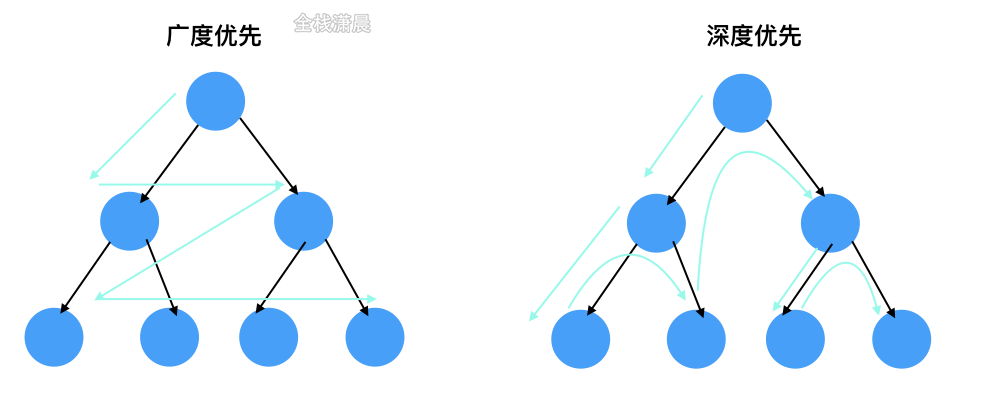
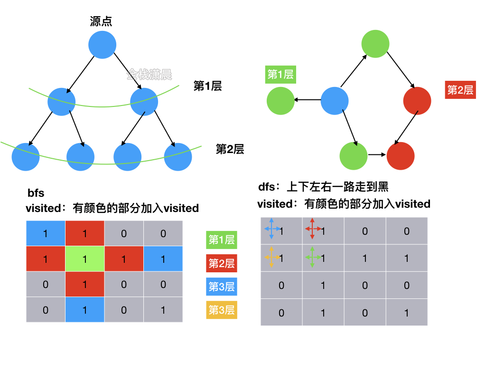
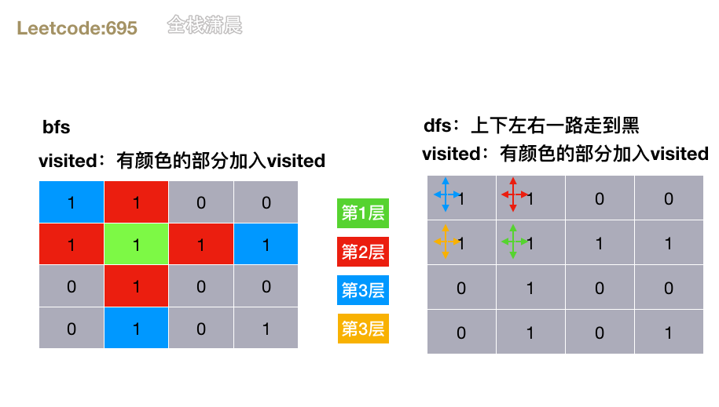
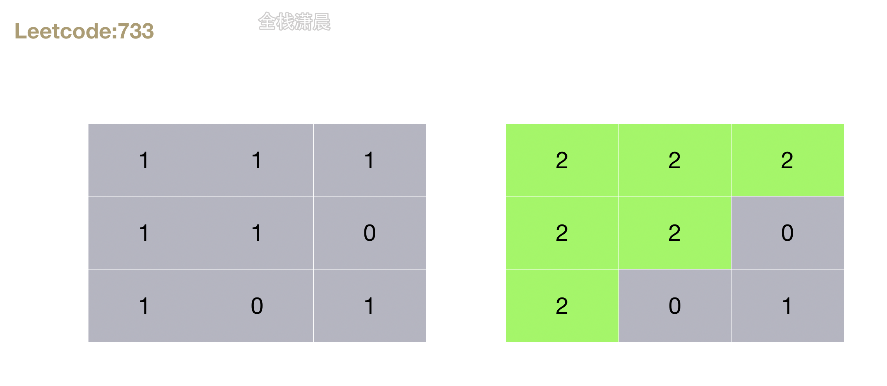

## 搞定大厂算法面试之leetcode精讲6.深度优先&广度优先

#### 深度优先&广度优先





[动画过大，点击查看](https://xiaochen1024.com/20211118150933.gif)

#### bfs:适用于层序遍历或者寻找最短路径的问。

```js
//bfs伪代码模版
function bfs(graph, start, end) {
  queue = [];
  queue.append([start]);
  visited.add(start);

  while (queue) 
  node = queue.pop();
  visited.add(node);

  process(node);
  nodes = generate_related_nodes(node);
  queue.add(nodes);
}
```

#### dfs:

```javascript
//dfs伪代码模版
//递归
function dfs(node, visited) {
  visited.add(node);

  for (next_node in node.children()) {
    if (!next_node in visited) 
      dfs(next_node, visited);
  }
}

//非递归
function dfs(tree) {
  if (tree.root === null) {
    return [];
  }

  visited, (stack = []), [tree.node];
  while (stack) 
    node = stack.pop();
    visited.add(node);

    process(node);
    nodes = generate_ralated_nodes(node);
    stack.push(nodes);
}
```

#### [695. 岛屿的最大面积](https://leetcode-cn.com/problems/max-area-of-island/) （medium）



##### 方法1.dfs

- 思路：深度优先，先循环网格， 当`grid[x][y] === 1`时，将当前单元格置为0并上下左右不断递归，计算每个岛屿的大小，然后不断更新最大岛屿
- 复杂度：时间复杂度`O(mn)`，m、n分别是网格的长和宽。空间复杂度`O(mn)`，递归最大深度

js：

```js
var maxAreaOfIsland = function(grid) {
    let row = grid.length, col = grid[0].length;
    function dfs (x, y) {
      	//越界判断 当grid[x][y] === 0时 直接返回
        if (x < 0 || x >= row || y < 0 || y >= col || grid[x][y] === 0) return 0;
        grid[x][y] = 0;//当grid[x][y] === 1时，将当前单元格置为0
        let ans = 1, dx = [-1, 1, 0, 0], dy = [0, 0, 1, -1];//方向数组
        for (let i = 0; i < dx.length; i++) {//上下左右不断递归，计算每个岛屿的大小
            ans += dfs(x + dx[i], y + dy[i]);
        }
        return ans;
    }
    let res = 0;
    for (let i = 0; i < row; i++) {
        for (let j = 0; j < col; j++) {
            res = Math.max(res, dfs(i, j));//循环网格 更新最大岛屿
        }
    }
    return res;
};
```

java

```java
class Solution {
    public int maxAreaOfIsland(int[][] grid) {
        int res = 0;
        for(int i = 0; i < grid.length; i++){
            for(int j = 0; j < grid[0].length; j++){
                if(grid[i][j] == 1){
                    res = Math.max(res, dfs(grid, i, j));
                }   
            }
        }
        return res;
    }

    public int dfs(int[][] grid, int i, int j){
        if(i < 0 || i >= grid.length || j < 0 || j >= grid[0].length || grid[i][j] == 0){
            return 0;
        }
        grid[i][j] = 0;
        return 1 + dfs(grid, i - 1, j) + dfs(grid, i + 1, j) + dfs(grid, i, j - 1) + dfs(grid, i, j + 1);
    }
}
```

##### 方法2.bfs

- 思路：广度优先，循环网格，不断将当前网格的坐标加入队列，如果当前网格对应的值是1，则置为0，然后向四周扩散，找到下一层的网格坐标，加入队列，直到队列为空
- 复杂度：时间复杂度`O(mn)`，m、n分别是网格的长和宽。空间复杂度`O(mn)`，queue的大小

js：

```js
var maxAreaOfIsland = function(grid) {
    let ans = 0, row = grid.length, col = grid[0].length;
    let dx = [1, -1, 0, 0], dy = [0, 0, 1, -1];//方向数组
    for (let i = 0; i < row; i++) {
        for (let j = 0; j < col; j++) {
            if (grid[i][j] === 0) continue;//循环网格，遇到0就跳过
            let queue = [[i, j]], curr = 0;//在队列中加入当前网格的值
            while (queue.length > 0) {
                let [x, y] = queue.shift();//不断出队
              	//越界判断
                if (x < 0 || x >= row || y < 0 || y >= col || grid[x][y] === 0) continue;
                ++curr;//更新岛屿的数量
                grid[x][y] = 0;//遍历过的网格置为0
                for (let k = 0; k < dx.length; k++) {//上下左右遍历，把下一层的节点加入队列
                    queue.push([x + dx[k], y + dy[k]]);
                }
            }
            ans = Math.max(ans, curr);//更新最大岛屿面积
        }
    }
    return ans;
};
```

java

```java
class Solution {
    public int maxAreaOfIsland(int[][] grid) {
        int res = 0;
        for(int i = 0; i < grid.length; i++){
            for(int j = 0; j < grid[0].length; j++){
                if(grid[i][j] == 1){
                    res = Math.max(res, bfs(grid, i, j));
                }   
            }
        }
        return res;
    }

    public int bfs(int[][] grid, int i, int j){
        int[] dx = {1, -1, 0, 0};
        int[] dy = {0, 0, 1, -1};
        Queue<int[]> queue = new LinkedList<>();
        queue.offer(new int[]{i, j});
        grid[i][j] = 0;
        int area = 1;
        while(!queue.isEmpty()){
            int[] x = queue.poll();
            for(int index = 0; index < 4; index++){
                int nx = x[0] + dx[index], ny = x[1] + dy[index];
                if(nx>=0 && nx < grid.length && ny >= 0 && ny < grid[0].length && grid[nx][ny] == 1){
                    grid[nx][ny] = 0;
                    area += 1;
                    queue.offer(new int[]{nx, ny});
                }
            }
        }
        return area;
    }
}
```

#### [733. 图像渲染](https://leetcode-cn.com/problems/flood-fill/) (easy)

#### 

##### 方法1.dfs

- 复杂度：时间复杂度`O(mn)`，m、n分别是网格的长和宽。空间复杂度`O(mn)`，递归最大深度

js：

```js
const floodFill = (image, sr, sc, newColor) => {
    const m = image.length;
    const n = image[0].length;
    const oldColor = image[sr][sc];
    if (oldColor == newColor) return image;

    const fill = (i, j) => {
        if (i < 0 || i >= m || j < 0 || j >= n || image[i][j] != oldColor) {
            return;
        }
        image[i][j] = newColor;
        fill(i - 1, j);
        fill(i + 1, j);
        fill(i, j - 1);
        fill(i, j + 1);
    };

    fill(sr, sc);
    return image;
};
```

##### 方法2.bfs

- 复杂度：时间复杂度`O(mn)`，m、n分别是网格的长和宽。空间复杂度`O(mn)`，递归最大深度

js：

```js
const floodFill = (image, sr, sc, newColor) => {
    const m = image.length;
    const n = image[0].length;
    const oldColor = image[sr][sc];

    if (oldColor == newColor) return image;

    const queue = [[sr, sc]];

    while (queue.length) {
        const [i, j] = queue.shift();
        image[i][j] = newColor;

        if (i - 1 >= 0 && image[i - 1][j] == oldColor) queue.push([i - 1, j]);
        if (i + 1 < m && image[i + 1][j] == oldColor) queue.push([i + 1, j]);
        if (j - 1 >= 0 && image[i][j - 1] == oldColor) queue.push([i, j - 1]);
        if (j + 1 < n && image[i][j + 1] == oldColor) queue.push([i, j + 1]);
    }

    return image;
};
```