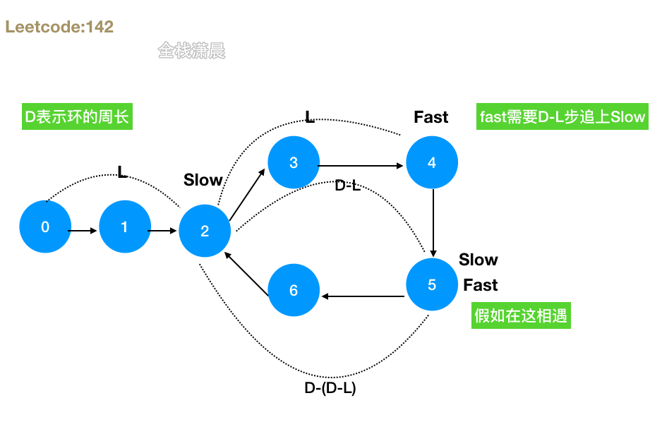
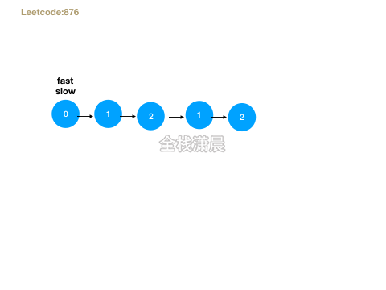

## 搞定大厂算法面试之leetcode精讲7.双指针

#### 双指针

- 普通指针：两指针同一方向或不同方向
- 对撞指针：两指针互相靠拢
- 快慢指针：一快一慢

#### [141. 环形链表](https://leetcode-cn.com/problems/linked-list-cycle/) (easy)

##### 方法1.哈希表或set:

[动画过大，点击查看](https://xiaochen1024.com/20211118151039.gif)

- 思路：准备一个map或者set，然后循环链表，每次遍历到一个节点的时候，判断当前节点是否在map中存在，如果不存在就把当前节点加入map中，如果存在的话说明之前访问过此节点，也就说明了这条链表有环。
- 复杂度分析：时间复杂度`O(n)`，n是链表的数量，最差的情况下每个节点都要遍历。空间复杂度`O(n)`，n是存储遍历过的节点的map或者set

js:

```js
var hasCycle = (head) => {
    let map = new Map();
    while (head) {
        if (map.has(head)) return true;//如果当前节点在map中存在就说明有环
        map.set(head, true);//否则就加入map
        head = head.next;//迭代节点
    }
    return false;//循环完成发现没有重复节点，说明没环
};
```

java:

```java
public class Solution {
    public boolean hasCycle(ListNode head) {
        Set<ListNode> seen = new HashSet<ListNode>();
        while (head != null) {
            if (!seen.add(head)) {
                return true;
            }
            head = head.next;
        }
        return false;
    }
}
```

##### 方法2.快慢指针

[动画过大，点击查看](https://xiaochen1024.com/20211118151040.gif)

- 思路：准备两个指针fast和slow，循环链表，slow指针初始也指向head，每次循环向前走一步，fast指针初始指向head，每次循环向前两步，如果没有环，则快指针会抵达终点，如果有环，那么快指针会追上慢指针
- 复杂度：时间复杂度`O(n)`，空间复杂度`O(1)`

js:

```js
var hasCycle = function (head) {
    //设置快慢指针
    let slow = head;
    let fast = head;
    //如果没有环，则快指针会抵达终点，否则继续移动双指针
    while (fast && fast.next) {
        slow = slow.next;
        fast = fast.next.next;
        //快慢指针相遇，说明含有环
        if (slow == fast) {
            return true;
        }
    }

    return false;
};
```

java:

```java
public class Solution {
    public boolean hasCycle(ListNode head) {
		ListNode fast = head;
		ListNode slow = head;
		while (fast != null && fast.next != null) {
			fast = fast.next.next;
			slow = slow.next; 
			if (fast == slow) {
				return true;
			}
		}
		return false;
    }
}
```

#### [142. 环形链表 II](https://leetcode-cn.com/problems/linked-list-cycle-ii/) (medium)

##### 方法1.哈希表

- 思路：遍历链表，将节点加入一个set中，每次判断当前节点是否在set中，如果存在重复的节点，这个节点就是入环节点
- 复杂度：时间复杂度`O(n)`，空间复杂度`O(n)`

js：

```js
var detectCycle = function(head) {
    const visited = new Set();
    while (head !== null) {//终止条件，如果没有环 跳出循环
        if (visited.has(head)) {//如果存在重复的节点，这个节点就是入环节点
            return head;
        }
        visited.add(head);//将节点加入set中
        head = head.next;
    }
    return null;
};
```

java：

```java
public class Solution {
    public ListNode detectCycle(ListNode head) {
        ListNode pos = head;
        Set<ListNode> visited = new HashSet<ListNode>();
        while (pos != null) {
            if (visited.contains(pos)) {
                return pos;
            } else {
                visited.add(pos);
            }
            pos = pos.next;
        }
        return null;
    }
}
```

##### 方法2.快慢指针

[动画过大，点击查看](https://xiaochen1024.com/20211118151041.gif)



- 思路：慢指针移动两步，快指针移动一步，相遇之后，快指针变成头指针，然后每次快慢指针各走一步直到相遇，相遇的节点就是入环节点
- 复杂度：时间复杂度`O(n)`，空间复杂度`O(1)`

js：

```js
var detectCycle = function(head) {
    if (head === null) {
        return null;
    }
    let slow = head, fast = head;
    while (fast !== null) {
        slow = slow.next;//慢指针移动两步，快指针移动一步
        if (fast.next !== null) {
            fast = fast.next.next;
        } else {
            return null;//如果没有环 之间返回null
        }
        if (fast === slow) {//有环
            let fast = head;
          	//快指针指向头节点，然后每次快慢指针各走一步直到相遇，相遇的节点就是入环节点
            while (fast !== slow) {
                fast = fast.next;
                slow = slow.next;
            }
            return fast;
        }
    }
    return null;
};
```

java：

```java
public class Solution {
    public ListNode detectCycle(ListNode head) {
        if (head == null) {
            return null;
        }
        ListNode slow = head, fast = head;
        while (fast != null) {
            slow = slow.next;
            if (fast.next != null) {
                fast = fast.next.next;
            } else {
                return null;
            }
            if (fast == slow) {
                ListNode fast1 = head;
                while (fast1 != slow) {
                    fast1 = fast1.next;
                    slow = slow.next;
                }
                return fast1;
            }
        }
        return null;
    }
}
```

#### [15. 三数之和](https://leetcode-cn.com/problems/3sum/) (medium)

**方法1.暴力求解**，对于三个数字，循环3次，分别计算和，时间复杂度`O(n^3)`

**方法2.c=-(a+b)**: 确定了a和b，那就可以想两数之和一样，在map中寻找`-(a+b)`，减少一层循环，时间复杂度`O(n^2)`，空间复杂度`O(n)`。

**方法3.排序然后查找**

[动画过大，点击查看](https://xiaochen1024.com/20211118151043.gif)

- 思路：先排序数组，数组长度必须大于3，循环数组，假如当前循环到了i索引，则定义两个指针`L = i+1`，和`R = nums.length-1`,如果和`sum=nums[i] + nums[L] + nums[R]`小于0，则向右移动左指针，如果sum大于0，则左移右指针，如果sum等于0，则正好找到了这3个数，然后在尝试`L++`,`R--`，继续寻找中间是否有三个数之和等于0，注意在循环的过程中遇见相同的三个数需要去重。
- 复杂度分析：时间复杂度`O(n^2)`，n为数组的长度。空间复杂度`O(logn)`，即排序所需要的空间

js:

```js
var threeSum = function(nums) {
    let ans = [];
    const len = nums.length;
    if(nums == null || len < 3) return ans;//数组的长度大于3
    nums.sort((a, b) => a - b); // 排序
    for (let i = 0; i < len ; i++) {
        if(nums[i] > 0) break; // 如果当前数字大于0，则三数之和一定大于0，所以结束循环
        if(i > 0 && nums[i] == nums[i-1]) continue; // 去重
        let L = i+1;
        let R = len-1;
        while(L < R){//虽然里面还有两个循环，但是整体的L和R移动的时间内复杂度还是o(n)
            const sum = nums[i] + nums[L] + nums[R];
            if(sum == 0){
                ans.push([nums[i],nums[L],nums[R]]);
                while (L<R && nums[L] == nums[L+1]) L++; // 去重
                while (L<R && nums[R] == nums[R-1]) R--; // 去重
                L++;
                R--;
            }
            else if (sum < 0) L++;
            else if (sum > 0) R--;
        }
    }        
    return ans;
};
```

java:

```java
class Solution {
    public static List<List<Integer>> threeSum(int[] nums) {
        List<List<Integer>> ans = new ArrayList();
        int len = nums.length;
        if(nums == null || len < 3) return ans;
        Arrays.sort(nums); 
        for (int i = 0; i < len ; i++) {
            if(nums[i] > 0) break; // 如果当前数字大于0，则三数之和一定大于0，所以结束循环
            if(i > 0 && nums[i] == nums[i-1]) continue; // 去重
            int L = i+1;
            int R = len-1;
            while(L < R){
                int sum = nums[i] + nums[L] + nums[R];
                if(sum == 0){
                    ans.add(Arrays.asList(nums[i],nums[L],nums[R]));
                    while (L<R && nums[L] == nums[L+1]) L++; // 去重
                    while (L<R && nums[R] == nums[R-1]) R--; // 去重
                    L++;
                    R--;
                }
                else if (sum < 0) L++;
                else if (sum > 0) R--;
            }
        }        
        return ans;
    }
}
```

#### [11. 盛最多水的容器](https://leetcode-cn.com/problems/container-with-most-water/) （medium）

##### 方法1:双指针

[动画过大，点击查看](https://xiaochen1024.com/20211118151044.gif)

- 思路：用双指针i，j循环height数，i，j对应高度较小的那个先向内移动，不断计算面积，更新最大面积
- 复杂度：时间复杂度`O(n)`，n是数组height的长度，遍历一次。空间复杂度`O(1)`

js：

```js
var maxArea = function(height) {
    let max = 0;
    for (let i = 0, j = height.length - 1; i < j;) {//双指针i，j循环height数组
      	//i，j较小的那个先向内移动 如果高的指针先移动，那肯定不如当前的面积大
        const minHeight = height[i] < height[j] ? height[i++] : height[j--];
        const area = (j - i + 1) * minHeight;//计算面积
        max = Math.max(max, area);//更新最大面积
    }
    return max;
};
```

java：

```java
class Solution {
    public int maxArea(int[] height) {
        int i = 0, j = height.length - 1, max = 0;
        while(i < j) {
            max = height[i] < height[j] ? 
                Math.max(max, (j - i) * height[i++]): 
                Math.max(max, (j - i) * height[j--]); 
        }
        return max;
    }
}
```

#### [160. 相交链表](https://leetcode-cn.com/problems/intersection-of-two-linked-lists/) （easy）

##### 方法1:哈希表

- 思路：将链表A存入set中，第一个相同的节点就是重合的节点
- 复杂度：时间复杂度`O(m+n)`，m、n分别是两个链表的长度。空间复杂度`O(m)`

js：

```js
var getIntersectionNode = function(headA, headB) {
    const visited = new Set();
    let temp = headA;
    while (temp !== null) {//将链表A存入set中
        visited.add(temp);
        temp = temp.next;
    }
    temp = headB;
    while (temp !== null) {
        if (visited.has(temp)) {//第一个相同的节点就是重合的节点
            return temp;
        }
        temp = temp.next;
    }
    return null;
};
```

Java：

```java
public class Solution {
    public ListNode getIntersectionNode(ListNode headA, ListNode headB) {
        Set<ListNode> visited = new HashSet<ListNode>();
        ListNode temp = headA;
        while (temp != null) {
            visited.add(temp);
            temp = temp.next;
        }
        temp = headB;
        while (temp != null) {
            if (visited.contains(temp)) {
                return temp;
            }
            temp = temp.next;
        }
        return null;
    }
}
```

##### 方法2:双指

[动画过大，点击查看](https://xiaochen1024.com/20211118151045.gif)

- 思路：用双指针pA 、pB循环俩个链表，链表A循环结束就循环链表B，链表A循环结束就循环链表B，当`pA == pB`时就是交点，因为两个指针移动的步数一样
- 复杂度：时间复杂度`O(m+n)`，m、n分别是两个链表的长度。空间复杂度`O(1)`

js：

```js
var getIntersectionNode = function(headA, headB) {
    if (headA === null || headB === null) {
        return null;
    }
    let pA = headA, pB = headB;
    while (pA !== pB) {
        pA = pA === null ? headB : pA.next;//链表A循环结束就循环链表B	
        pB = pB === null ? headA : pB.next;//链表A循环结束就循环链表B	
    }
    return pA;//当pA == pB时就是交点
};
```

java:

```java
public class Solution {
    public ListNode getIntersectionNode(ListNode headA, ListNode headB) {
        if (headA == null || headB == null) {
            return null;
        }
        ListNode pA = headA, pB = headB;
        while (pA != pB) {
            pA = pA == null ? headB : pA.next;
            pB = pB == null ? headA : pB.next;
        }
        return pA;
    }
}
```

#### [876. 链表的中间结点](https://leetcode-cn.com/problems/middle-of-the-linked-list/)（easy)



- 思路：快慢指针遍历，直到快指针到达最后
- 复杂度：时间复杂度`O(n)`，空间复杂度`O(1)`

js：

```js
var middleNode = function(head) {
    slow = fast = head;
    while (fast && fast.next) {//快慢指针遍历，直到快指针到达最后
        slow = slow.next;
        fast = fast.next.next;
    }
    return slow;
};
```

java：

```java
class Solution {
    public ListNode middleNode(ListNode head) {
        ListNode slow = head, fast = head;
        while (fast != null && fast.next != null) {
            slow = slow.next;
            fast = fast.next.next;
        }
        return slow;
    }
}
```