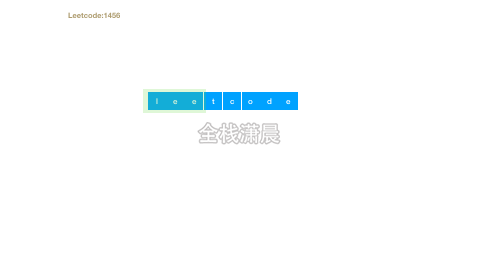

## 搞定大厂算法面试之leetcode精讲8.滑动窗口

#### [3. 无重复字符的最长子串](https://leetcode-cn.com/problems/longest-substring-without-repeating-characters/) (medium)

##### 方法1.滑动窗口

[动画过大，点击查看](https://xiaochen1024.com/20211118151541.gif)

- 思路：滑动窗口不断向前，当前元素不在set中 就加入set 然后更新最大长度，`i++`继续下一轮循环，set中有重复元素不断让`j++` 并删除窗口之外的元素 直到滑动窗口内没有重复的元素
- 复杂度：时间复杂度`O(n)`，n是字符串的长度。空间复杂度是`O(n)`，即set的空间，最差的情况是`O(n)`

js:

```js
var lengthOfLongestSubstring = function (s) {
    const set = new Set(); //判断滑动窗口内是否有重复元素
    let i = 0,//滑动窗口右边界
        j = 0,//滑动窗口左边界
        maxLength = 0;
    if (s.length === 0) {//极端情况
        return 0;
    }
    for (i; i < s.length; i++) {
        if (!set.has(s[i])) {//当前元素不在set中 就加入set 然后更新最大长度，i++继续下一轮循环
            set.add(s[i]);
            maxLength = Math.max(maxLength, set.size);
        } else {
            //set中有重复元素不断让j++ 并删除窗口之外的元素 直到滑动窗口内没有重复的元素
            while (set.has(s[i])) {
                set.delete(s[j]);
                j++;
            }
            set.add(s[i]);//放心将s[i]加入set中
        }
    }
    return maxLength;
};
```

Java:

```java
class Solution {
    public int lengthOfLongestSubstring(String s) {
        Set<Character> set = new HashSet<Character>();
        int n = s.length();
        int j = -1, ans = 0;
        for (int i = 0; i < n; ++i) {
            if (i != 0) {
                set.remove(s.charAt(i - 1));
            }
            while (j + 1 < n && !set.contains(s.charAt(j + 1))) {
                set.add(s.charAt(j + 1));
                ++j;
            }
            ans = Math.max(ans, j - i + 1);
        }
        return ans;
    }
}
```

#### [219. 存在重复元素 II](https://leetcode-cn.com/problems/contains-duplicate-ii/) （easy）

[动画过大，点击查看](https://xiaochen1024.com/20211118151542.gif)

##### 方法1:滑动窗口

- 思路：循环数组，不断将元素加入滑动窗口中，也就是加入set，如果set中存在重复元素并且窗口大小小于指定大小就返回，否则加入set中，当滑动窗口超过了指定大小，缩小窗口
- 复杂度：时间复杂度`O(n)`，空间复杂度`O(min(n, k))`

js：

```js
var containsNearbyDuplicate = function(nums, k) {
    const set = new Set();
    for(let i = 0; i < nums.length; i++) {
        if(set.has(nums[i])) {//找到了重复的元素
            return true;
        }
        set.add(nums[i]);//没找到就加入set中 扩大窗口
        if(set.size > k) {//滑动窗口超过了指定大小，缩小窗口
            set.delete(nums[i - k]);
        }
    }
    return false;
};
```

java：

```java
class Solution {
    public boolean containsNearbyDuplicate(int[] nums, int k) {
        HashSet<Integer> set = new HashSet<>();
        for(int i = 0; i < nums.length; i++) {
            if(set.contains(nums[i])) {
                return true;
            }
            set.add(nums[i]);
            if(set.size() > k) {
                set.remove(nums[i - k]);
            }
        }
        return false;
    }
}
```

#### [76. 最小覆盖子串](https://leetcode-cn.com/problems/minimum-window-substring/) （hard）

##### 方法1.滑动窗口

- 思路：用左右两个指针遍历`s`字符串，当滑动窗口中的字符不能覆盖`t`中的字符时，右指针右移，扩大窗口，把右边的字符加入滑动窗口，当滑动窗口中的字符能覆盖`t`中的字符时，不断左移左指针，缩小窗口，直到窗口中的字符刚好能覆盖`t`中的字符，这个时候在左移就不能覆盖`t`中的字符了，在指针移动的过程中，不断更新最小覆盖子串
- 复杂度：时间复杂度o(n)，n是s的长度，空间复杂度o(t)，t是字符集的大小

[动画过大，点击查看](https://xiaochen1024.com/20211118151543.gif)

js：

```js
var minWindow = function (s, t) {
    let need = {};//需要覆盖的字符串频数
    let window = {};//滑动窗口的字符串频数
    for (let a of t) {
        need[a] = (need[a] || 0) + 1;//统计t中字符频数
    }
    //左右指针
    let left = 0,
        right = 0;
    let valid = 0;//滑动窗口中能覆盖的字符种类数
    let start = 0,//最小覆盖子串的起始索
        len = Number.MAX_VALUE;//最小覆盖子串长度
    while (right < s.length) {
        let c = s[right];//进入滑动窗口右边的字符
        right++;//右移窗口
        if (need[c]) {//如果当前字符在need字符中 更新window中字符数
            window[c] = (window[c] || 0) + 1;
            if (window[c] == need[c]) {//如果当前窗口和需要的字符数量一致时，字符种类+1
                valid++;
            }
        }

        while (valid == Object.keys(need).length) {//字符种类与需要的字符个数一致时，就收缩窗口
            if (right - left < len) {//当前窗口长度小于之前窗口的长度len 更新最小覆盖子串的起始位置和长度
                start = left;
                len = right - left;
            }
            let d = s[left];//需要被移除的字符
            left++;//左移窗口 从窗口中移除字符
            if (need[d]) {//如果在需要的字符中 更新window中字符数
                if (window[d] == need[d]) {//如果当前窗口和需要的字符数量一致时，字符种类-1
                    valid--;
                }
                window[d]--;
            }
        }
    }
    //没有找到覆盖子串 返回'' 否则返回覆盖子串
    return len == Number.MAX_VALUE ? "" : s.substr(start, len);
};
```

Java:

```java
class Solution {
    public String minWindow(String s, String t) {
        Map<Character,Integer> needMap = new HashMap<Character,Integer>();
        Map<Character,Integer> windowsMap = new HashMap<Character,Integer>();
        for(char c : t.toCharArray()){
            needMap.put(c,needMap.getOrDefault(c,0)+1);
        }
        int left = 0,right = 0;
        int valid = 0;
        int start = 0,end = 0,len = Integer.MAX_VALUE;
        while(right < s.length()){
            char c = s.charAt(right);
            right++;
            if(needMap.containsKey(c)){
                windowsMap.put(c,windowsMap.getOrDefault(c,0)+1);
                if(windowsMap.get(c).equals(needMap.get(c))){
                    valid++;
                }
            }
            while(valid == needMap.size()){
                if(right - left< len){
                    len = right - left;
                    start = left;
                }
                char d = s.charAt(left);
                left++;
                if(windowsMap.containsKey(d)){
                    if(windowsMap.get(d).equals(needMap.get(d))){
                        valid--;
                    }
                    windowsMap.put(d,windowsMap.getOrDefault(d,0)-1);
                } 
            }
        }
        return len == Integer.MAX_VALUE ? "" : s.substring(start,start+len);
    }
}
```

#### [438. 找到字符串中所有字母异位词](https://leetcode-cn.com/problems/find-all-anagrams-in-a-string/) (medium)

[动画过大，点击查看](https://xiaochen1024.com/20211118151544.gif)

- 思路：用滑动窗口的思路，遍历字符串，
  1. 判断进入窗口的字符是否是需要的字符，并且加入窗口之后该字符的数量是否是和`need`中的字符数量一致
  2. 判断出窗口的字符是否是需要的字符，并且该字符在窗口中的数量是否和`need`中的字符数量一致
  3. 判断窗口中和`need`中符合要求的字符是否一致 如果一致 则这个窗口形成的子串就是一个异位词
- 复杂度：时间复杂度`O(n)`，n是字符串的长度。空间复杂度`O(k)`，k是字符集的空间

js:

```js
//写法1
var findAnagrams = function (s, p) {
    let need = {};//需要的字符
    let win = {};//窗口中的字符
    for (let a of p) {//统计异位词的数量
        need[a] = (need[a] || 0) + 1;
    }
    //左右指针
    let left = 0,
        right = 0;
    let val = 0;//窗口中和need中字符数量一致的字符种类
    let res = [];
    while (right < s.length) {
        let c = s[right];
        right++;//右边的字符进入窗口
        if (need[c]) {
            win[c] = (win[c] || 0) + 1;//当前字符在need中，更新窗口中的字符数量
            if (win[c] == need[c]) {
                val++;//该字符在窗口中和need中的字符匹配时，字符种类+1
            }
        }
        while (right - left >= p.length) {//不断出窗口
            if (val == Object.keys(need).length) {//如果此时窗口中的子串和p是异位词则将左边界加入res中
                res.push(left);
            }
            let d = s[left];
            left++;//出窗口
            if (need[d]) {//如果该字符在need中 更新窗口中的字符数量 和字符种类
                if (win[d] == need[d]) {
                    val--;
                }
                win[d]--;
            }
        }
    }
    return res;
};

//写法2
var findAnagrams = function (s, p) {
    //res：返回的结果
    //win：存储窗口中的字符和对应的频次
    //need：存储需要的异位词的种类和数量
    //len：need异位词的字符种类
    //val：滑动窗口中和need中字符数量相同的字符种类
    const res = [], win = {}, need = {}, pLen = p.length;
    let len = 0, val = 0;
    for (const x of p) {//循环p 
        //如果字符在need中不存在 则初始化need数组中对应的字符数量 并且让字符种类加1
        if (need[x] === undefined) {
            need[x] = win[x] = 0;
            len++;
        }
        need[x]++;//need中存在该字符 则字符数量加1
    }
    for (let i = 0; i < s.length; i++) {
        const j = i - pLen;//滑动窗口左边界
        //如果进入滑动窗口的字符s[i]在need中，并且窗口中的该字符数量加1之后和need中的字符数量相同，
      	//说明该字符已经满足了异位字符的要求，让val加1
        if (s[i] in need && ++win[s[i]] === need[s[i]]) val++;
        //如果出滑动窗口的字符s[j]在need中，并且滑动窗口中该字符数量和need中的字符数量相同，
      	//说明从窗口中移除该字符之后不满足异位字符的要求了，让窗口中这个字符的数量减1，并且val减1
        if (s[j] in need && win[s[j]]-- === need[s[j]]) val--;
      	//如果need中滑动窗口中的异位字符种类一致 就说明从j+1开始就是异位字符串的一个起点
        if (val === len) res.push(j + 1);
    }
    return res;
};
```

java：

```java
class Solution {
    public List<Integer> findAnagrams(String s, String p) {
        int[] need = new int[26];
        for (int i = 0; i < p.length(); i++) {
            need[p.charAt(i) - 'a']++;
        }
        int start = 0, end = 0;
        int[] window = new int[26];
        List<Integer> ans = new ArrayList<Integer>();
        while (end < s.length()) {
            window[s.charAt(end) - 'a']++;
            if (end - start + 1 == p.length()) {
                if (Arrays.equals(window, need)) ans.add(start);
                window[s.charAt(start) - 'a']--;
                start++;
            }
            end++;
        }
        return ans;
    }
}
```

#### [1456. 定长子串中元音的最大数目](https://leetcode-cn.com/problems/maximum-number-of-vowels-in-a-substring-of-given-length/) (medium)



- 思路：滑动窗口遍历字符串，不断更新最大元音个数
- 复杂度：时间复杂度`O(n)`，n是字符串长度。空间复杂度`O(1)`

js:

```js
//例子： s=leetcode k=3
var maxVowels = function (s, k) {
    const vowels = new Set(['a', 'e', 'i', 'o', 'u'])
    let count = 0,
        l = 0,
        r = 0
    while (r < k) {//初始化大小k的窗口
        vowels.has(s[r]) && count++
        r++
    }
    let max = count
    while (r < s.length) {//不断移动窗口
        vowels.has(s[r]) && count++
        vowels.has(s[l]) && count--
        l++
        r++
        max = Math.max(max, count)//更新最大元音数
    }
    return max
};
```

java:

```java
class Solution {
    public int maxVowels(String s, int k) {
        int n = s.length();
        int count = 0;
        for (int i = 0; i < k; ++i) {
            count += isVowel(s.charAt(i));
        }
        int ans = count;
        for (int i = k; i < n; ++i) {
            count += isVowel(s.charAt(i)) - isVowel(s.charAt(i - k));
            ans = Math.max(ans, count);
        }
        return ans;
    }

    public int isVowel(char ch) {
        return ch == 'a' || ch == 'e' || ch == 'i' || ch == 'o' || ch == 'u' ? 1 : 0;
    }
}
```

#### [904. 水果成篮](https://leetcode-cn.com/problems/fruit-into-baskets/) (medium)

[动画过大，点击查看](https://xiaochen1024.com/20211118151546.gif)

- 思路：用滑动窗口遍历fruits，当有新种类的水果进入窗口时
  1. 如果窗口中只有一种水果，将这种水果加入arr数组
  2. 如果有两种水果，更新窗口的左边界，更新arr中水果的种类
  3. 如果进来了一种新的类型的水果 更新前一种水果的位置
  4. 更新滑动窗口的最大值
- 复杂度：时间复杂度`O(n)`，空间复杂度`O(1)`。

js：

```js
//[1,1,2,2]
//[1,1,2,2,3] -> [2,2,3]
var totalFruit = function(fruits) {
    let l = 0;//起始指针
    let maxLen = 0;//窗口的最大长度 其中最多包涵两种水果
    let n = 0//前一类水果的结束位置
    let arr = [fruits[l]]//水果的种类数组

    for(let r = 0; r < fruits.length; r++){//窗口的右指针不断前进
        if(!arr.includes(fruits[r])){//如果窗口中不包含 进窗口的水果
            if(arr.length <= 1){//如果只有一种水果
                arr[1] = fruits[r]//将这种水果加入arr数组
            }else{//如果有两种水果
                l = n//更新窗口的左边界
                arr[0] = fruits[r-1]//更新arr中水果的种类
                arr[1] = fruits[r]
            }
        }
       
        if(fruits[r] !== fruits[n]){//如果进来了一种新的类型的水果 更新前一种水果的位置
            n = r
        }

        maxLen = Math.max(maxLen,r-l+1)//更新滑动窗口的最大值
    }
    return maxLen

};
```

java：

```java
class Solution {
    public int totalFruit(int[] tree) {
        if (tree == null || tree.length == 0) return 0;
        int n = tree.length;

        Map<Integer, Integer> map = new HashMap<>();
        int maxLen = 0, left = 0;
        for (int i = 0; i < n; i++) {
            map.put(tree[i], map.getOrDefault(tree[i], 0) + 1); 
            while (map.size() > 2) { 
                map.put(tree[left], map.get(tree[left]) - 1);
                if (map.get(tree[left]) == 0) map.remove(tree[left]); 
                left++;
            }
            maxLen = Math.max(maxLen, i - left + 1);
        }
        return maxLen;
    }
}
```