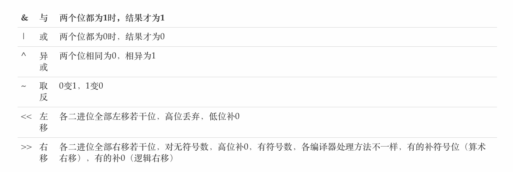
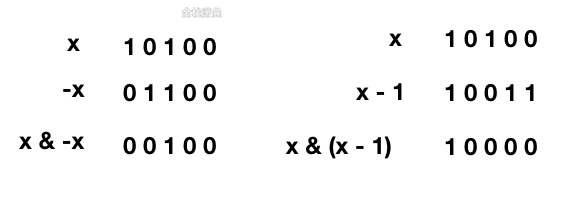
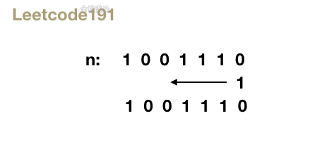

## 搞定大厂算法面试之leetcode精讲9.位运算

#### 位运算基础：

程序中所有的数载计算机内存中都是以二进制存储的，位运算就是直接对整数在内存中的二进制进行操作，由于直接在内存中进行操作，不需要转成十进制，因此处理速度非常快



常见位运算

```js
x & 1 === 0 //判断奇偶
x & (x - 1) //清除最右边的1
x & -x //得到最右边的1
```



#### [191. 位1的个数](https://leetcode-cn.com/problems/number-of-1-bits/) （easy）



##### 方法1：循环每个二进制位

- 思路：直接循环二进制中的每一位，判断是否为1，统计1的个数
- 复杂度分析：时间复杂度`O(k)`，k=32。空间复杂度为`O(1)`

Js:

```javascript
var hammingWeight = function(n) {
    let ret = 0;
    for (let i = 0; i < 32; i++) {
        if ((n & (1 << i)) !== 0) {//让1不断左移 判断该位是否为1
            ret++;
        }
    }
    return ret;
};
```

Java:

```java
public class Solution {
    public int hammingWeight(int n) {
        int ret = 0;
        for (int i = 0; i < 32; i++) {
            if ((n & (1 << i)) != 0) {
                ret++;
            }
        }
        return ret;
    }
}
```

##### 方法2：优化循环的过程

- 思路：巧用二进制公式`x&(x-1)`表示去掉二进制中最右边的第一个1，加速循环过程
- 复杂度分析：时间复杂度为`O(k)`，k为二进制中1的个数，最坏的情况下所有位都是1。空间复杂度是`O(1)`

js:

```javascript
var hammingWeight = function(n) {
    let ret = 0;
    while (n) {
        n &= n - 1;//不断消掉最右边的1
        ret++;
    }
    return ret;
};
```

java:

```java
public class Solution {
    public int hammingWeight(int n) {
        int ret = 0;
        while (n != 0) {
            n &= n - 1;
            ret++;
        }
        return ret;
    }
}
```

#### [231. 2 的幂](https://leetcode-cn.com/problems/power-of-two/)（easy）

##### 方法1.二进制

- 思路：一个数是2的幂需要满足这个数的二进制中只有一个1，也就是需要满足这个数>0，同时消除唯一的一个1之后就是0
- 复杂度：时间复杂度`O(1)`。空间复杂度`O(1)`

Js:

```javascript
var isPowerOfTwo = function(n) {
    return n > 0 && (n & (n - 1)) === 0;
};
```

Java:

```java
class Solution {
    public boolean isPowerOfTwo(int n) {
        return n > 0 && (n & (n - 1)) == 0;
    }
}
```

##### 方法2.是否为最大 2的幂的约数

- 思路：最大的2的幂为 `2^30 = 1073741824`， 判断 n 是否是 `2^30` 的约数即可。
- 复杂度:时间复杂度`O(1)`。空间复杂度`O(1)`

js:

```javascript
var isPowerOfTwo = function(n) {
    const MAX = 1 << 30;
    return n > 0 && MAX % n === 0;
};
```

Java:

```java
class Solution {
    static final int MAX = 1 << 30;

    public boolean isPowerOfTwo(int n) {
        return n > 0 && MAX % n == 0;
    }
}
```

#### [338. 比特位计数](https://leetcode-cn.com/problems/counting-bits/) (easy)

##### 方法1.循环

- 思路：循环`0-n`，计算每个数二进制中1的个数。
- 复杂度：时间复杂度`O(nk)`，k一个整数统计二进制1的复杂度，最坏的情况下是k=32。空间复杂度是`O(1)`

js:

```javascript
var countBits = function(n) {
    const bits = new Array(n + 1).fill(0);
    for (let i = 0; i <= n; i++) {
        bits[i] = countOnes(i);
    }
    return bits
};

const countOnes = (x) => {
    let ones = 0;
    while (x > 0) {
        x &= (x - 1);
        ones++;
    }
    return ones;
}
```

Java:

```java
class Solution {
    public int[] countBits(int n) {
        int[] bits = new int[n + 1];
        for (int i = 0; i <= n; i++) {
            bits[i] = countOnes(i);
        }
        return bits;
    }

    public int countOnes(int x) {
        int ones = 0;
        while (x > 0) {
            x &= (x - 1);
            ones++;
        }
        return ones;
    }
}
```

##### 方法2.动态规划

- 思路：`bits[i]`表示i的二进制中1的个数，那么`bits[i-1]`就是`bits[i]`拿掉一个1之后的值，`i & (i - 1)`就是去掉最低位的一个1.

所以状态转移方程就是`bits[i] = bits[i & (i - 1)] + 1`，不断循环计算出从1-n中每个数二进制中1的个数即可

- 复杂度：时间复杂度`O(n)`。空间复杂度是`O(1)`

Js:

```javascript
var countBits = function(n) {
    const bits = new Array(n + 1).fill(0);
    for (let i = 1; i <= n; i++) {
        bits[i] = bits[i & (i - 1)] + 1;
    }
    return bits;
};
```

Java:

```javascript
class Solution {
    public int[] countBits(int n) {
        int[] bits = new int[n + 1];
        for (int i = 1; i <= n; i++) {
            bits[i] = bits[i & (i - 1)] + 1;
        }
        return bits;
    }
}
```

#### [389. 找不同](https://leetcode-cn.com/problems/find-the-difference/)（ easy）

##### 方法1.计数

- 思路：循环字符串s 统计每个字符的个数，循环字符串t 每出现一次s中的字符 就让相应字符的数量减少1，如果字符减少到了小于0 则这个字符就是答案
- 复杂度：时间复杂度`O(n)`，n是字符串的长度。空间复杂度`O(k)`，k是字符集的大小

js：

```js
var findTheDifference = function(s, t) {
    const cnt = new Array(26).fill(0);
    for (const ch of s) {//循环字符串s 统计每个字符的个数
        cnt[ch.charCodeAt() - 'a'.charCodeAt()]++;
    }
    for (const ch of t) {//循环字符串t 每出现一次s中的字符 就让相应字符的数量减少1
        cnt[ch.charCodeAt() - 'a'.charCodeAt()]--;
        if (cnt[ch.charCodeAt() - 'a'.charCodeAt()] < 0) {//如果字符减少到了小于0 则这个字符就是答案
            return ch;
        }
    }
    return ' ';
};
```

java：

```java
class Solution {
    public char findTheDifference(String s, String t) {
        int[] cnt = new int[26];
        for (int i = 0; i < s.length(); ++i) {
            char ch = s.charAt(i);
            cnt[ch - 'a']++;
        }
        for (int i = 0; i < t.length(); ++i) {
            char ch = t.charAt(i);
            cnt[ch - 'a']--;
            if (cnt[ch - 'a'] < 0) {
                return ch;
            }
        }
        return ' ';
    }
}
```

##### 方法2.求和

- 思路：统计字符串s和t中字符Unicode的总和，两个和的差 就是不同的字符
- 复杂度：时间复杂度`O(n)`。空间复杂度`O(1)`

js：

```js
var findTheDifference = function(s, t) {
    let as = 0, at = 0;
    for (let i = 0; i < s.length; i++) {//统计字符串s中字符Unicode值的总和
        as += s[i].charCodeAt();
    }
    for (let i = 0; i < t.length; i++) {//统计字符串t中字符Unicode值的总和
        at += t[i].charCodeAt();
    }
    return String.fromCharCode(at - as);//两个和的差 就是不同的字符
};
```

java：

```java
class Solution {
    public char findTheDifference(String s, String t) {
        int as = 0, at = 0;
        for (int i = 0; i < s.length(); ++i) {
            as += s.charAt(i);
        }
        for (int i = 0; i < t.length(); ++i) {
            at += t.charAt(i);
        }
        return (char) (at - as);
    }
}
```

##### 方3.位运算

- 思路：循环s和t 不断异或 相同元素异或等于0 所以唯一不同的字符最后会留下来
- 复杂度：时间复杂度`O(n)`。空间复杂度`O(1)`

js：

```js
//s = "abcd", t = "abcde"
var findTheDifference = function(s, t) {
    let ret = 0;//循环s和t 不断异或 相同元素异或等于0 所以唯一不同的字符最后会留下来
    for (const ch of s) {
        ret ^= ch.charCodeAt();
    }
    for (const ch of t) {
        ret ^= ch.charCodeAt();
    }
    return String.fromCharCode(ret);
};
```

java：

```java
class Solution {
    public char findTheDifference(String s, String t) {
        int ret = 0;
        for (int i = 0; i < s.length(); ++i) {
            ret ^= s.charAt(i);
        }
        for (int i = 0; i < t.length(); ++i) {
            ret ^= t.charAt(i);
        }
        return (char) ret;
    }
}
```

#### [268. 丢失的数字](https://leetcode-cn.com/problems/missing-number/) （easy）

**方法1.排序**：在循环数组，看后一个数是不是比前一个大1

**方法2.哈希表**：将数组中的元素插入哈希表，然后循环0～nums.length-1中的数是不是都在哈希表中

**方法3.求和**：0～nums.length-1求和减去nums中的和

**方法4**:位运算

- 思路：相同的数异或为0
- 复杂度：时间复杂度`O(n)`，空间复杂度`O(1)`

js:

```js
//nums = [3,0,1]
//index = 0,1,2
var missingNumber = function (nums) {
    let missing = nums.length
    for (let i = 0; i < nums.length; i++) {//相同的数异或为0
        missing = missing ^ nums[i] ^ (i)
    }
    return missing
}
```

java

```java
class Solution {
    public int missingNumber(int[] nums) {
        int missing = nums.length;
        for (int i = 0; i < nums.length; i++) {
            missing ^= i ^ nums[i];
        }
        return missing;
    }
}
```