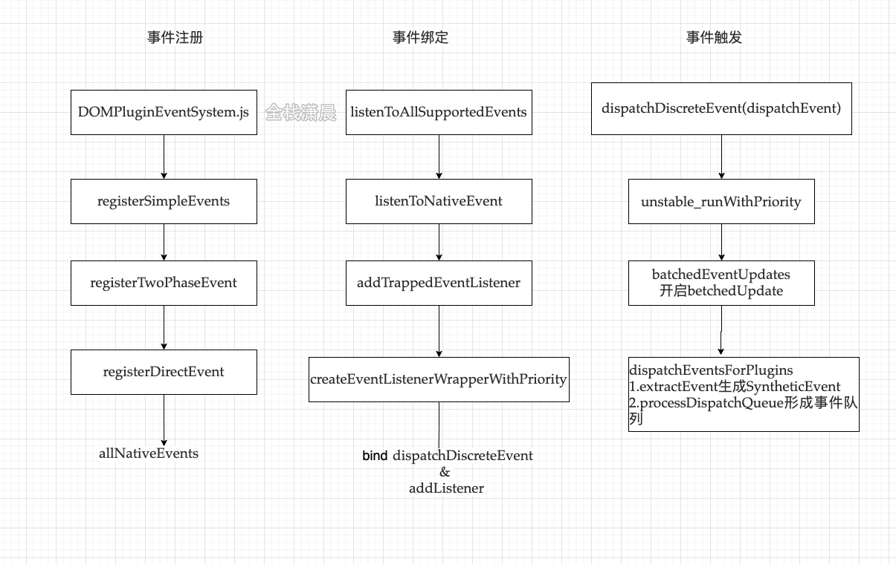

## react源码解析18事件系统

#### 从一个bug说起

下面这个demo_13在react17和react16中有什么不同吗？代码也很简单，模拟一个modal框，点击显示出现，点击其他地方，相当于点击了mask，modal消失，因为react事件都是委托到上层，所以需要在handleClick阻止冒泡，这样点击显示的时候不会触发document上的事件回调，导致modal无法显示。但是在react16上发现这样做还是不行，需要调用e.nativeEvent.stopImmediatePropagation()才能实现，而react17上没什么影响

究其原因就是react16和17在委托事件的容器上做出了改变，react16的事件会冒泡的document上，而17则会冒泡到root容器上，也就是ReactDom.render的第二个参数

```js
export default class Demo13 extends React.Component {
  state = { show: false };
  componentDidMount() {
    document.addEventListener("click", () => {
      this.setState({ show: false });
    });
  }
  handleClick = (e) => {
    e.stopPropagation();//react17中生效
    // e.nativeEvent.stopImmediatePropagation(); //react16中生效 stopImmediatePropagation也阻止本级监听函数执行
    this.setState({ show: true });
  };
  render() {
    return (
      <div>
        <button onClick={this.handleClick}>显示</button>
        {this.state.show && <div onClick={(e) => e.nativeEvent.stopImmediatePropagation()}>modal</div>}
      </div>
    );
  }
}
```

大家也可以看下demo_11、demo_12在react16、17触发顺序有何差异，同时demo项目中的event.html也模拟了react16、17的事件代理机制

#### 事件系统架构图



我们以SimpleEvent为例看事件注册、绑定和触发的过程，看视频的调试过程

#### 事件注册

1. DOMPluginEventSystem.js会调用SimpleEventPlugin插件的registerEvents方法注册事件

   ```js
   //DOMPluginEventSystem.js
   SimpleEventPlugin.registerEvents();
   ```

2. registerSimpleEvents

   ```js
   function registerSimpleEvents() {
     registerSimplePluginEventsAndSetTheirPriorities(discreteEventPairsForSimpleEventPlugin, DiscreteEvent);
     //...
   }
      
   function registerSimplePluginEventsAndSetTheirPriorities(eventTypes, priority) {
     for (var i = 0; i < eventTypes.length; i += 2) {
       var topEvent = eventTypes[i];
       var event = eventTypes[i + 1];
       var capitalizedEvent = event[0].toUpperCase() + event.slice(1);
       var reactName = 'on' + capitalizedEvent;
       eventPriorities.set(topEvent, priority);
       topLevelEventsToReactNames.set(topEvent, reactName);
       registerTwoPhaseEvent(reactName, [topEvent]);//注册捕获和冒泡两个阶段的事件
     }
   }
   ```

3. registerTwoPhaseEvent

   ```js
   function registerTwoPhaseEvent(registrationName, dependencies) {
     registerDirectEvent(registrationName, dependencies);
     registerDirectEvent(registrationName + 'Capture', dependencies);
   }
   ```

4. registerDirectEvent

   ```js
   function registerDirectEvent(registrationName, dependencies) {
    //...
      
     for (var i = 0; i < dependencies.length; i++) {
       allNativeEvents.add(dependencies[i]);//生成allNativeEvents对象
     }
   }
   ```

#### 事件绑定

1. listenToAllSupportedEvents

   ```js
   //由函数createRootImpl调用，也就是在创建根节点之后执行
   function listenToAllSupportedEvents(rootContainerElement) {
       allNativeEvents.forEach(function (domEventName) {
         if (!nonDelegatedEvents.has(domEventName)) {
           listenToNativeEvent(domEventName, false, rootContainerElement, null);
         }
      
         listenToNativeEvent(domEventName, true, rootContainerElement, null);
       });
     }
   }
   ```

2. listenToNativeEvent

   ```js
   function listenToNativeEvent(domEventName, isCapturePhaseListener, rootContainerElement, targetElement) {
    //...
      
     if (!listenerSet.has(listenerSetKey)) {
       if (isCapturePhaseListener) {
         eventSystemFlags |= IS_CAPTURE_PHASE;
       }
      
       addTrappedEventListener(target, domEventName, eventSystemFlags, isCapturePhaseListener);
       listenerSet.add(listenerSetKey);
     }
   }
   ```

3. addTrappedEventListener

   ```js
   function addTrappedEventListener(targetContainer, domEventName, eventSystemFlags, isCapturePhaseListener, isDeferredListenerForLegacyFBSupport) {
     //创建具有优先级的监听函数
     var listener = createEventListenerWrapperWithPriority(targetContainer, domEventName, eventSystemFlags); 
     //...
     targetContainer =  targetContainer;
     var unsubscribeListener; 
      
     if (isCapturePhaseListener) {//节点上添加事件
       if (isPassiveListener !== undefined) {
         unsubscribeListener = addEventCaptureListenerWithPassiveFlag(targetContainer, domEventName, listener, isPassiveListener);
       } else {
         unsubscribeListener = addEventCaptureListener(targetContainer, domEventName, listener);
       }
     } else {
       if (isPassiveListener !== undefined) {
         unsubscribeListener = addEventBubbleListenerWithPassiveFlag(targetContainer, domEventName, listener, isPassiveListener);
       } else {
         unsubscribeListener = addEventBubbleListener(targetContainer, domEventName, listener);
       }
     }
   }
   ```

4. createEventListenerWrapperWithPriority

   ```js
   function createEventListenerWrapperWithPriority(targetContainer, domEventName, eventSystemFlags) {
     var eventPriority = getEventPriorityForPluginSystem(domEventName);
     var listenerWrapper;
      
     switch (eventPriority) {
       case DiscreteEvent:
         listenerWrapper = dispatchDiscreteEvent;
         break;
      
       case UserBlockingEvent:
         listenerWrapper = dispatchUserBlockingUpdate;
         break;
      
       case ContinuousEvent:
       default:
         listenerWrapper = dispatchEvent;
         break;
     }
   	//绑定dispatchDiscreteEvent
     return listenerWrapper.bind(null, domEventName, eventSystemFlags, targetContainer);
   }
   ```

#### 事件触发

1. dispatchDiscreteEvent(dispatchEvent)

   ```js
   function dispatchDiscreteEvent(domEventName, eventSystemFlags, container, nativeEvent) {
     {
       flushDiscreteUpdatesIfNeeded(nativeEvent.timeStamp);
     }
      
     discreteUpdates(dispatchEvent, domEventName, eventSystemFlags, container, nativeEvent);
   }
   ```

2. unstable_runWithPriority

   ```js
   function unstable_runWithPriority(priorityLevel, eventHandler) {//eventHandler就是dispatchEvent函数
     switch (priorityLevel) {
       case ImmediatePriority:
       case UserBlockingPriority:
       case NormalPriority:
       case LowPriority:
       case IdlePriority:
         break;
      
       default:
         priorityLevel = NormalPriority;
     }
      
     var previousPriorityLevel = currentPriorityLevel;
     currentPriorityLevel = priorityLevel;
      
     try {
       return eventHandler();
     } finally {
       currentPriorityLevel = previousPriorityLevel;
     }
   }
   ```

3. batchedEventUpdates

   ```js
   function batchedEventUpdates(fn, a, b) {
     if (isBatchingEventUpdates) {
       return fn(a, b);
     }
      
     isBatchingEventUpdates = true;
      
     try {
       return batchedEventUpdatesImpl(fn, a, b);
       //fn参数即：
       //function () {
       //	return dispatchEventsForPlugins(domEventName, eventSystemFlags, nativeEvent, 		       		 //ancestorInst);
     	//}
       function () {
       return dispatchEventsForPlugins(domEventName, eventSystemFlags, nativeEvent, ancestorInst);
     }
     } finally {
       isBatchingEventUpdates = false;
       finishEventHandler();
     }
   }
   ```

4. dispatchEventsForPlugins

   ```js
   function dispatchEventsForPlugins(domEventName, eventSystemFlags, nativeEvent, targetInst, targetContainer) {
     var nativeEventTarget = getEventTarget(nativeEvent);
     var dispatchQueue = [];
     //extractEvent生成SyntheticEvent
     extractEvents(dispatchQueue, domEventName, targetInst, nativeEvent, nativeEventTarget, eventSystemFlags);
     //processDispatchQueue执行形成事件队列
     processDispatchQueue(dispatchQueue, eventSystemFlags);
   }
   ```