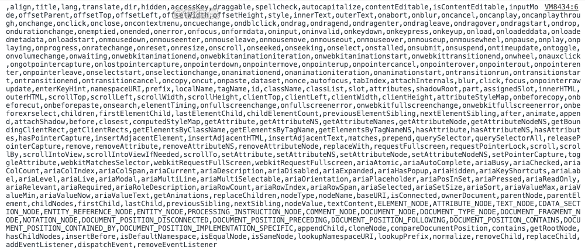

## react源码解析5.jsx&核心api

#### virtual Dom是什么

一句话概括就是，用js对象表示dom信息和结构，更新时重新渲染更新后的对象对应的dom，这个对象就是React.createElement()的返回结果

virtual Dom是一种编程方式，它以对象的形式保存在内存中，它描述了我们dom的必要信息，并且用类似react-dom等模块与真实dom同步，这一过程也叫协调(reconciler)，这种方式可以声明式的渲染相应的ui状态，让我们从dom操作中解放出来，在react中是以fiber树的形式存放组件树的相关信息，在更新时可以增量渲染相关dom，所以fiber也是virtual Dom实现的一部分

#### 为什么要用virtual Dom

大量的dom操作慢，很小的更新都有可能引起页面的重新排列，js对象优于在内存中，处理起来更快，可以通过diff算法比较新老virtual Dom的差异，并且批量、异步、最小化的执行dom的变更，以提高性能

另外就是可以跨平台，jsx --> ReactElement对象 --> 真实节点，有中间层的存在，就可以在操作真实节点之前进行对应的处理，处理的结果反映到真实节点上，这个真实节点可以是浏览器环境，也可以是Native环境

virtual Dom真的快吗？其实virtual Dom只是在更新的时候快，在应用初始的时候不一定快


```js
const div = document.createElement('div');
let str = ''
for(let k in div){
  str+=','+k
}
console.log(str)
```



#### jsx&createElement

jsx可以声明式的描述视图，提升开发效率，通过babel可以转换成React.createElement()的语法糖，也是js语法的扩展。

jsx是ClassComponent的render函数或者FunctionComponent的返回值，可以用来表示组件的内容，在经过babel编译之后，最后会被编译成`React.createElement`，这就是为什么jsx文件要声明`import React from 'react'`的原因（react17之后不用导入），你可以在 babel编译jsx 站点查看jsx被编译后的结果

 `React.createElement`的源码中做了如下几件事

- 处理config，把除了保留属性外的其他config赋值给props
- 把children处理后赋值给props.children
- 处理defaultProps
- 调用ReactElement返回一个jsx对象(virtual-dom)

```js
//ReactElement.js
export function createElement(type, config, children) {
  let propName;

  const props = {};

  let key = null;
  let ref = null;
  let self = null;
  let source = null;

  if (config != null) {
    //处理config，把除了保留属性外的其他config赋值给props
    //...
  }

  const childrenLength = arguments.length - 2;
  //把children处理后赋值给props.children
  //...

  //处理defaultProps
  //...

  return ReactElement(
    type,
    key,
    ref,
    self,
    source,
    ReactCurrentOwner.current,
    props,
  );
}

const ReactElement = function(type, key, ref, self, source, owner, props) {
  const element = {
    $$typeof: REACT_ELEMENT_TYPE,//表示是ReactElement类型

    type: type,//class或function
    key: key,//key
    ref: ref,//ref属性
    props: props,//props
    _owner: owner,
  };

  return element;
};
```

$$typeof表示的是组件的类型，例如在源码中有一个检查是否是合法Element的函数，就是根object.$$typeof === REACT_ELEMENT_TYPE来判断的

```js
//ReactElement.js
export function isValidElement(object) {
  return (
    typeof object === 'object' &&
    object !== null &&
    object.$$typeof === REACT_ELEMENT_TYPE
  );
}
```

如果组件是ClassComponent则type是class本身，如果组件是FunctionComponent创建的，则type是这个function，源码中用ClassComponent.prototype.isReactComponent来区别二者。注意class或者function创建的组件一定要首字母大写，不然后被当成普通节点，type就是字符串。

jsx对象上没有优先级、状态、effectTag等标记，这些标记在Fiber对象上，在mount时Fiber根据jsx对象来构建，在update时根据最新状态的jsx和current Fiber对比，形成新的workInProgress Fiber，最后workInProgress Fiber切换成current Fiber。

#### render

```js
//ReactDOMLegacy.js
export function render(
  element: React$Element<any>,//jsx对象
  container: Container,//挂载dom
  callback: ?Function,//回调
) {
  
  return legacyRenderSubtreeIntoContainer(
    null,
    element,
    container,
    false,
    callback,
  );
}
```

可以看到render所做的事也就是调用legacyRenderSubtreeIntoContainer，这个函数在下一章讲解，这里重点关注ReactDom.render()使用时候的三个参数。

#### component

```js
//ReactBaseClasses.js
function Component(props, context, updater) {
  this.props = props;//props属性
  this.context = context;//当前的context
  this.refs = emptyObject;//ref挂载的对象
  this.updater = updater || ReactNoopUpdateQueue;//更新的对像
}

Component.prototype.isReactComponent = {};//表示是classComponent
```

component函数中主要在当前实例上挂载了props、context、refs、updater等，所以在组件的实例上能拿到这些，而更新主要的承载结构就是updater， 主要关注isReactComponent，它用来表示这个组件是类组件

总结：jsx是React.createElement的语法糖，jsx通过babel转化成React.createElement函数，React.createElement执行之后返回jsx对象，也叫virtual-dom，Fiber会根据jsx对象和current Fiber进行对比形成workInProgress Fiber

pureComponent也很简单，和component差不多，他会进行原型继承，然后赋值isPureReactComponent

```js
function PureComponent(props, context, updater) {
  this.props = props;
  this.context = context;
  this.refs = emptyObject;
  this.updater = updater || ReactNoopUpdateQueue;
}

const pureComponentPrototype = (PureComponent.prototype = new ComponentDummy());
pureComponentPrototype.constructor = PureComponent;
Object.assign(pureComponentPrototype, Component.prototype);
pureComponentPrototype.isPureReactComponent = true;

export {Component, PureComponent};
```