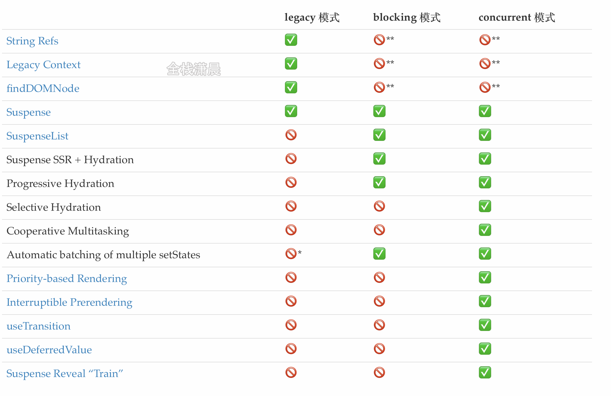

## react源码解析6.legacy和concurrent模式入口函数

#### react启动的模式

react有3种模式进入主体函数的入口，我们可以从 react官方文档 [使用 Concurrent 模式（实验性）](https://zh-hans.reactjs.org/docs/concurrent-mode-adoption.html#feature-comparison)中对比三种模式：

- **legacy 模式：** `ReactDOM.render(<App />, rootNode)`。这是当前 React app 使用的方式。当前没有计划删除本模式，但是这个模式可能不支持这些新功能。
- **blocking 模式：** `ReactDOM.createBlockingRoot(rootNode).render(<App />)`。目前正在实验中。作为迁移到 concurrent 模式的第一个步骤。
- **concurrent 模式：** `ReactDOM.createRoot(rootNode).render(<App />)`。目前在实验中，未来稳定之后，打算作为 React 的默认开发模式。这个模式开启了*所有的*新功能。

**特性对比：**

#### 

legacy 模式在合成事件中有自动批处理的功能，但仅限于一个浏览器任务。非 React 事件想使用这个功能必须使用 `unstable_batchedUpdates`。在 blocking 模式和 concurrent 模式下，所有的 `setState` 在默认情况下都是批处理的。会在开发中发出警告

#### 不同模式在react运行时的含义

legacy模式是我们常用的，它构建dom的过程是同步的，所以在render的reconciler中，如果diff的过程特别耗时，那么导致的结果就是js一直阻塞高优先级的任务(例如用户的点击事件)，表现为页面的卡顿，无法响应。

concurrent Mode是react未来的模式，它用时间片调度实现了异步可中断的任务，根据设备性能的不同，时间片的长度也不一样，在每个时间片中，如果任务到了过期时间，就会主动让出线程给高优先级的任务。这部分将在第15节 scheduler&lane模型 。

#### 两种模式函数主要执行过程

**1.主要执行流程：**


2.**详细函数调用过程**：

用demo_0跟着视频调试更加清晰，黄色部分是主要任务是创建fiberRootNode和rootFiber，红色部分是创建Update，蓝色部分是调度render阶段的入口函数


**3.legacy模式：**

- render调用legacyRenderSubtreeIntoContainer，最后createRootImpl会调用到createFiberRoot创建fiberRootNode,然后调用createHostRootFiber创建rootFiber，其中fiberRootNode是整个项目的的根节点，rootFiber是当前应用挂在的节点，也就是ReactDOM.render调用后的根节点

  ```js
  //最上层的节点是整个项目的根节点fiberRootNode
  ReactDOM.render(<App />, document.getElementById("root"));//rootFiber
  ReactDOM.render(<App />, document.getElementById("root"));//rootFiber
  ```

  

- 创建完Fiber节点后，legacyRenderSubtreeIntoContainer调用updateContainer创建创建Update对象挂载到updateQueue的环形链表上，然后执行scheduleUpdateOnFiber调用performSyncWorkOnRoot进入render阶段和commit阶段

**4.concurrent模式：**

- createRoot调用createRootImpl创建fiberRootNode和rootNode
- 创建完Fiber节点后，调用ReactDOMRoot.prototype.render执行updateContainer，然后scheduleUpdateOnFiber异步调度performConcurrentWorkOnRoot进入render阶段和commit阶段

**5.legacy模式主要函数注释**

```js
function legacyRenderSubtreeIntoContainer(parentComponent, children, container, forceHydrate, callback) {
  //...
  var root = container._reactRootContainer;
  var fiberRoot;

  if (!root) {
    // mount时
    root = container._reactRootContainer = legacyCreateRootFromDOMContainer(container, forceHydrate);//创建root节点
    fiberRoot = root._internalRoot;

    if (typeof callback === 'function') {//处理回调
      var originalCallback = callback;

      callback = function () {
        var instance = getPublicRootInstance(fiberRoot);
        originalCallback.call(instance);
      };
    } 


    unbatchedUpdates(function () {
      updateContainer(children, fiberRoot, parentComponent, callback);//创建update入口
    });
  } else {
    // update时
    fiberRoot = root._internalRoot;

    if (typeof callback === 'function') {//处理回调
      var _originalCallback = callback;

      callback = function () {
        var instance = getPublicRootInstance(fiberRoot);

        _originalCallback.call(instance);
      };
    } 
    
    updateContainer(children, fiberRoot, parentComponent, callback);
  }
}
function createFiberRoot(containerInfo, tag, hydrate, hydrationCallbacks) {
  var root = new FiberRootNode(containerInfo, tag, hydrate);//创建fiberRootNode
  const uninitializedFiber = createHostRootFiber(tag);//创建rootFiber
  //rootFiber和fiberRootNode连接
  root.current = uninitializedFiber;
  uninitializedFiber.stateNode = root;
  //创建updateQueue
  initializeUpdateQueue(uninitializedFiber);
  return root;
}

//对于HostRoot或者ClassComponent会使用initializeUpdateQueue创建updateQueue，然后将updateQueue挂载到fiber节点上
export function initializeUpdateQueue<State>(fiber: Fiber): void {
  const queue: UpdateQueue<State> = {
    baseState: fiber.memoizedState,//初始state，后面会基于这个state，根据Update计算新的state
    firstBaseUpdate: null,//Update形成的链表的头
    lastBaseUpdate: null,//Update形成的链表的尾
		//新产生的update会以单向环状链表保存在shared.pending上，计算state的时候会剪开这个环状链表，并且连接在			  //lastBaseUpdate后
    shared: {
      pending: null,
    },
    effects: null,
  };
  fiber.updateQueue = queue;
}
function updateContainer(element, container, parentComponent, callback) {
  var lane = requestUpdateLane(current$1);//获取当前可用lane 在12章讲解
  var update = createUpdate(eventTime, lane); //创建update

  update.payload = {
    element: element//jsx
  };

  enqueueUpdate(current$1, update);//update入队
  scheduleUpdateOnFiber(current$1, lane, eventTime);//调度update
  return lane;
}
function scheduleUpdateOnFiber(fiber, lane, eventTime) {
  if (lane === SyncLane) {//同步lane 对应legacy模式
    //...
    performSyncWorkOnRoot(root);//render阶段的起点 render在第6章讲解
  } else {//concurrent模式
    //...
    ensureRootIsScheduled(root, eventTime);//确保root被调度
  } 
}
```

**6.concurrent主要函数注释：**

```js
function ensureRootIsScheduled(root, currentTime) {
  //...
  var nextLanes = getNextLanes(root, root === workInProgressRoot ? workInProgressRootRenderLanes : NoLanes); //计算nextLanes

  //...

 //将lane的优先级转换成schduler的优先级
  var schedulerPriorityLevel = lanePriorityToSchedulerPriority(newCallbackPriority);
  //以schedulerPriorityLevel的优先级执行performConcurrentWorkOnRoot 也就是concurrent模式的起点
  newCallbackNode = 	  scheduleCallback(schedulerPriorityLevel,performConcurrentWorkOnRoot.bind(null, root));
}
```

**7.两种模式的不同点：**

1. createRootImpl中传入的第二个参数不一样 一个是LegacyRoot一个是ConcurrentRoot
2. requestUpdateLane中获取的lane的优先级不同
3. 在函数scheduleUpdateOnFiber中根据不同优先级进入不同分支，legacy模式进入performSyncWorkOnRoot，concurrent模式会异步调度performConcurrentWorkOnRoot