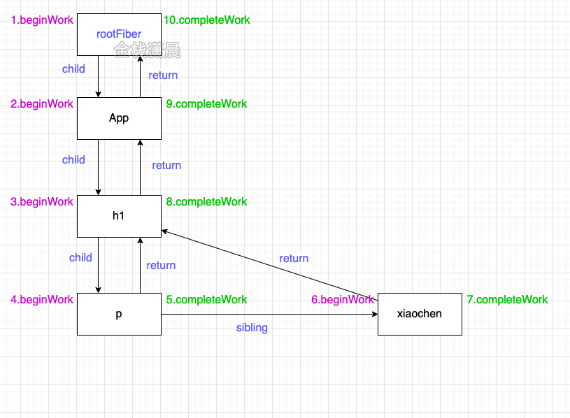
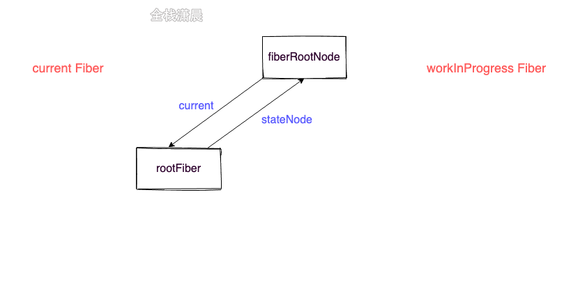
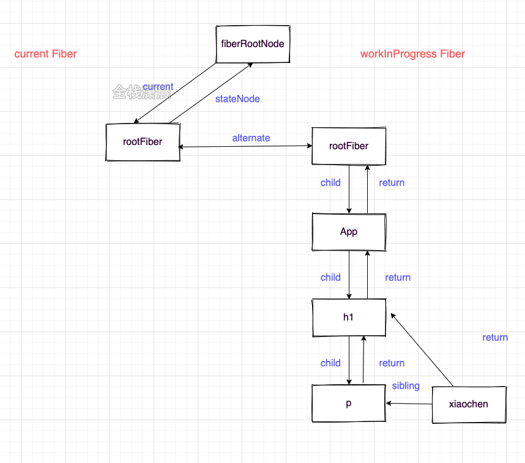
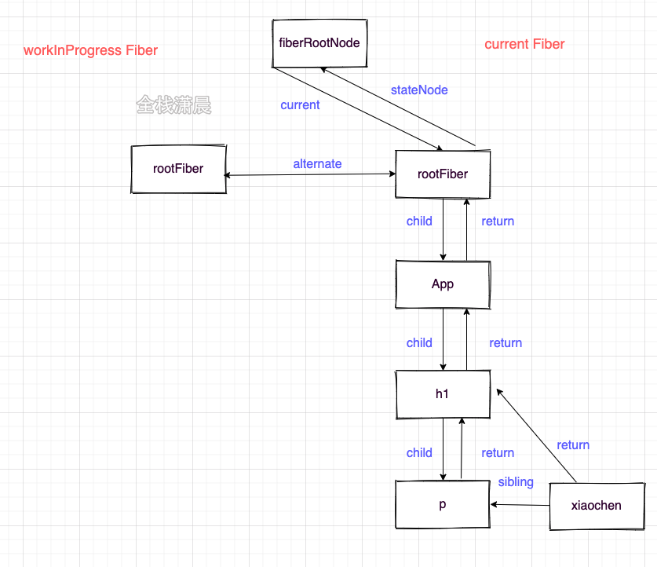
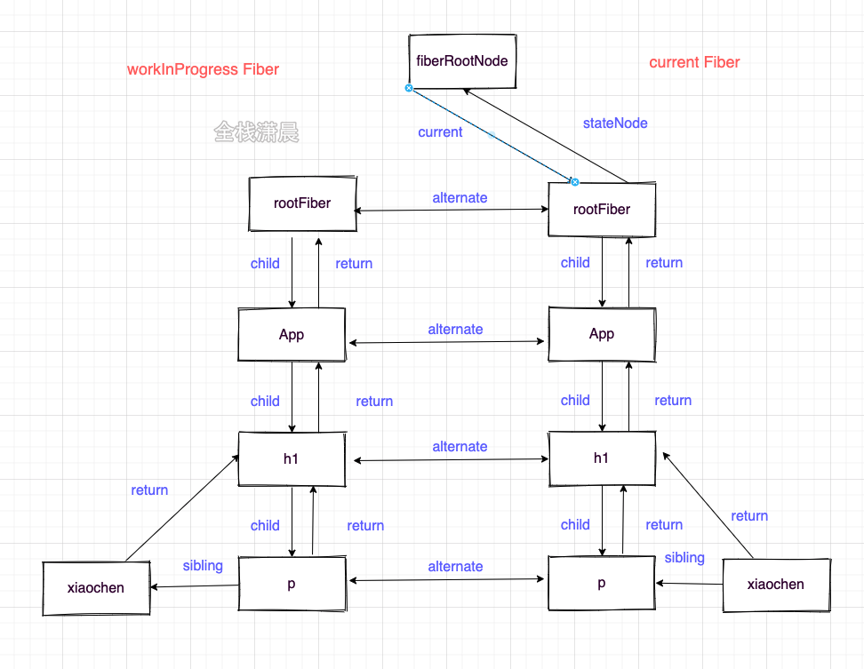
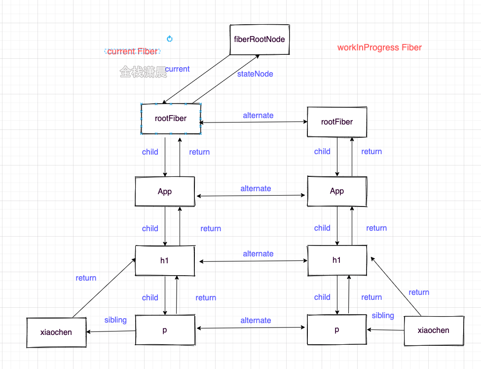

## react源码解析7.Fiber架构

#### Fiber的深度理解

react15在render阶段的reconcile是不可打断的，这会在进行大量节点的reconcile时可能产生卡顿，因为浏览器所有的时间都交给了js执行，并且js的执行时单线程。为此react16之后就有了scheduler进行时间片的调度，给每个task（工作单元）一定的时间，如果在这个时间内没执行完，也要交出执行权给浏览器进行绘制和重排，所以异步可中断的更新需要一定的数据结构在内存中来保存工作单元的信息，这个数据结构就是Fiber。

那么有了Fiber这种数据结构后，能完成哪些事情呢，

- **工作单元 任务分解** ：Fiber最重要的功能就是作为工作单元，保存原生节点或者组件节点对应信息（包括优先级），这些节点通过指针的形似形成Fiber树
- **增量渲染**：通过jsx对象和current Fiber的对比，生成最小的差异补丁，应用到真实节点上
- **根据优先级暂停、继续、排列优先级**：Fiber节点上保存了优先级，能通过不同节点优先级的对比，达到任务的暂停、继续、排列优先级等能力，也为上层实现批量更新、Suspense提供了基础
- **保存状态：**因为Fiber能保存状态和更新的信息，所以就能实现函数组件的状态更新，也就是hooks

#### Fiber的数据结构

Fiber的自带的属性如下：

```js
//ReactFiber.old.js
function FiberNode(
  tag: WorkTag,
  pendingProps: mixed,
  key: null | string,
  mode: TypeOfMode,
) {
  //作为静态的数据结构 保存节点的信息 
  this.tag = tag;//对应组件的类型
  this.key = key;//key属性
  this.elementType = null;//元素类型
  this.type = null;//func或者class
  this.stateNode = null;//真实dom节点

  //作为fiber数架构 连接成fiber树
  this.return = null;//指向父节点
  this.child = null;//指向child
  this.sibling = null;//指向兄弟节点
  this.index = 0;

  this.ref = null;

  //用作为工作单元 来计算state
  this.pendingProps = pendingProps;
  this.memoizedProps = null;
  this.updateQueue = null;
  this.memoizedState = null;
  this.dependencies = null;

  this.mode = mode;
    
	//effect相关
  this.effectTag = NoEffect;
  this.nextEffect = null;
  this.firstEffect = null;
  this.lastEffect = null;

  //优先级相关的属性
  this.lanes = NoLanes;
  this.childLanes = NoLanes;

  //current和workInProgress的指针
  this.alternate = null;
}
```

#### Fiber双缓存

现在我们知道了Fiber可以保存真实的dom，真实dom对应在内存中的Fiber节点会形成Fiber树，这颗Fiber树在react中叫current Fiber，也就是当前dom树对应的Fiber树，而正在构建Fiber树叫workInProgress Fiber，这两颗树的节点通过alternate相连.

```js
function App() {
  return (
		<>
      <h1>
        <p>count</p> xiaochen
      </h1>
    </>
  )
}

ReactDOM.render(<App />, document.getElementById("root"));
```



构建workInProgress Fiber发生在createWorkInProgress中，它能创建或者服用Fiber

```js
//ReactFiber.old.js
export function createWorkInProgress(current: Fiber, pendingProps: any): Fiber {
  let workInProgress = current.alternate;
  if (workInProgress === null) {//区分是在mount时还是在update时
    workInProgress = createFiber(
      current.tag,
      pendingProps,
      current.key,
      current.mode,
    );
    workInProgress.elementType = current.elementType;
    workInProgress.type = current.type;
    workInProgress.stateNode = current.stateNode;
   
    workInProgress.alternate = current;
    current.alternate = workInProgress;
  } else {
    workInProgress.pendingProps = pendingProps;//复用属性
    workInProgress.type = current.type;
    workInProgress.flags = NoFlags;

    workInProgress.nextEffect = null;
    workInProgress.firstEffect = null;
    workInProgress.lastEffect = null;
	
    //...
  }

  workInProgress.childLanes = current.childLanes;//复用属性
  workInProgress.lanes = current.lanes;

  workInProgress.child = current.child;
  workInProgress.memoizedProps = current.memoizedProps;
  workInProgress.memoizedState = current.memoizedState;
  workInProgress.updateQueue = current.updateQueue;

  const currentDependencies = current.dependencies;
  workInProgress.dependencies =
    currentDependencies === null
      ? null
      : {
          lanes: currentDependencies.lanes,
          firstContext: currentDependencies.firstContext,
        };

  workInProgress.sibling = current.sibling;
  workInProgress.index = current.index;
  workInProgress.ref = current.ref;


  return workInProgress;
}
```

- 在mount时：会创建fiberRoot和rootFiber，然后根据jsx对象创建Fiber节点，节点连接成current Fiber树。

- 在update时：会根据新的状态形成的jsx（ClassComponent的render或者FuncComponent的返回值）和current Fiber对比形（diff算法）成一颗叫workInProgress的Fiber树，然后将fiberRoot的current指向workInProgress树，此时workInProgress就变成了current Fiber。fiberRoot：指整个应用的根节点，只存在一个

  > fiberRoot：指整个应用的根节点，只存在一个
  >
  > rootFiber：ReactDOM.render或者ReactDOM.unstable_createRoot创建出来的应用的节点，可以存在多个。

我们现在知道了存在current Fiber和workInProgress Fiber两颗Fiber树，Fiber双缓存指的就是，在经过reconcile（diff）形成了新的workInProgress Fiber然后将workInProgress Fiber切换成current Fiber应用到真实dom中，存在双Fiber的好处是在内存中形成视图的描述，在最后应用到dom中，减少了对dom的操作。

**现在来看看Fiber双缓存创建的过程图**：

- **mount时：**
  1. 刚开始只创建了fiberRoot和rootFiber两个节点
  2. 然后根据jsx创建workInProgress Fiber：
  3. 把workInProgress Fiber切换成current Fiber
- **update时**
  1. 根据current Fiber创建workInProgress Fiber
  2. 把workInProgress Fiber切换成current Fiber

