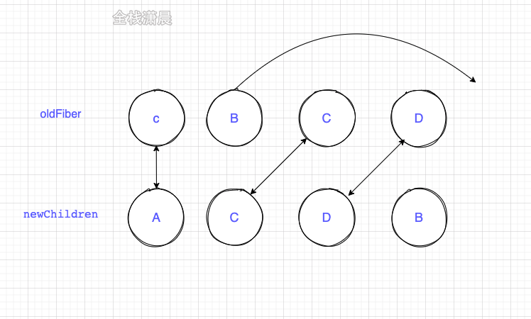

## react源码解析9.diff算法

在render阶段更新Fiber节点时，我们会调用reconcileChildFibers对比current Fiber和jsx对象构建workInProgress Fiber，这里current Fiber是指当前dom对应的fiber树，jsx是class组件render方法或者函数组件的返回值。

在reconcileChildFibers中会根据newChild的类型来进入单节点的diff或者多节点diff

```js
//ReactChildFiber.old.js
function reconcileChildFibers(
  returnFiber: Fiber,
  currentFirstChild: Fiber | null,
  newChild: any,
): Fiber | null {

  const isObject = typeof newChild === 'object' && newChild !== null;

  if (isObject) {
    switch (newChild.$$typeof) {
      case REACT_ELEMENT_TYPE:
				//单一节点diff
        return placeSingleChild(
            reconcileSingleElement(
              returnFiber,
              currentFirstChild,
              newChild,
              lanes,
            ),
          );
    }
  }
	//...
  
  if (isArray(newChild)) {
     //多节点diff
    return reconcileChildrenArray(
        returnFiber,
        currentFirstChild,
        newChild,
        lanes,
      );
  }

  // 删除节点
  return deleteRemainingChildren(returnFiber, currentFirstChild);
}
```

**diff过程的主要流程如下图：**


我们知道对比两颗树的复杂度本身是O(n3)，对我们的应用来说这个是不能承受的量级，react为了降低复杂度，提出了三个前提：

1. 只对同级比较，跨层级的dom不会进行复用

2. 不同类型节点生成的dom树不同，此时会直接销毁老节点及子孙节点，并新建节点

3. 可以通过key来对元素diff的过程提供复用的线索，例如：

   ```js
   const a = (
       <>
         <p key="0">0</p>
         <p key="1">1</p>
       </>
     );
   const b = (
     <>
       <p key="1">1</p>
       <p key="0">0</p>
     </>
   );
   ```

    如果a和b里的元素都没有key，因为节点的更新前后文本节点不同，导致他们都不能复用，所以会销毁之前的节点，并新建节点，但是现在有key了，b中的节点会在老的a中寻找key相同的节点尝试复用，最后发现只是交换位置就可以完成更新，具体对比过程后面会讲到。

#### 单节点diff

单点diff有如下几种情况：

- key和type相同表示可以复用节点
- key不同直接标记删除节点，然后新建节点
- key相同type不同，标记删除该节点和兄弟节点，然后新创建节点

```js
function reconcileSingleElement(
  returnFiber: Fiber,
  currentFirstChild: Fiber | null,
  element: ReactElement
): Fiber {
  const key = element.key;
  let child = currentFirstChild;
  
  //child节点不为null执行对比
  while (child !== null) {

    // 1.比较key
    if (child.key === key) {

      // 2.比较type

      switch (child.tag) {
        //...
        
        default: {
          if (child.elementType === element.type) {
            // type相同则可以复用 返回复用的节点
            return existing;
          }
          // type不同跳出
          break;
        }
      }
      //key相同，type不同则把fiber及和兄弟fiber标记删除
      deleteRemainingChildren(returnFiber, child);
      break;
    } else {
      //key不同直接标记删除该节点
      deleteChild(returnFiber, child);
    }
    child = child.sibling;
  }
   
  //新建新Fiber
}
```

#### 多节点diff

多节点diff比较复杂，我们分三种情况进行讨论，其中a表示更新前的节点，b表示更新后的节点

- 属性变化

  ```js
  const a = (
      <>
        <p key="0" name='0'>0</p>
        <p key="1">1</p>
      </>
    );
    const b = (
      <>
        <p key="0" name='00'>0</p>
        <p key="1">1</p>
      </>
    );
  ```

- type变化

  ```js
  const a = (
      <>
        <p key="0">0</p>
        <p key="1">1</p>
      </>
    );
    const b = (
      <>
        <div key="0">0</div>
        <p key="1">1</p>
      </>
    );
  ```

- 新增节点

  ```js
  const a = (
      <>
        <p key="0">0</p>
        <p key="1">1</p>
      </>
    );
    const b = (
      <>
        <p key="0">0</p>
        <p key="1">1</p>
        <p key="2">2</p>
      </>
    );
  ```

- 节点删除

  ```js
  const a = (
      <>
        <p key="0">0</p>
        <p key="1">1</p>
        <p key="2">2</p>
      </>
    );
    const b = (
      <>
        <p key="0">0</p>
        <p key="1">1</p>
      </>
    );
  ```

- 节点位置变化

  ```js
  	const a = (
      <>
        <p key="0">0</p>
        <p key="1">1</p>
      </>
    );
    const b = (
      <>
        <p key="1">1</p>
        <p key="0">0</p>
      </>
    );
  ```

在源码中多节点diff有三个for循环遍历（并不意味着所有更新都有经历三个遍历，进入循环体有条件，也有条件跳出循环），第一个遍历处理节点的更新（包括props更新和type更新和删除），第二个遍历处理其他的情况（节点新增），其原因在于在大多数的应用中，节点更新的频率更加频繁，第三个处理位节点置改变

- 第一次遍历 因为老的节点存在于current Fiber中，所以它是个链表结构，还记得Fiber双缓存结构嘛，节点通过child、return、sibling连接，而newChildren存在于jsx当中，所以遍历对比的时候，首先让newChildren[i]`与`oldFiber对比，然后让i++、nextOldFiber = oldFiber.sibling。在第一轮遍历中，会处理三种情况，其中第1，2两种情况会结束第一次循环

  1. key不同，第一次循环结束
  2. newChildren或者oldFiber遍历完，第一次循环结束
  3. key同type不同，标记oldFiber为DELETION
  4. key相同type相同则可以复用

   newChildren遍历完，oldFiber没遍历完，在第一次遍历完成之后将oldFiber中没遍历完的节点标记为DELETION，即删除的DELETION Tag

- 第二个遍历 第二个遍历考虑三种情况

  1. newChildren和oldFiber都遍历完：多节点diff过程结束
  2. newChildren没遍历完，oldFiber遍历完，将剩下的newChildren的节点标记为Placement，即插入的Tag
  3. newChildren和oldFiber没遍历完，则进入节点移动的逻辑

- 第三个遍历 主要逻辑在placeChild函数中，例如更新前节点顺序是ABCD，更新后是ACDB

  1. newChild中第一个位置的A和oldFiber第一个位置的A，key相同可复用，lastPlacedIndex=0
  2. newChild中第二个位置的C和oldFiber第二个位置的B，key不同跳出第一次循环，将oldFiber中的BCD保存在map中
  3. newChild中第二个位置的C在oldFiber中的index=2 > lastPlacedIndex=0不需要移动，lastPlacedIndex=2
  4. newChild中第三个位置的D在oldFiber中的index=3 > lastPlacedIndex=2不需要移动，lastPlacedIndex=3
  5. newChild中第四个位置的B在oldFiber中的index=1 < lastPlacedIndex=3,移动到最后

  **看图更直观**

  

  例如更新前节点顺序是ABCD，更新后是DABC

  1. newChild中第一个位置的D和oldFiber第一个位置的A，key不相同不可复用，将oldFiber中的ABCD保存在map中，lastPlacedIndex=0
  2. newChild中第一个位置的D在oldFiber中的index=3 > lastPlacedIndex=0不需要移动，lastPlacedIndex=3
     1. newChild中第二个位置的A在oldFiber中的index=0 < lastPlacedIndex=3,移动到最后
     2. newChild中第三个位置的B在oldFiber中的index=1 < lastPlacedIndex=3,移动到最后
     3. newChild中第四个位置的C在oldFiber中的index=2 < lastPlacedIndex=3,移动到最后

  **看图更直观**

  

 **代码如下**：

```js
//ReactChildFiber.old.js

function placeChild(newFiber, lastPlacedIndex, newIndex) {
       newFiber.index = newIndex;
   
       if (!shouldTrackSideEffects) {
         return lastPlacedIndex;
       }
   
    var current = newFiber.alternate;
 
       if (current !== null) {
         var oldIndex = current.index;
   
         if (oldIndex < lastPlacedIndex) {
           //oldIndex小于lastPlacedIndex的位置 则将节点插入到最后
           newFiber.flags = Placement;
           return lastPlacedIndex;
         } else {
           return oldIndex;//不需要移动 lastPlacedIndex = oldIndex;
         }
       } else {
         //新增插入
         newFiber.flags = Placement;
         return lastPlacedIndex;
       }
     }
//ReactChildFiber.old.js

function reconcileChildrenArray(
    returnFiber: Fiber,//父fiber节点
    currentFirstChild: Fiber | null,//childs中第一个节点
    newChildren: Array<*>,//新节点数组 也就是jsx数组
    lanes: Lanes,//lane相关 第12章介绍
  ): Fiber | null {

    let resultingFirstChild: Fiber | null = null;//diff之后返回的第一个节点
    let previousNewFiber: Fiber | null = null;//新节点中上次对比过的节点

    let oldFiber = currentFirstChild;//正在对比的oldFiber
    let lastPlacedIndex = 0;//上次可复用的节点位置 或者oldFiber的位置
    let newIdx = 0;//新节点中对比到了的位置
    let nextOldFiber = null;//正在对比的oldFiber
    for (; oldFiber !== null && newIdx < newChildren.length; newIdx++) {//第一次遍历
      if (oldFiber.index > newIdx) {//nextOldFiber赋值
        nextOldFiber = oldFiber;
        oldFiber = null;
      } else {
        nextOldFiber = oldFiber.sibling;
      }
      const newFiber = updateSlot(//更新节点，如果key不同则newFiber=null
        returnFiber,
        oldFiber,
        newChildren[newIdx],
        lanes,
      );
      if (newFiber === null) {
        if (oldFiber === null) {
          oldFiber = nextOldFiber;
        }
        break;//跳出第一次遍历
      }
      if (shouldTrackSideEffects) {//检查shouldTrackSideEffects
        if (oldFiber && newFiber.alternate === null) {
          deleteChild(returnFiber, oldFiber);
        }
      }
      lastPlacedIndex = placeChild(newFiber, lastPlacedIndex, newIdx);//标记节点插入
      if (previousNewFiber === null) {
        resultingFirstChild = newFiber;
      } else {
        previousNewFiber.sibling = newFiber;
      }
      previousNewFiber = newFiber;
      oldFiber = nextOldFiber;
    }

    if (newIdx === newChildren.length) {
      deleteRemainingChildren(returnFiber, oldFiber);//将oldFiber中没遍历完的节点标记为DELETION
      return resultingFirstChild;
    }

    if (oldFiber === null) {
      for (; newIdx < newChildren.length; newIdx++) {//第2次遍历
        const newFiber = createChild(returnFiber, newChildren[newIdx], lanes);
        if (newFiber === null) {
          continue;
        }
        lastPlacedIndex = placeChild(newFiber, lastPlacedIndex, newIdx);//插入新增节点
        if (previousNewFiber === null) {
          resultingFirstChild = newFiber;
        } else {
          previousNewFiber.sibling = newFiber;
        }
        previousNewFiber = newFiber;
      }
      return resultingFirstChild;
    }

    // 将剩下的oldFiber加入map中
    const existingChildren = mapRemainingChildren(returnFiber, oldFiber);

    for (; newIdx < newChildren.length; newIdx++) {//第三次循环 处理节点移动
      const newFiber = updateFromMap(
        existingChildren,
        returnFiber,
        newIdx,
        newChildren[newIdx],
        lanes,
      );
      if (newFiber !== null) {
        if (shouldTrackSideEffects) {
          if (newFiber.alternate !== null) {
            existingChildren.delete(//删除找到的节点
              newFiber.key === null ? newIdx : newFiber.key,
            );
          }
        }
        lastPlacedIndex = placeChild(newFiber, lastPlacedIndex, newIdx);//标记为插入的逻辑
        if (previousNewFiber === null) {
          resultingFirstChild = newFiber;
        } else {
          previousNewFiber.sibling = newFiber;
        }
        previousNewFiber = newFiber;
      }
    }

    if (shouldTrackSideEffects) {
      //删除existingChildren中剩下的节点
      existingChildren.forEach(child => deleteChild(returnFiber, child));
    }

    return resultingFirstChild;
  }
```