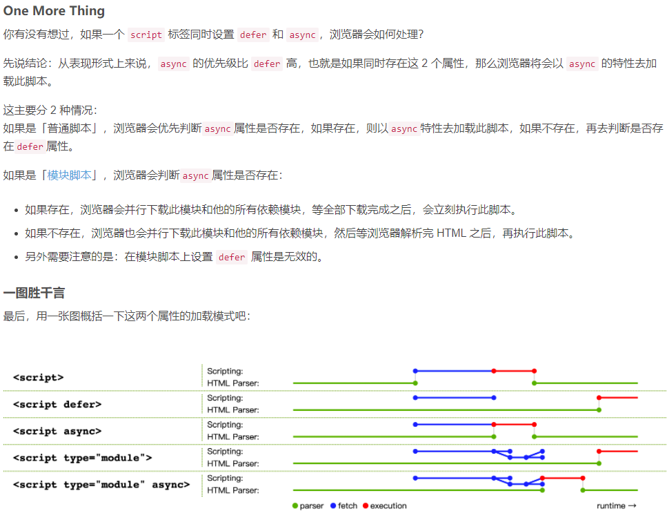

### script标签defer和async的区别

###### defer

不阻塞浏览器解析 HTML，等解析完 HTML 之后，才会执行 script。
会并行下载 JavaScript 资源。
会按照 HTML 中的相对顺序执行脚本。
会在脚本下载并执行完成之后，才会触发 DOMContentLoaded 事件。
在脚本执行过程中，一定可以获取到 HTML 中已有的元素。
defer 属性对模块脚本无效。
适用于：所有外部脚本（通过 src 引用的 script）。

###### async

不阻塞浏览器解析 HTML，但是 script 下载完成后，会立即中断浏览器解析 HTML，并执行此 script。
会并行下载 JavaScript 资源。
互相独立，谁先下载完，谁先执行，没有固定的先后顺序，不可控。
由于没有确定的执行时机，所以在脚本里面可能会获取不到 HTML 中已有的元素。
DOMContentLoaded 事件和 script 脚本无相关性，无法确定他们的先后顺序。
适用于：独立的第三方脚本。
另外：async 和 defer 之间最大的区别在于它们的执行时机。

