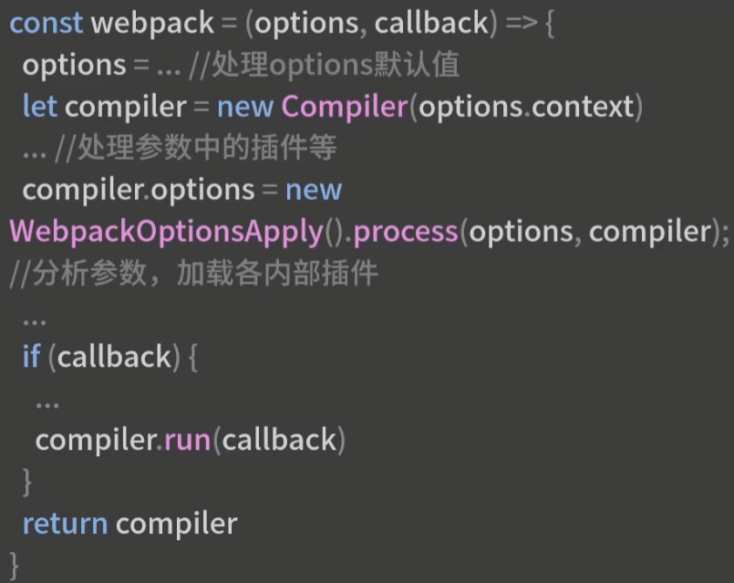
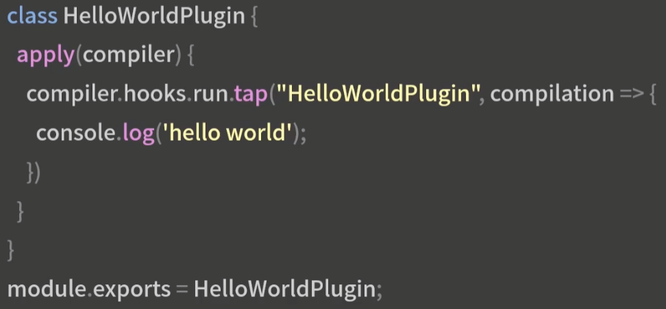
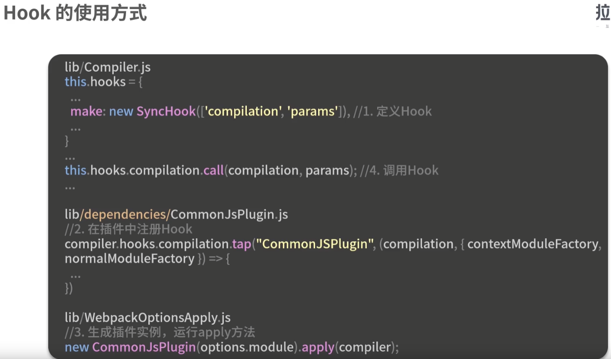
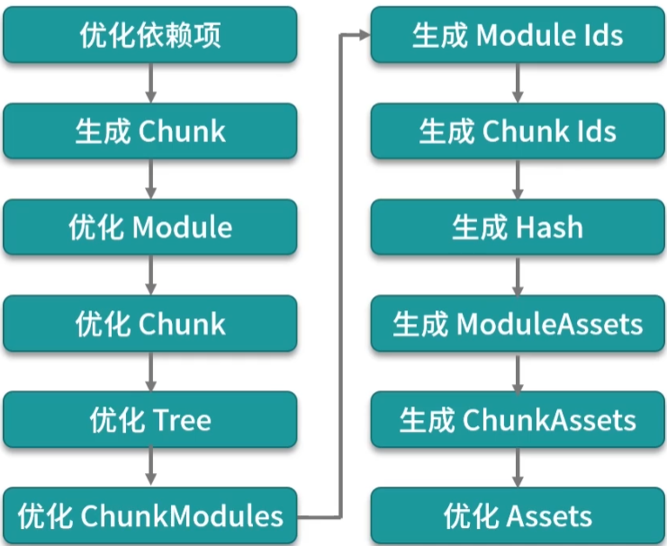
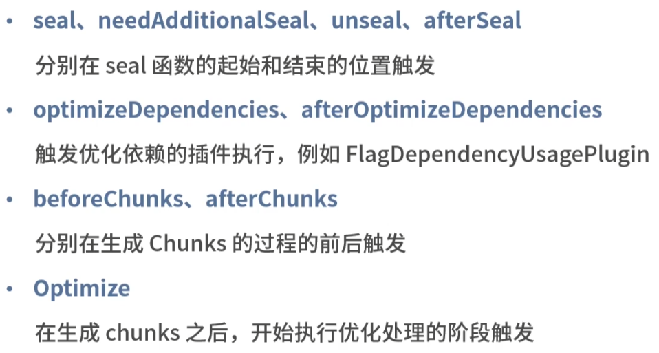
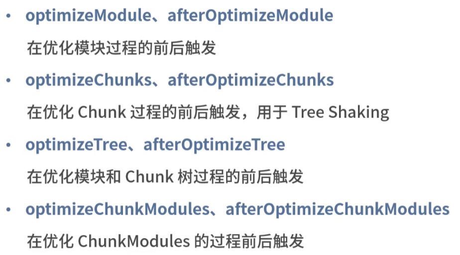
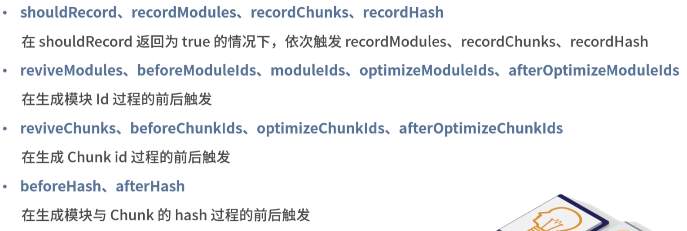
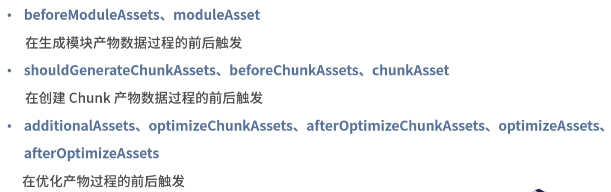
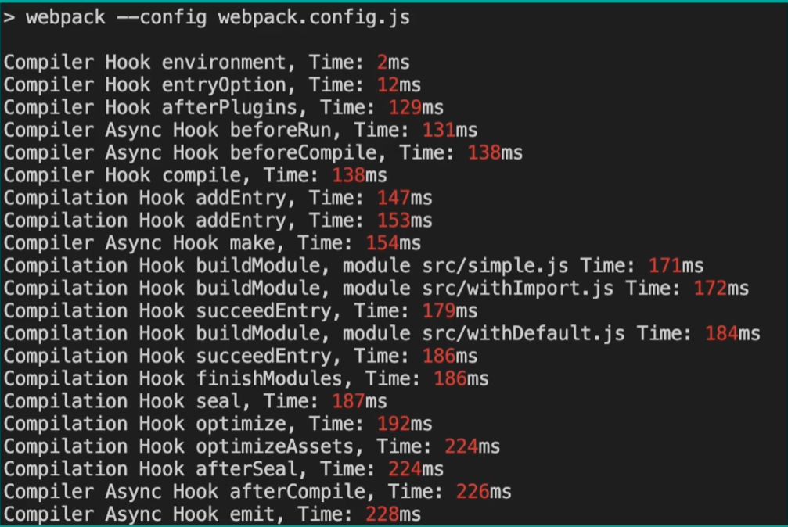

### 09构建效率篇-Webpack完整的构建流程

##### webpack的两种使用方式


不管哪种方式，核心逻辑是根据配置生成编译器的实例compiler，处理参数，根据参数加载不同插件，根据模式执行compiler.watch()还是compiler.run()



##### Compiler.js的基本流程

1. readRecord阶段：读取构建记录，用于分包缓存优化，在未设置recordsPath时直接返回；
2. compile的构建阶段：编译器（Compiler.js）流程的核心是本步骤，是在生成的compilation的实例中进行的，compile的主要构建流程：
   1. newCompilationParams：创建NormalModule和ContextModule的工厂实例，用于创建后续模块的实例；
   2. newCompilation：创建编译过程实例，传入上一步两个工厂实例作为参数；
   3. compiler.hooks.make.callAsync：出发make的Hook，执行所有监听make的插件；会在具体的插件中，出发compilation的entry方法；
   4. compilation.finish：编译过程实例（newCompilation）的finish方法，出发对应hook并报告构建模块的错误和警告；
   5. compilation.seal：编译过程的seal方法，包含了编译之后的所有优化过程 ；
3. emitAssets阶段：构建之后会调用compilation.getAssets()方法，将产物内容写入到输出文件中；
4. emitRecords阶段：对应第一步的readRecords，用于写入构建记录，在未设置recordsPath时直接返回；

##### compilation实例的源码逻辑

- addEntry：编译过程之前从配置文件中的entryPoint开始递归添加和构建模块；
- seal：编译完成之后触发，冻结各个模块，进行一系列优化，以及出发各个优化阶段的hooks；

##### Webpack的基本工作流程

1. 创建编译器Compiler实例；
2. 根据Webpack参数，加载参数中的插件以及程序内置插件；
3. 执行编译流程：创建Compilation实例，从入口（entryPoint）递归添加和构建模块（Module），模块构建完成后冻结模块并进行相关优化（seal）；
4. 构建与优化过程结束后，将构建产物写入到文件；

##### Webpack的生命周期和插件系统

​	1.生命周期






###### 构建器实例compiler的生命周期

1. 初始化阶段：
   1. enviroment、afterenviroment：在创建完compiler实例且执行了配置内定义的插件的apply方法后触发；
   2. entryOptions、afterPlugins、afterResolvers：在WebpackOptionsApply.js中，这三个Hooks分别在执行了EntryOptions插件和其他内置插件，以及解析了Resolver配置后触发（afterResolvers）；
2. 构建过程阶段：
   1. normalModuleFactory、contextModuleFactory：在两类模块工厂创建后触发；
   2. beforeRUn、run、watchRun、beforeCompile、compile、thisCompilation、compilation、make、afterCompile等：在运行构建过程中触发；
3. 产物生成阶段：
   1. shouldEmit、emit、assetEmitted、afterEmit：在两类模块工厂构建后触发；
   2. failed、done：在达到构建效果后触发；

###### 构建过程实例Compilation的生命周期

1. 编译模块阶段：
   1. addEntry、failedEntry、succeedEntry：在添加入口和添加入口结束时触发（webpack5移除）；
   2. buildModule、rebuildModule、finishRebuildingModule、failedModule、succeedModule：在构建单个模块时触发；
   3. finishModules：构建完成时触发；
2. 优化阶段：seal函数的处理过程
   1. 优化依赖项
   2. 生成Chunk
   3. 优化Module
   4. 优化Chunk
   5. 优化Tree
   6. 优化ChunkModules
   7. 生成Module ids
   8. 生成Chunk ids
   9. 生成Hash
   10. 生成ModuleAssets
   11. 生成ChunkAssets
   12. 优化Assets：代码压缩就在这个阶段，比如Terser插件，就执行在这个阶段；











##### 作用

可以利用上述几十个生命周期来编写插件被调用的时机

```javascript
// 统计各个构建过程耗时的插件示例
class SamplePlugin {
    apply(compiler) {
        var start = Date.now()
        // 初始化阶段的执行时机
        var statsHooks = ['enviroment', 'entryOption', 'afterPlugins', 'compile']
        var statsAsyncHooks = [
            'beforeRun',
            'beforeCompile',
            'make',
            'afterCpmpile',
            'emit',
            'done',
        ]
        
        statsHooks.forEach(hookName => {
            compiler.hooks[hookName].tap("Sameple Plugin", () => {
                console.log(`compiler hook ${hookName}, Time: ${Date.now() - start}ms`)
            })
        })
		...
    }
}
    
module.exports = SamplePlugin;
```

