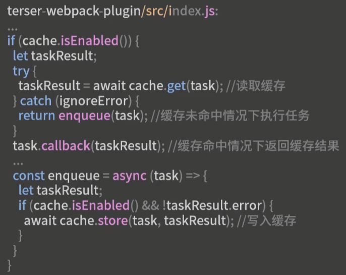
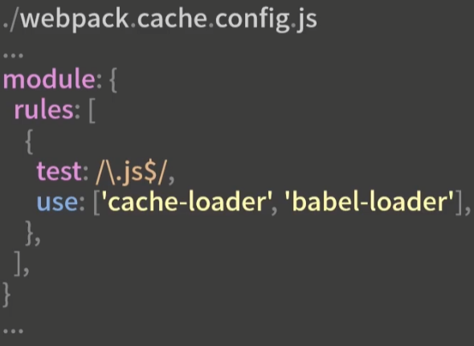
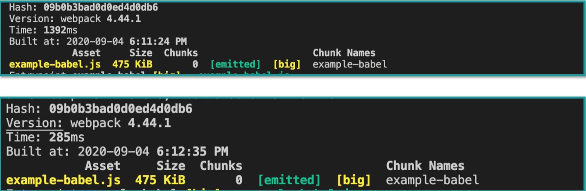

### 12基于缓存的构建优化

webpack内置压缩插件terser-webpack-plugin原理：

​	

除此之外，还有哪些任务环节可以用到缓存优化：

###### 编译阶段的缓存优化

编译过程的耗时点，是使用不同的加载器，编译对应模块的过程

1. babel-loader：
   1. cachDirectory：默认false不开启缓存，值为true时开启缓存并使用默认缓存目录，也可以改为字符串设置其指定缓存目录；
   2. cacheIdentifier：缓存标识符，默认使用Babel相关依赖包的版本与模块内容一起参与计算缓存标识符，如果上述cachDirectory目录发生变化，即便依赖包不变，也无法命中缓存；
   3. cacheCompression：默认为true；作用是将缓存内容压缩成gz包，从而减小体积。改为false时会跳过压缩和解压的过程，从而提升这阶段的速度；
2. Cache-loader:
   1. 在babel-loader之前增加Cache-loader；
   2. 经测试发现，使用cache-loader比babel-loader开启缓存选项的效果更佳，原因是babel-loader的缓存信息相对于cache-loader来说是较少的，并且cache-loader的缓存数据格式是buffer形式的，效率更高；

​	

###### 打包阶段的缓存优化

生成ChunkAssets时的缓存优化，在webpack4中，生成ChunkAsset过程的缓存优化是受限的，只有watch模式下，且配置中开启cache时，才能在这一阶段执行缓存的逻辑；（developement时自动开启）

###### 代码压缩阶段的缓存优化

对于JS，Terser和UglifyJSPlugin都支持缓存优化；

对于CSS，最新发布的CSSMinimizerWebpackPlugin支持并默认开启缓存优化；

###### 缓存失效问题

如何最大程度让缓存命中？

1. 缓存标识符发生变化引起缓存失效：在支持缓存的Loader和插件中，会根据固定字段值加所处理的模块或chunk的hash值来生成缓存标识符；例如依赖包的版本，对应插件的配置项信息，环境变量等；

   解决：尽量少变更对应属性；

2. 编译阶段的缓存失效问题：只会将发生变更代码的module重新编译，其余则不需要，因此需要注意缓存失效扩大化的问题；

   例如：修改入口文件后，尽管模块编译阶段，其余代码和对应module都没改变，但是在压缩阶段，各个模块都关联到了新的chunk文件中，因为入口文件的module发生改变，导致整个chunk都发生了改变，进而导致缓存失效；

   解决：尽可能将哪些不变的处理成本高的模块打入单独的chunk中；webpack的分包配置；分包的好处：合并通用依赖，提升构建缓存利用率，提升资源缓存利用率，懒加载等；

3. CI/CD的缓存目录问题：在很多自动化继承的系统中，项目的构建空间在每次构建完毕后都会立即收回清理，导致无法使用缓存；

   因此需要根据平台规范，将缓存设置到公共缓存目录下；--部署优化的内容；

4. 缓存清理：需要定期清理缓存区，或者设置自动过期的清理策略；

5. 与产物的持久化缓存相区别；

   如浏览器加载资源的缓存问题；webpack中生成产物的持久化缓存方法（hash，chunkhash，contenthash），主要影响项目的访问性能，而对构建效率没影响；