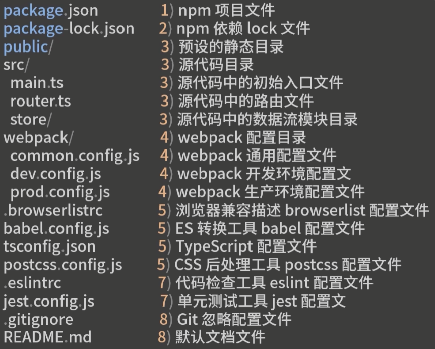
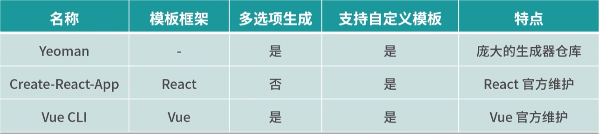
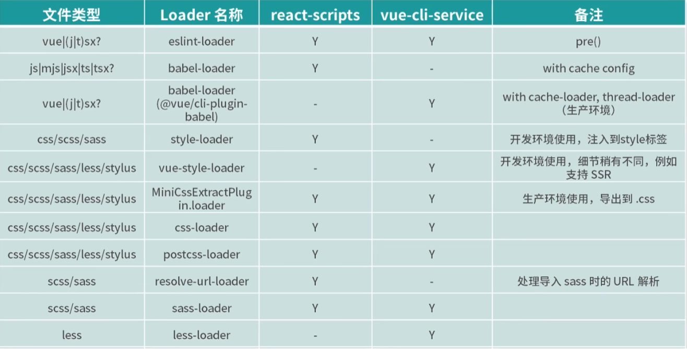
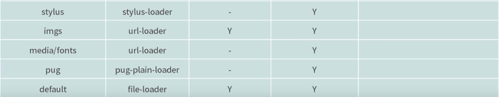
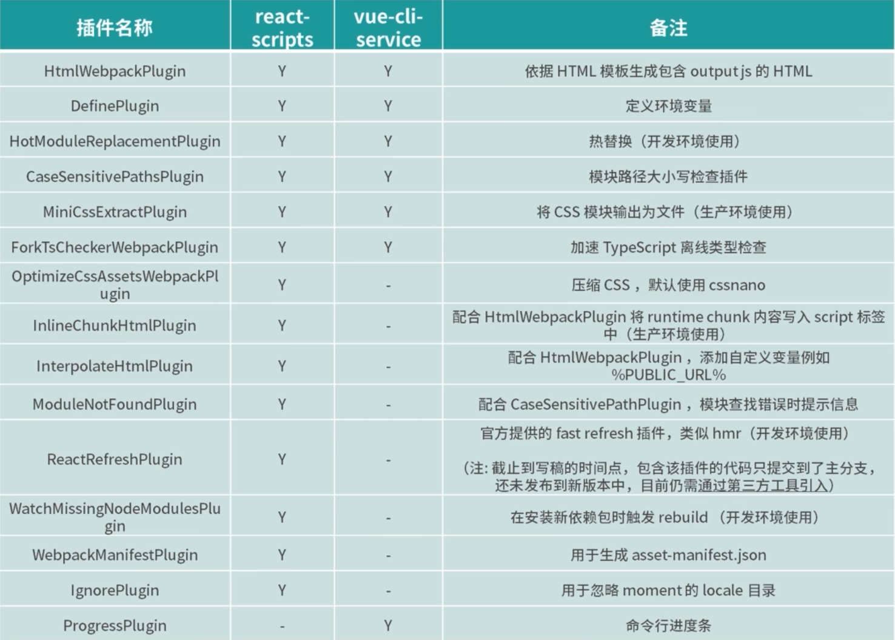
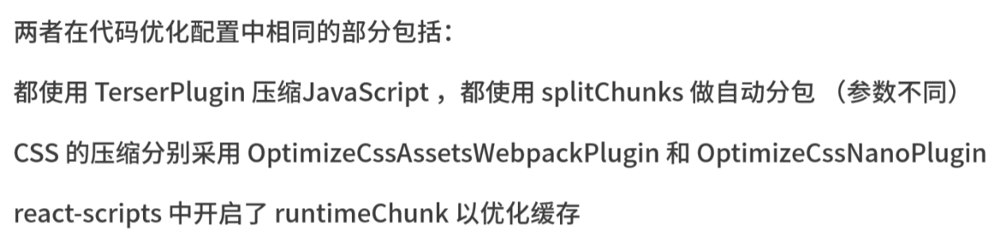
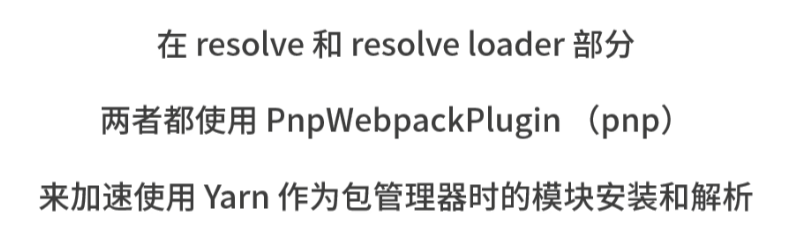
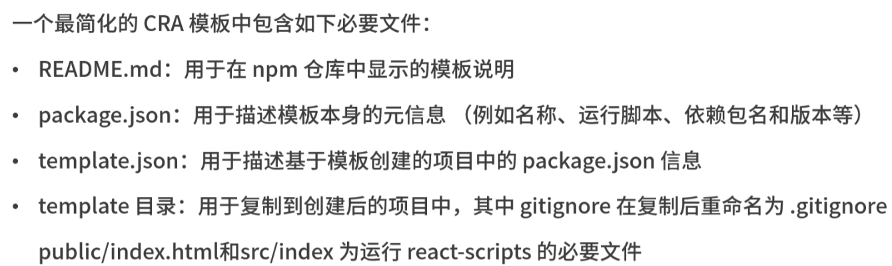
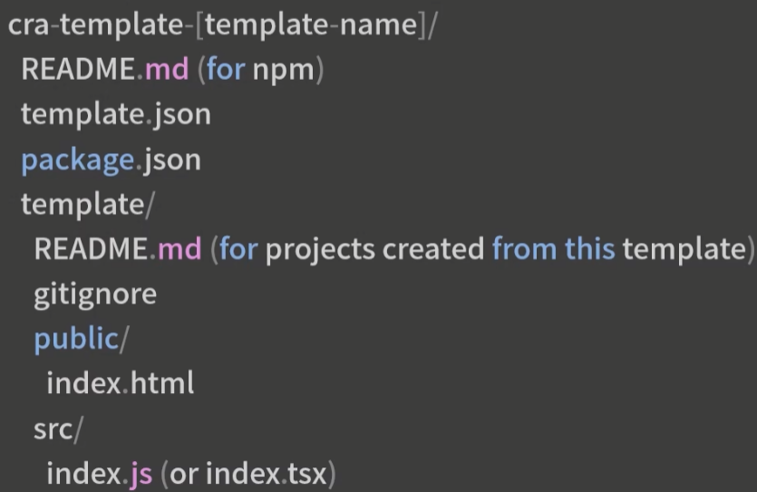
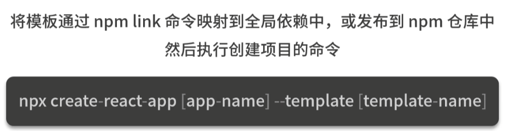

#### 01前端脚手架工具

##### 在一个新项目进入实际业务编码前，会遇到的问题

- 准备基础的开发设施
- 较短时间内配置一个技术栈完整，辅助功能丰富，可扩展性强，兼顾不同环境下构建优化目标的项目基础代码
- 不同项目需求和团队情况，基础设施建设也不同，例如项目需求复杂度不高，人员流动大，编码水平参差不一，可以选择vue；需求复杂，人员稳定，水平较高，可选择react等；

要根据技术选型选择使用的技术栈，然后根据技术栈选择合适的脚手架工具，做项目代码的初始化；

##### 进入开发须要的准备

1. package.json作为基础配置文件

2. 选择npm或者yarn作为包管理器

3. 确定技术栈，需考虑到团队最熟悉的技术框架，比如选择哪个数据流模块，redux或者dva，是否用ts，用哪种css预处理器等；确定后要安装对应依赖包，并在src目录下建立入口文件；

4. 选择构建工具，webpack/vite，或者no-bundle方案等；确定构建工具厚要增加对应的配置文件，可以考虑针对开发/生产环境使用不同的配置文件；

5. 打通构建流程，安装配置Loader，PlugIns等

6. 优化构建流程，针对开发/生产环境的不同特点进行优化，比如：开发环境重点关注开发效率和调试便捷性，生产环境更关注访问性能和代码安全等；

7. 选择和调试辅助工具：例如代码检查工具和单元测试工具，并安装相应依赖并调试配置文件；

8. 检查主要环节的脚本是否正常，编写说明文档等，不需要纳入版本管理的文件目录需要计入.gitignore等

   

   ##### 实例模板




##### 前端的脚手架工具

三种代表性的脚手架工具：



1. Yeoman

   Google的，提供特定生成器来创建项目基础代码的功能，不限制技术栈，足够开放和自由，但是缺乏某一技术栈的深度集成和技术生态；

2. Create-React-App

   cra用于选择脚手架创建项目

   react-scripts提供了封装后的项目启动、编译、测试等基础工具

   cra将一个项目开发运行时的各种配置细节，完全封装在react-script依赖包中，大大降低了开发者开发项目的学习成本，但是这种黑盒操作对后期自定义优化带来了不便，可以通过eject来注入自定义配置；

   可通过下列工具进行cra项目配置的自定义管理

   可以自定义create-react-app项目配置的工具主要有以下几种：

   1. react-app-rewired：react-app-rewired是一个自定义create-react-app配置的工具。使用react-app-rewired，可以在不eject的情况下修改Webpack配置。
   2. craco：craco是另一个自定义create-react-app配置的工具。它提供了一种简单的方法来覆盖create-react-app默认的配置，而不需要eject。
   3. customize-cra：customize-cra是一个用于自定义create-react-app配置的工具库。它提供了一组高阶函数，可以用于修改create-react-app配置，包括Webpack配置和Babel配置等。
   4. react-scripts：react-scripts是create-react-app默认的配置工具。虽然不能直接修改，但是可以通过eject将默认配置暴露出来，然后再进行修改。

3. Vue Cli

   定位是vue.js快速开发的完整系统，由三部分组成：

   - 作为全局命令的@vue/cli
   - 作为项目内集成工具的@vue/cli-server
   - 作为功能插件系统的@vue/cli-plugin

   保留了开箱即用的优点，还提供了覆盖原有各项配置文件的特点，使得使用者可以根据自身需要进行定制化选项，比如是否集成路由，是否使用Ts等

##### react-scripts和vue-cli-service的优化项

###### webpack loader





###### webpack plugins




###### webpack.optimize



###### webpack resolve



##### 定制专属脚手架

哪些情况下需要定制化脚手架？

1. 为项目引入新特性时

2. 针对构建环节webpack配置优化，来提升开发环境效率和生产环境性能时 

   `module.exports = {
     configureWebpack: {
       devtool: 'source-map',
       optimization: {
         splitChunks: {
           chunks: 'all'
         }
       }
     }
   }`

   这些配置将启用SourceMap生成，并将优化Webpack的代码拆分功能。

3. 定制符合团队内部规范的代码规范配置

   `"eslintConfig": {
     "extends": [
       "plugin:vue/recommended",
       "@vue/prettier"
     ],
     "rules": {
       "semi": ["error", "never"],
       "quotes": ["error", "single"]
     }
   },
   "prettier": {
     "semi": false,
     "singleQuote": true
   }`

4. 定制单测等辅助工具的配置项

5. 定制符合团队内部规范的目录结构与通用业务模块，例如业务组件库，辅助工具类，页面模板等

- 可以减少开发中处理重复事务的时间
- 减少因为各个开发者代码风格不一导致项目维护成本增加的问题


###### create-react-app自定义模板

针对create-react-app的自定义模板的配置文件示例：

```js
// webpack 配置项
const webpackConfig = {
  // 开发环境配置
  development: {
    // ...具体配置项
  },
  // 生产环境配置
  production: {
    // ...具体配置项
  },
};

// 代码规范配置项
const codeStyleConfig = {
  // ...具体配置项
};

// 辅助工具配置项
const helperConfig = {
  // ...具体配置项
};

// 目录结构与通用业务模块配置项
const structureConfig = {
  // ...具体配置项
};

// 第三方库配置项
const thirdPartyConfig = {
  // ...具体配置项
};

// 状态管理库配置项
const stateManagementConfig = {
  // ...具体配置项
};

// 开发时的热重载和错误提示配置项
const devConfig = {
  // ...具体配置项
};

// 其他配置项
const otherConfig = {
  // ...具体配置项
};

// 汇总所有配置项
const config = {
  webpack: webpackConfig,
  codeStyle: codeStyleConfig,
  helper: helperConfig,
  structure: structureConfig,
  thirdParty: thirdPartyConfig,
  stateManagement: stateManagementConfig,
  dev: devConfig,
  other: otherConfig,
};

module.exports = config;
```

上述配置文件只是示例，具体的配置项需要根据实际项目需求进行定制。








###### vue-cli创建自定义模板

Vue CLI允许用户通过创建自定义模板来扩展其功能。以下是创建自定义模板的步骤：

1. 创建一个新的Vue项目并安装所需的依赖项。

2. 在项目的根目录下创建一个名为`my-template`的文件夹，并在其中创建一个`template.json`文件。`template.json`文件是一个必需的文件，其中定义了模板的名称、版本、描述等信息。示例`template.json`文件如下：

```
{
  "name": "my-template",
  "version": "1.0.0",
  "description": "My custom Vue CLI template",
  "author": "Your Name",
  "license": "MIT"
}
```

3. 在`my-template`文件夹中创建一个`template`文件夹，用于存储模板文件。

4. 将您想要包含在模板中的文件和目录复制到`template`文件夹中。

5. 在项目的根目录下运行以下命令：

```
vue create --preset ./my-template your-project-name
```

其中，`your-project-name`是您要创建的项目的名称。

6. Vue CLI将使用您创建的模板来生成新项目，并将您的模板文件复制到新项目中。

通过这些步骤，您就可以创建自定义模板并使用它来生成新的Vue项目。在`template`文件夹中添加或修改文件，您可以扩展模板的功能，以满足特定的需求。

非常抱歉，可能是我之前的链接已经失效了。这里提供一个新的示例仓库链接，包含基于vue-cli的自定义模板的配置文件和目录结构：https://github.com/wwenj/vue-cli-template-demo

一些常见的配置文件和目录结构，例如：

- `babel.config.js`：Babel编译配置文件；
- `eslint.config.js`：ESLint代码规范配置文件；
- `jest.config.js`：Jest单元测试配置文件；
- `postcss.config.js`：PostCSS配置文件；
- `vue.config.js`：Vue CLI配置文件；
- `public`目录：用于存放静态资源，例如index.html；
- `src`目录：用于存放源代码；
- `src/api`目录：用于存放API请求相关代码；
- `src/assets`目录：用于存放通用的静态资源；
- `src/components`目录：用于存放业务组件；
- `src/directives`目录：用于存放自定义指令；
- `src/filters`目录：用于存放自定义过滤器；
- `src/layouts`目录：用于存放页面布局组件；
- `src/mixins`目录：用于存放自定义混入；
- `src/router`目录：用于存放Vue Router相关代码；
- `src/store`目录：用于存放Vuex相关代码；
- `src/utils`目录：用于存放辅助工具函数；
- `src/views`目录：用于存放页面组件。

需要注意的是，这些配置文件和目录结构只是示例，具体的实现方式需要根据具体的项目需求和开发习惯进行调整。

##### 根据不同的环境使用不同的webpack配置文件

在webpack中可以通过设置`mode`选项来指定当前构建的模式，可选值为`development`、`production`和`none`。同时可以使用`--env`参数传入自定义的环境变量。

例如，在`package.json`中配置如下的构建脚本：

```
"scripts": {
  "build:dev": "webpack --mode=development --env.NODE_ENV=development --config webpack.dev.js",
  "build:prod": "webpack --mode=production --env.NODE_ENV=production --config webpack.prod.js"
}
```

上述配置中，我们分别指定了不同的构建模式和`NODE_ENV`环境变量，并且使用了不同的webpack配置文件。

在webpack配置文件中，可以使用`process.env.NODE_ENV`获取`NODE_ENV`环境变量的值，并进行不同的配置。

例如，可以在`webpack.dev.js`中设置如下的配置：

```
module.exports = {
  // ...
  devtool: 'cheap-module-eval-source-map',
  devServer: {
    // ...
  },
  // ...
}
```

而在`webpack.prod.js`中，则可以设置如下的配置：

```
module.exports = {
  // ...
  devtool: false,
  optimization: {
    // ...
  },
  // ...
}
```

这样就可以根据不同的环境使用不同的webpack配置文件，并实现不同的构建配置。