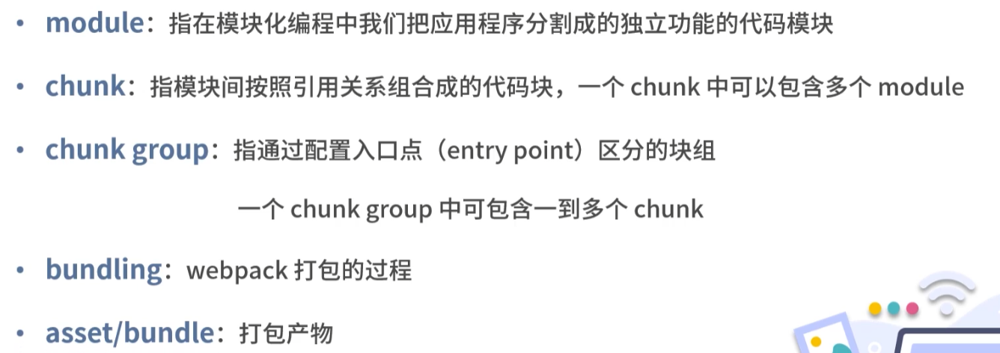
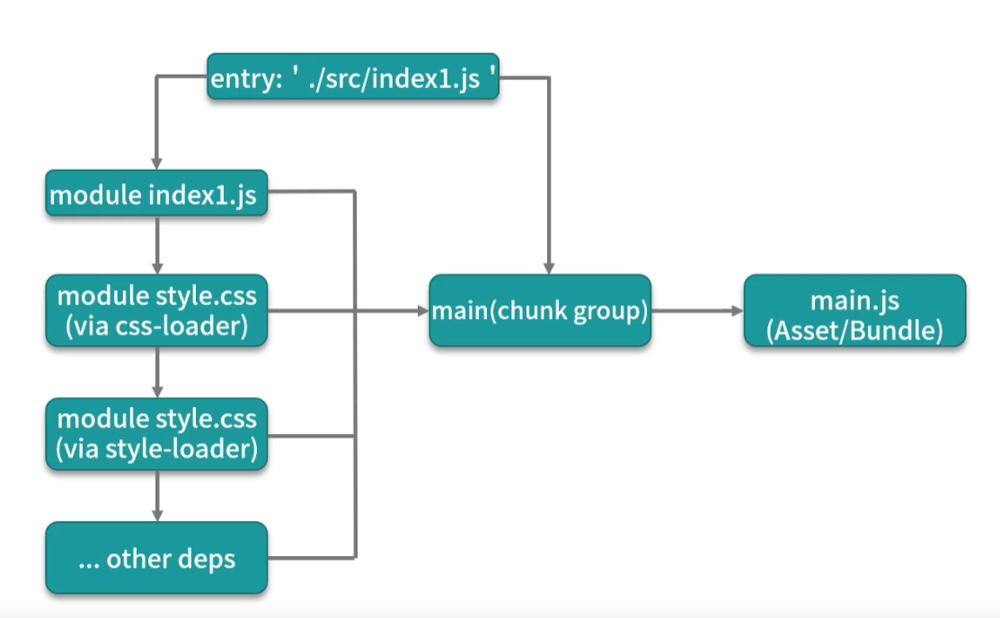
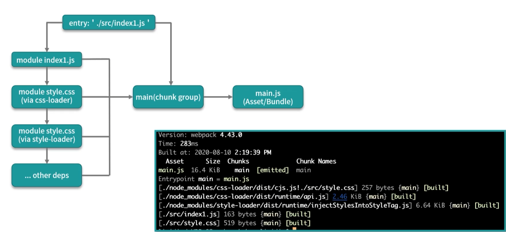
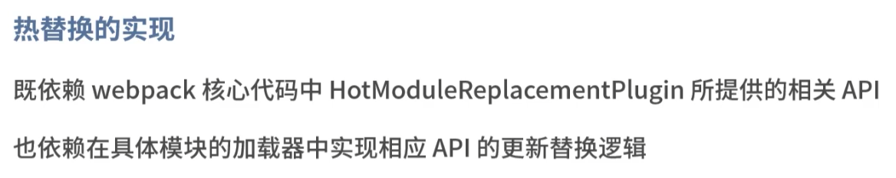

### 02热更新

##### watch

可以在保存变更代码后自动构建，不需手动执行脚本，但是浏览器不会自动刷新；

方法：

​	package.json中，"build: watch": "webpack的build命令"，或者webpack.config.js中 watch: true;

##### reload

​	package.json中， "dev:reload":"webpack-dev-server"

​	原理：通过websocket来建立本地代码和浏览器的通信

##### HMR

​	模块热替换，解决了在网页某些操作后，例如展示弹框，填写表单等，保存改动代码对应效果消失的问题；

​	使用方法：package.json: "dev:hmr":"webpack-dev-server"，或者webpack.config.js中DevServer的hot: true;

​	效果：当修改代码后，会新增两个请求，hot-update.json和hot-update.js，并插入到html中；

​	原理：可以基于node.js的文件模块fs.watch来实现对文件或文件夹的监控

##### webpack打包流程

##### webpack打包思想

1. 不管什么类型的资源文件，都可以通过各种loader转化为js模块（module）,模块间可以互相引用（chunk）;
2. webpack通过入口点（entry point）来递归处理各个模块引用关系，最后输出为一个或多个产物包；
3. 入口点（entry point）都是一个块组（chunk group）,在没有分包的情况下，一个chunk group只有一个chunk，这个chunk包括了递归分析后的所有模块（module）;不指定名称的情况下，chunk group名称默认是main； 
4. 每个chunk都有一个对应打包后的模块Asset/Bundle;

##### 热替换的原理

在webpack runtime的api，会执行hmr插件的两个方法hot.accpet，和hot.dispose

hot.accept方法传入依赖模块的名称和回调函数，当accpet方法执行时，会在依赖模块加载完成时执行回调，回调中执行update(依赖模块)，并将依赖模块传入更新函数(update())；

hot.dispose方法接受一个回调函数，在这个回调里可以清空热更新的内容；

##### 热替换的实现

所以说，仅仅是配置hot:true，并不能实现所有代码改动都能热替换，而是要配置对应加载器（loader），并且这个loader必须支持热更新；