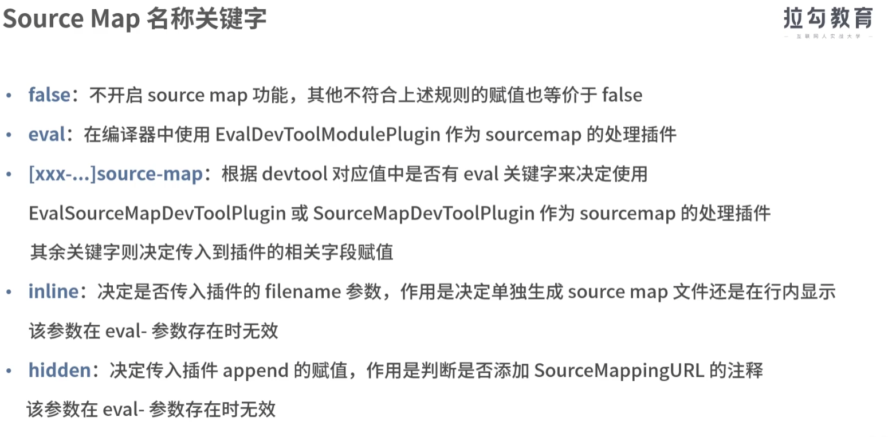
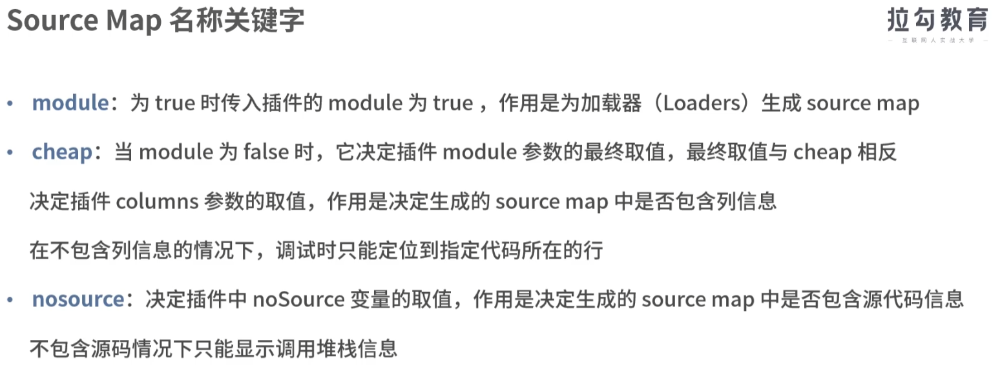
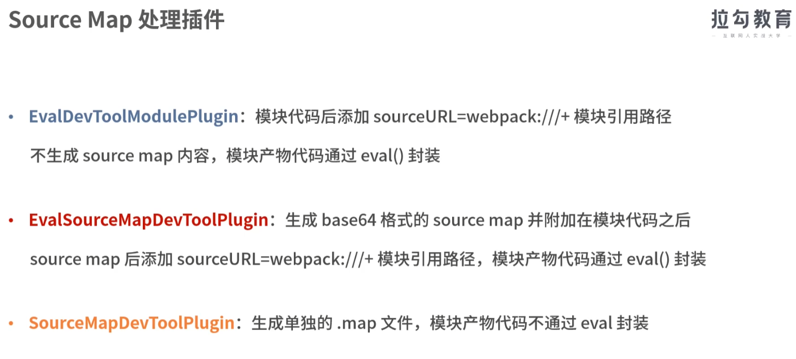
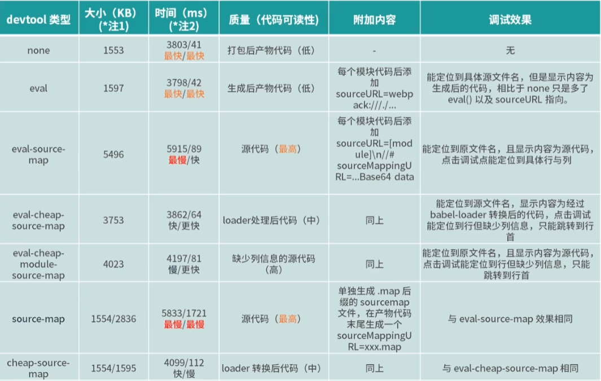
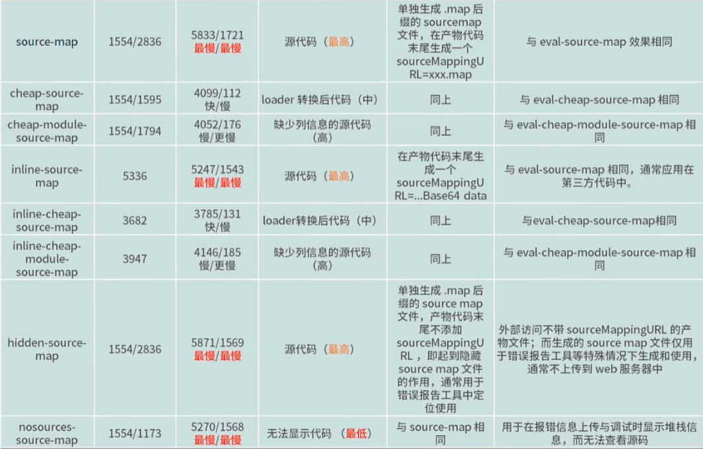
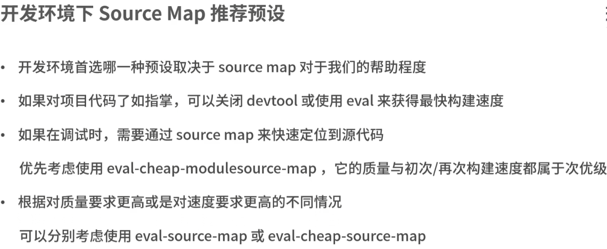
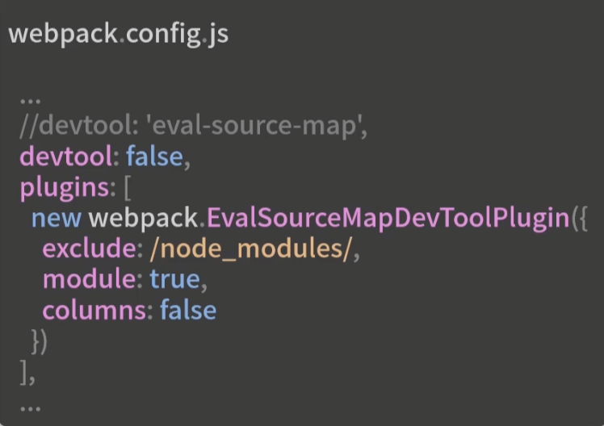
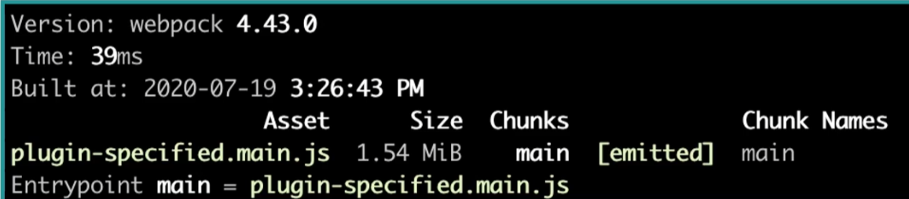

### 03正确使用sourcMap

问题：为什么有的项目在开启hmr的开发环境下每次构建都很卡，每次保存完代码后等几秒才能看到效果

##### 原理

在编译处理过程中，生成产物代码（压缩混淆）的同时，生成产物中被转换部分与源码对应部分的**映射关系表**

通过chrome控制台中的"Enable javascript source map"来实现调试时显示定位源码的功能；

对于同一个源码，目标不同，构建的sourceMap也不同

##### 不同环境的不同期望

开发环境：关注的是构建速度快，质量高，便于提高开发效率；

生产环境：关注的是是否需要提供线上sourcrMap，生成文件大小，访问是否会对页面性能造成影响，其次才是构建质量和构建速度

##### sourceMap预设关键字

对于sourceMap模式，是通过关键字匹配的方式来进行的，而不是精确匹配；

##### 不同预设关键字示例结果对比

##### 开发环境sourceMap推荐预设

如果对质量要求高，可选择eval-source-map

如果对构建速度要求高，可选择eval-cheap-source-map

##### 几种工具和脚手架的默认预设

webpack：默认值是eval

cra：

- 生产环境：根据shouldUseSourceMap参数决定使用source-map还是false;
- 开发环境：默认是cheap-module-source-map;(不包含列信息的源码，但构建快)；

vue-cli-service：同cra；

##### EvalSourceMapDevToolPlugin的使用和优化提升

传入的参数：

- 预设相关的filename、append、module、columns等
- 影响注释内容的moduleFilenameTemplate和protocal
- 影响处理范围的test、include、exclude等

优化举例：

该配置效果和'eval-source-map'是一样的，但是通过对比，发现打包速度和产物大小比使用预设配置要快和小了许多，因此在一些大型项目中，可使用自定义配置sourceMap的方式来优化打包速度和产物大小；