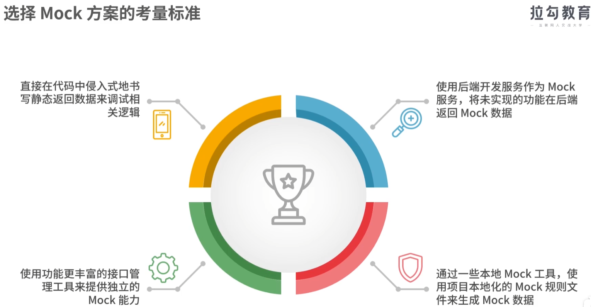
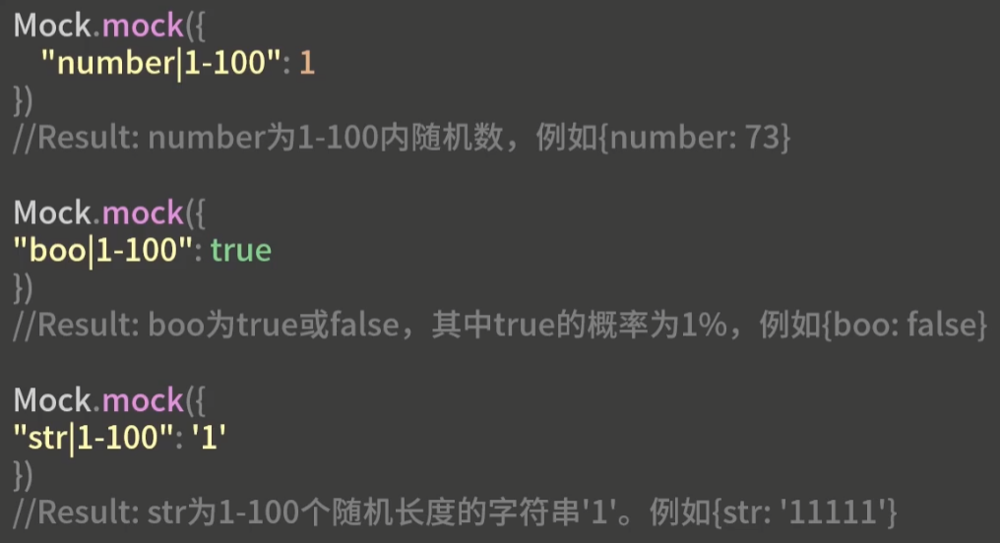
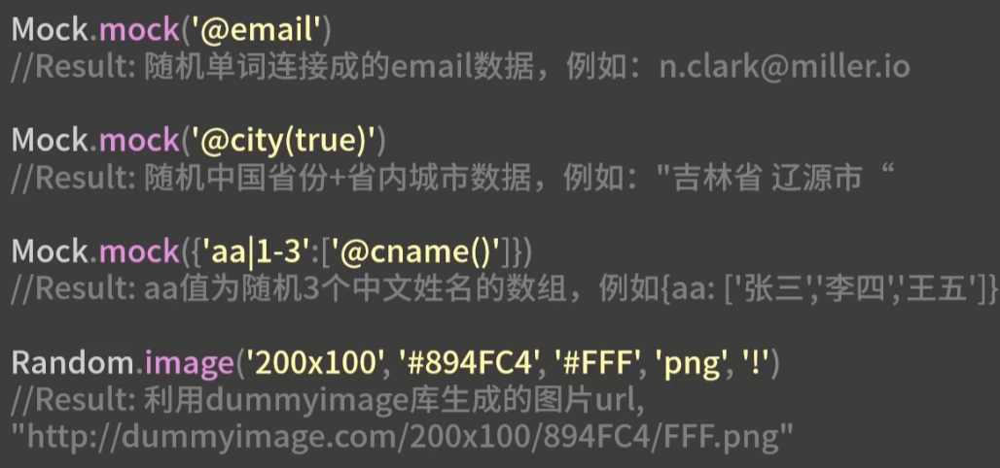
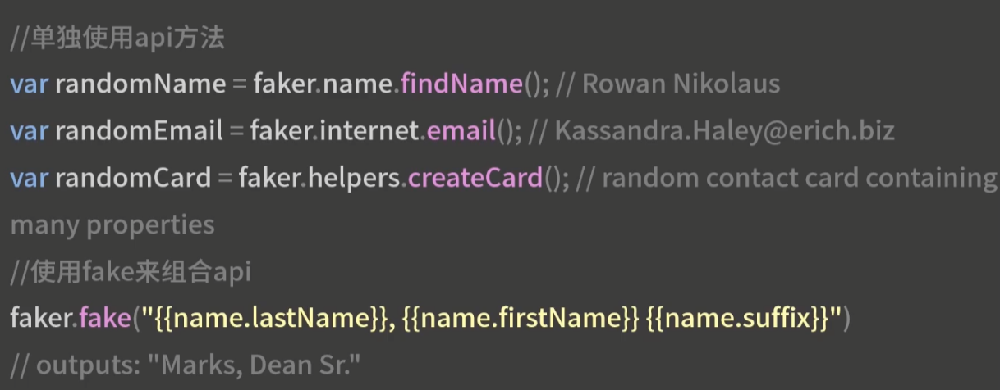
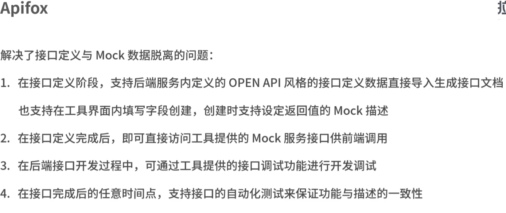

### 04mock快速调试

1.侵入式书写静态数据；

2.后端先返回既定格式的数据，后续根据其需求排期再完成；

3.前端本地Mock工具；

4.使用接口管理工具的mock能力；

其中第一二种对复杂的数据格式不适用；

第三点虽然前端更方便，但是不利于和后端配合；

第四点在与后端配合好的情况下更实用；

##### 方案考量标准

1. 数据仿真度；
2. 易用性；将接口文档自动转化为Mock接口的能力；
3. 灵活性：根据不同调用方式和入参来返回不同的输出值；

##### 有哪些方案

###### Mock.js

- 定义了两类生成模拟数据的规范，以及实现了对应规范生成模拟数据的方法
  - 数据模板定义规范
    - 
  - 数据占位符定义规范
    - 

​	其他功能：

- Ajax请求拦截：Mock.mock通过传入url和type来拦截，Mock.setup设置拦截请求后的响应时间；原理是覆盖XmlHttpRequest来实现的，因此使用fetch请求的项目没法用；
- 数据验证：Mock.validate验证返回的数据和接口文档中是否一致；
- 模板导出：Mock.toJSONSchema，导出数据模板到支持JSONSchema的工具中；

###### Faker.js

提供了指定类型的随机数据

支持多语言的国际化包；其余和mock.js差不多

##### mock平台化工具

YAPI和ApiFox都可以让后端根据接口文档自动生成mock环境接口

