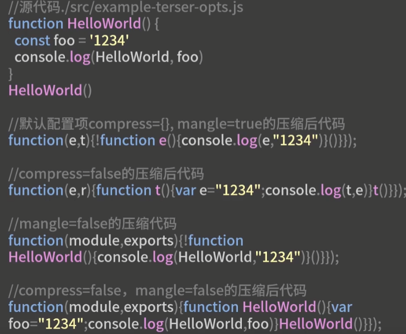
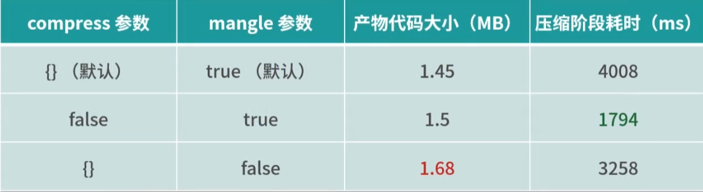
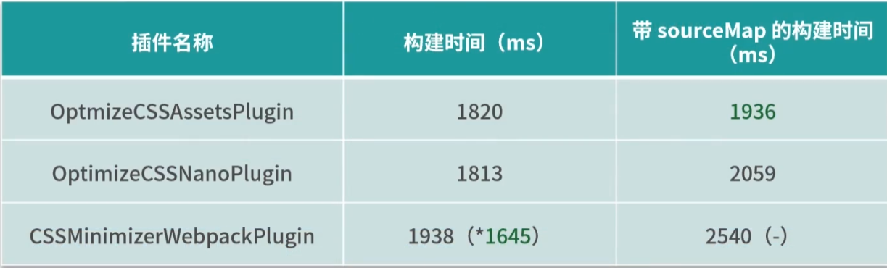
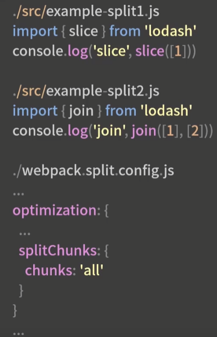

### 11构建效率篇-打包阶段提速

 优化阶段效率提升的整体分析

1. 优化依赖项
2. 生成Chunk
3. 优化Module
4. 优化Chunk
5. 优化Tree
6. 优化ChunkModules
7. 生成Module ids
8. 生成Chunk ids
9. 生成Hash
10. 生成ModuleAssets
11. 生成ChunkAssets
12. 优化Assets：代码压缩就在这个阶段，比如Tezer插件，就执行在这个阶段；

针对以上12个流程任务，可分为两个提效方向

- 针对某些任务，使用效率更高的工具或配置项，从而提升当前任务的工作效率；

  - 生成ChunkAssets，即根据Chunk信息生成Chunk产物代码；主要在缓存包中；
  - 优化Assets，即压缩Chunk产物代码
    - webpack4内置了TerserWebpackPlugin作为默认的js压缩工具；Terser和uglify是兼容的；
    - TerserWebpackPlugin优化：
      - cache选项：默认开启，使用缓存能够极大提升再次构建时的效率；
      - paraller选项：并发选项，默认开启；因项目规模而异，多进程会额外开销；
      - terserOptions：主要是compress和mangle，这些选项是对具体压缩处理过程产生的配置项；
      - 
    - CSS压缩的工具：
      - OptimizeCSSAssetsPlugin--create-react-app中用到
      - OptimizeCSSNanoPlugin--Vue-Cli中用到
      - CSSMinimizerWebpackPlugin--webpack社区新发布的插件，支持缓存和多进程，是上面两个没有的，推荐这个
      - 

- 提升特定任务的优化效果，以减少传递给下一任务的数据量，从而提升后续环节的工作效率；

  - 分包SplitChunks

    - SplitChunks是指在Chunk生成之后，将原先以入口点来划分的Chunks，根据一定的规则，分离出子Chunk的过程，有利于缓存命中，有利于运行时的畅销文件缓存；通过分包，抽离多个入口点的公共依赖来提效；
    - 对于示例的多入口静态引入相同依赖包的情况，设置分包后，lodash只需要压缩一次，从而减少压缩时间；
    - 
    - SplitChunksPlugin的作用阶段是optimizeChunks阶段；压缩代码是optimizeChunkAssets阶段，从而起到提升后续环节效率的作用；

  - TreeShaking：自动移除那些被引入但未被使用的资源；只有es6才能进行tree-shaking，因为es6依赖关系是确定的，可以进行不依赖运行时的静态分析；而CommonJs则不能，只能依赖第三方插件tree-shaking；

    - 以default方式引入的模块，无法被TreeShaking；引入单个导出的方式，不管是import ... as ...还是import {xxx} 都可以进行tree-shaking
    - 
    - 在webpack4中，会根据依赖模块的package.json中的sideEffects，来确认对应依赖包代码是否会产生副作用；设置为false表明无副作用 ，可以tree-shaking；
    - babel：
      - 在babel7之前babel-preset-env中，modules的默认选项为'commonjs'，因此不管依赖包是否为es6module，都会被转换成commonJs语法，从而无法进行tree-shaking；
      - babel7之后的@babel/preset-env中，modules默认为auto，对于es6module的依赖包是可以进行tree-shaking的；

    

